# Configuration Management Lab Overview

## Abstract

During this lab, you will learn how to define infrastructure-as-code (IaC). You will learn how to use Azure Resource Manager (ARM) templates to describe an infrastructure of resources such as a virtual network, virtual machine, and more. Then, you will learn how to use technologies such as PowerShell Desired Stated Configuration (DSC), Chef, and Puppet to configure the internals of a virtual machine.

## Learning Objectives

After completing the exercises in this lab, you will be able to:

-   Create an ARM template to provision a virtual machine and additional required resources.

-   Use PowerShell to deploy an ARM template to Azure.

-   Use PowerShell Desired State Configuration (DSC) to apply internal configuration for a virtual machine.

-   Use Chef to apply internal configuration for a virtual machine.

-   Use Puppet to apply internal configuration for a virtual machine.

**Estimated time to complete this lab: *60* minutes**

# Exercise : Create an ARM template to provision a virtual machine

## Scenario

In this exercise, we will introduce you to the authoring tools used to create ARM templates using Visual Studio 2015. You will create a new ARM template from scratch to provision an Azure virtual machine. For this exercise, you will use:

-   Visual Studio 2015 with Update 3

-   Microsoft Azure SDK for .NET v2.9.1

After completing this exercise, you will understand:

-   The overall structure of an ARM template.

-   How resources are added and configured in an ARM template.

-   How parameters are passed into an ARM template.

## Create a new Azure Resource Group Project

1. Open Visual Studio.

1. Select **File &gt; New &gt; Project**.

    - Select the **Azure Resource Group** project.

    - Set the **Name** of the project to *IaC-Lab*.

    - Click **OK**.

        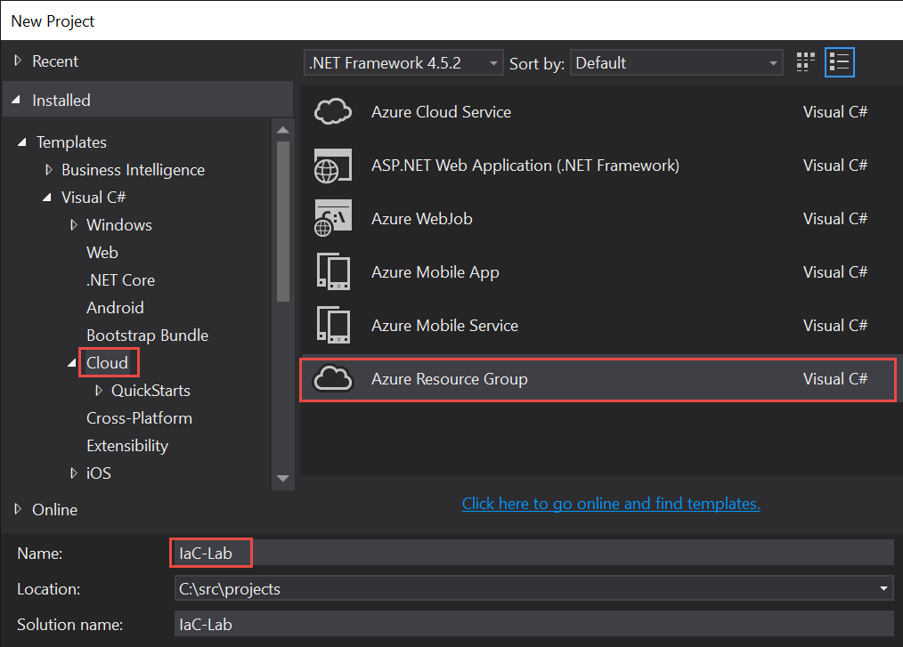

1. In the **Azure Template** window, select the **Blank Template** and click **OK**.

    

1. Select **View &gt; Solution Explorer**.

1. In **Solution Explorer**, expand the **Templates** folder and double-click **azuredeploy.json**. Opening this file in the Visual Studio editor should result in the **JSON Outline** window displaying as shown. If it is not visible, you can open it by selecting **View &gt; Other Windows &gt; JSON Outline**.

    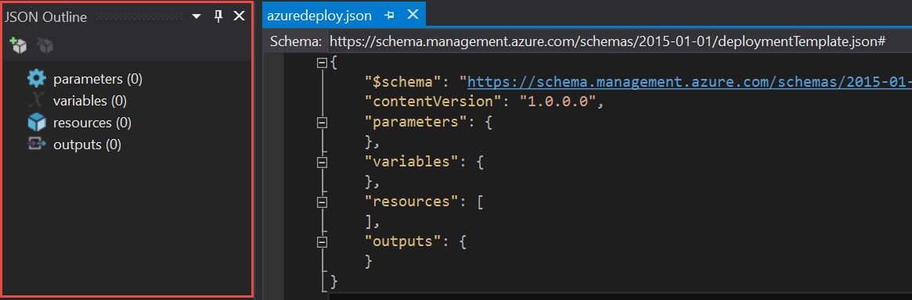

## Add Azure resources to the deployment template

1. In the **JSON Outline** window, right-click **Resources** and select **Add New Resource**.

1. In the **Add Resource** window, select **Storage Account**.

    - Set the resource **Name** to *stg*. Note: Be sure to use all lowercase letters. Azure storage account names must be al lowercase and can only contain alpha-numeric characters.

    - Click **Add**.

    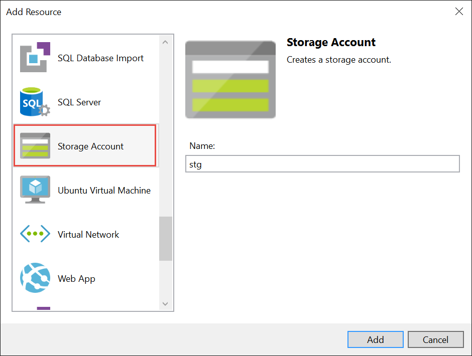

1. In the **JSON Outline** window, right-click **Resources** and select **Add New Resource**.

1. In the **Add Resource** window, select **Storage Account**.

    - Set the resource **Name** to *vnet*.

    - Click **Add**.

    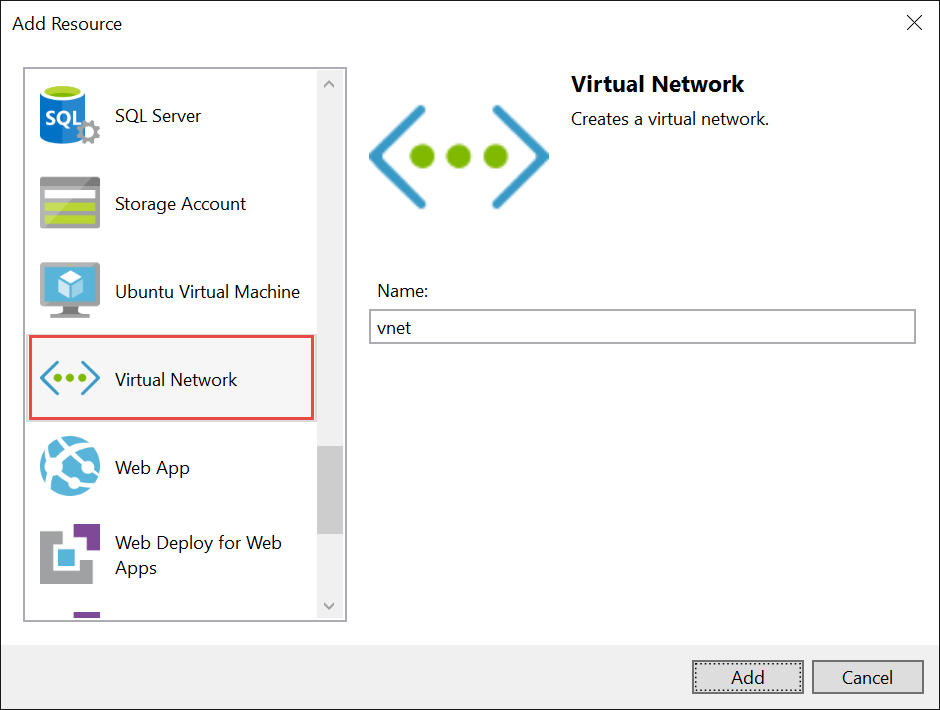

1. In the **JSON Outline** window, right-click **Resources** and select **Add New Resource**.

1. In the **Add Resource** window, select **Windows Virtual Machine**.

    - Set the resource **Name** to *vm*.

    - Set the **Storage account** field to *stg*, which is the storage account you created previously.

    - Set the **Virtual network/subnet** field to *\[variables(‘vnetSubnet1Name/\](vnet)*, which is the virtual network you created previously. By default, it creates two subnets but you can add, remove, or rename the subnets in the template. For this lab, you will just use the first default subnet.

    - Click **Add**.

    

1. In the **JSON Outline** window, right-click on **Resources** and select **Add New Resource**.

1. In the **Add Resource** window, select **Public IP Address**.

    - Set the resource **Name** to *vmpip*.

    - Set the **Network interface** field to *vmNic*. The Network Interface Card (Nic) resource was added when you added the virtual machine resource.

    - Click **Add**.

    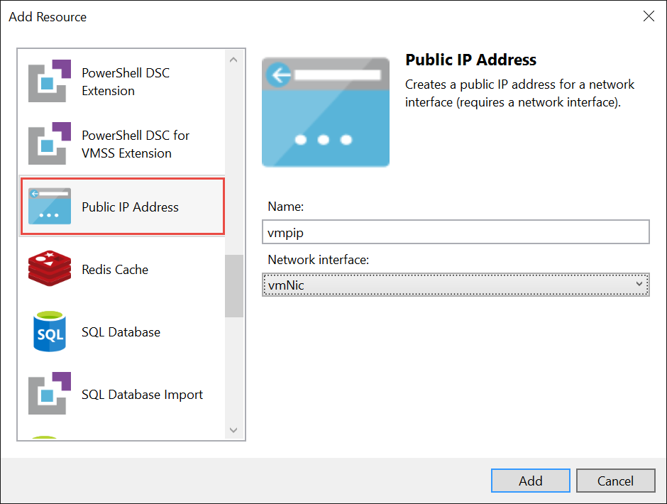

1. In the **JSON Outline** window, expand the **Parameters** node to show all the parameters.

    - Right-click *vmpipDnsName* and select **Delete**.

1. In the editor window for azuredeploy.json, add a new variable called *vmpipDnsName* as shown.

    ```json
    "variables": {

        "stgName": "\[concat('stg', uniqueString(resourceGroup().id))\]",

        "vnetPrefix": "10.0.0.0/16",

        "vnetSubnet1Name": "Subnet-1",

        "vnetSubnet1Prefix": "10.0.0.0/24",

        "vnetSubnet2Name": "Subnet-2",

        "vnetSubnet2Prefix": "10.0.1.0/24",

        "vmImagePublisher": "MicrosoftWindowsServer",

        "vmImageOffer": "WindowsServer",

        "vmOSDiskName": "vmOSDisk",

        "vmVmSize": "Standard\_D1",

        "vmVnetID": "\[resourceId('Microsoft.Network/virtualNetworks', 'vnet')\]",

        "vmSubnetRef": "\[concat(variables('vmVnetID'), '/subnets/', variables('vnetSubnet1Name'))\]",

        "vmStorageAccountContainerName": "vhds",

        "vmNicName": "\[concat(parameters('vmName'), 'NetworkInterface')\]",

        "vmpipName": "vmpip",

        "vmpipDnsName": "\[concat(parameters('vmName'), uniqueString(resourceGroup().id))\]"
    ```

    In last few steps, we refactor the parameter called *vmpipDnsName* into a variable that will automatically generate a unique DNS name for the Public IP Address. If we did not do it, then the end-user deploying the template could potentially experience a DNS name conflict if the value specified is not unique. By refactoring to a variable and using the uniqueString function, we are able to provide a better end-user experience during deployment.

1. In the **JSON Outline** window, click the *vmpip* resource in the **resources** node.

    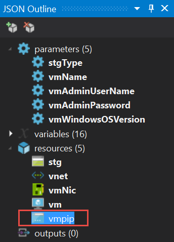

    The **JSON Outline** window is also a useful way to navigate through the JSON text file that describes the environment.

1. Change the **dnsSettings.domainNameLabel** property for the **Public IP Address** to reference the **vmpipDnsName** variable.

    ```json
    {

        "name": "\[variables('vmpipName')\]",

        "type": "Microsoft.Network/publicIPAddresses",

        "location": "\[resourceGroup().location\]",

        "apiVersion": "2015-06-15",

        "dependsOn": \[ \],

        "tags": {

            "displayName": "vmpip"

        },

        "properties": {

            "publicIPAllocationMethod": "Dynamic",

            "dnsSettings": {

                "domainNameLabel": "\[variables('vmpipDnsName')\]"

            }

        }

    }
    ```

1. Press **Ctrl-S** to save the changes.

1. In the **JSON Outline** window, right-click **Resources** and select **Add New Resource**.

1. In the **Add Resource** window, select **PowerShell DSC Extension**.

    - Set the resource **Name** to *dsc*.

    - Set the **Virtual machine** field to *vm*, which is the virtual machine resource you added previously to the template.

    - Click **Add**.

    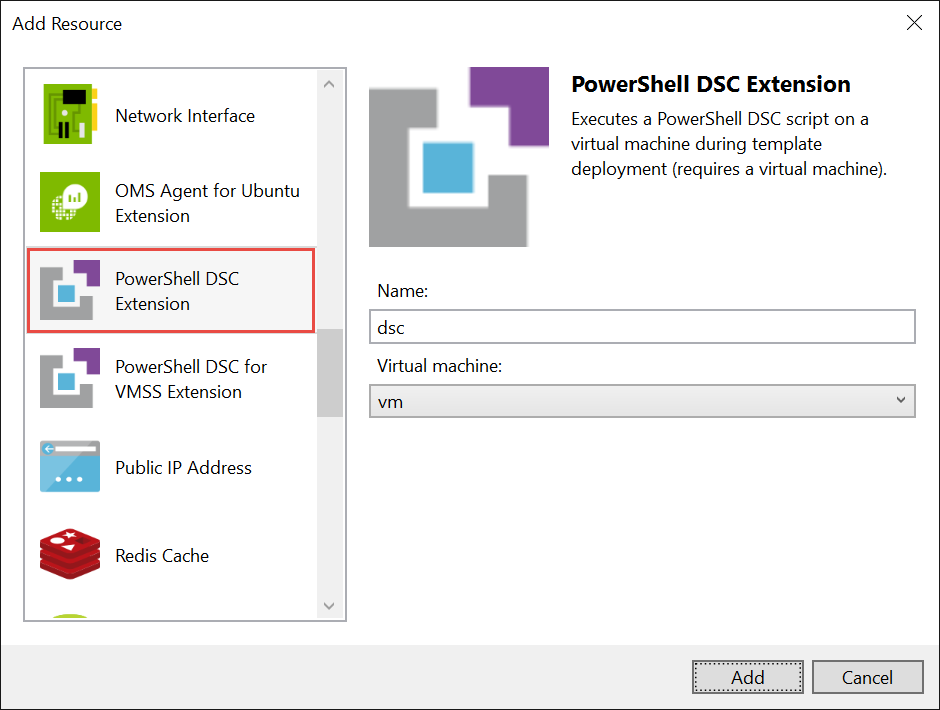

1. In **Solution Explorer**, expand the **DSC** folder and double-click the **dsc.ps1** file.

    - Replace the contents of **dsc.ps1** with the following code.

    ```PowerShell
    Configuration Main

    {

        Param ( \[string\] $nodeName )

        Import-DscResource -ModuleName PSDesiredStateConfiguration

        Node $nodeName

        {

            WindowsFeature WebServerRole

            {

                Name = "Web-Server"

                Ensure = "Present"

            }

            WindowsFeature WebManagementService

            {

                Name = "Web-Mgmt-Service"

                Ensure = "Present"

            }   

            WindowsFeature ASPNet45

            {

                Name = "Web-Asp-Net45"

                Ensure = "Present"

            }

            Script DownloadWebDeploy

            {

                TestScript = {

                    Test-Path "C:\\WindowsAzure\\WebDeploy\_amd64\_en-US.msi"

                }

                SetScript ={

                    $source = "https://download.microsoft.com/download/0/1/D/01DC28EA-638C-4A22-A57B-4CEF97755C6C/WebDeploy\_amd64\_en-US.msi"

                    $dest = "C:\\WindowsAzure\\WebDeploy\_amd64\_en-US.msi"

                    Invoke-WebRequest $source -OutFile $dest

                }

                GetScript = {@{Result = "DownloadWebDeploy"}}

                DependsOn = "\[WindowsFeature\]WebServerRole"

            }

            Package InstallWebDeploy

            {

                Ensure = "Present"

                Path = "C:\\WindowsAzure\\WebDeploy\_amd64\_en-US.msi"

                Name = "Microsoft Web Deploy 3.6"

                ProductId = "{ED4CC1E5-043E-4157-8452-B5E533FE2BA1}"

                Arguments = "ADDLOCAL=ALL"

                DependsOn = "\[Script\]DownloadWebDeploy"

            }

            Service StartWebDeploy

            {

                Name = "WMSVC"

                StartupType = "Automatic"

                State = "Running"

                DependsOn = "\[Package\]InstallWebDeploy"

            }

            Script DownloadWebDeployPackage

            {

                TestScript = {

                    Test-Path -Path "C:\\TR23WebApp.zip"

                }

                SetScript = {

                    $source = "https://github.com/GSIAzureCOE/Networking/raw/master/Demo-TrafficManager/TM-Demo-Solution/TM-Demo/App/TM-Demo-App.zip"

                    $dest = "C:\\TR23WebApp.zip"

                    Invoke-WebRequest $source -OutFile $dest

                }

                GetScript = {@{Result = "DownloadWebDeployPackage"}}

                DependsOn = "\[Service\]StartWebDeploy"

            }

            Script InstallWebDeployPackage

            {

                TestScript = {

                Test-Path -Path "HKLM:\\SOFTWARE\\TR23\\WebDeployPkgInstalled"

            }

            SetScript = {

                $appName = "IIS Web Application Name"

                $siteName = "Default Web Site"

                $msDeployPath = "C:\\Program Files\\IIS\\Microsoft Web Deploy V3\\msdeploy.exe"

                & $msDeployPath "-verb:sync", "-source:package=C:\\TR23WebApp.zip", "-dest:auto,ComputerName=""localhost""", "-setParam:name=""$appName"",value=""$siteName"""

                if ($LASTEXITCODE -eq 0)

                {
                                    
                    New-Item -Path "HKLM:\\SOFTWARE\\TR23\\WebDeployPkgInstalled" -Force

                }

            }

            GetScript = {@{Result = "InstallWebDeployPackage"}}

            DependsOn = "\[Script\]DownloadWebDeployPackage"

            }

        }

    }
    ``` 

1. Press **Ctrl-S** to save the changes.

1. In **Solution Explorer**, double-click **azuredeploy.parameters.json**.

    - Replace the parameters section with the highlighted code.

    ```json
    {

        "$schema": "https://schema.management.azure.com/schemas/2015-01-01/deploymentParameters.json\#",

        "contentVersion": "1.0.0.0",

        "parameters": {

            "vmName": {

                "value": "iisvm"

            },

            "vmAdminUserName": {

                "value": "adminuser"

            },

            "vmAdminPassword": {

                "value": "TechReady23!"

            }

        }

    }
    ```

1. Press **Ctrl-S** to save the changes.

    A best practice is to store credentials in Azure Key Vault and have Azure Resource Manager retrieve the credentials from the vault to provision the administrator credentials in the virtual machine. Azure Key Vault is beyond the scope of this lab so we are storing the credentials in the parameters file for simplicity.

You now have a complete ARM template that provisions an IaaS environment with the following resources:

-   A storage account to store the virtual machine’s hard disk (.vhd).

-   A virtual network with two subnets, a virtual machine requires a virtual network.

-   A virtual network interface card (NIC). It binds the virtual machine to the virtual network.

-   A public IP address resource. It is necessary if you want the virtual machine to be publicly accessible.

-   A PowerShell DSC extension to configure the internals of the virtual machine. The DSC configuration script adds the following configuration:

    -   Configures the virtual machine to be an IIS Web Server.

    -   Adds support for ASP.NET 4.5.

    -   Downloads and installs the Web Deploy Service package.

    -   Starts the Web Deploy Service.

    -   Downloads a sample Web Deploy Package from GitHub.

    -   Installs the Web Deploy Package.

# Exercise : Deploy the ARM Template

## Scenario

In this exercise, you will deploy the ARM template created in the previous exercise. There are several ways to deploy the ARM template including:

-   Using Azure PowerShell—AzureRm cmdlets.

-   Using Azure Command-Line Interface (CLI) from a Mac, Linux, or Windows client.

-   Deploying directly from Visual Studio.

-   Using the **Template Deployment** feature in the Azure portal.

-   Deploying as part of Continuous Deployment Strategy (see TR22 session CT302 ).

For this exercise, you will first deploy from Visual Studio since you used Visual Studio to create the template. Then, you will deploy the same template using PowerShell. You will be using:

-   Visual Studio 2015 with Update 3

-   Microsoft Azure SDK for .NET v2.9.1

-   Azure PowerShell Cmdlets v1.6.0

After completing this exercise, you will understand:

-   How to deploy an ARM template from Visual Studio.

-   How to deploy an ARM template using PowerShell.

## Deploy from Visual Studio

1. Select **Project &gt; Deploy &gt; New Deployment**.

1. In the **Deploy to Resource Group** window

    - Set the **Subscription** field to your Azure Subscription.

    - Set the **Resource Group** field to *&lt;Create New&gt;*.

    - In the **Create Resource Group** dialog, select a **Resource group location** closest to you. It is where the resource group will be created and eventually where the resources will be deployed.

    - Click **Create**.

        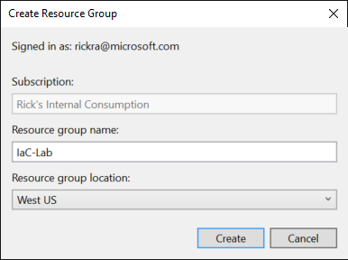

    - Click **Edit Parameters**.

    - In the Edit Parameters dialog:

        - Set the **vmName** field to *iisvm*. Ensure it is lowercase.

        - Set the **vmAdminUserName** field to *adminuser*.

        - Set the **vmAdminPassword** field to *TechReady23!.*

        - Select **Save passwords as plain text in the parameters file**.

        - Click **Save**.

        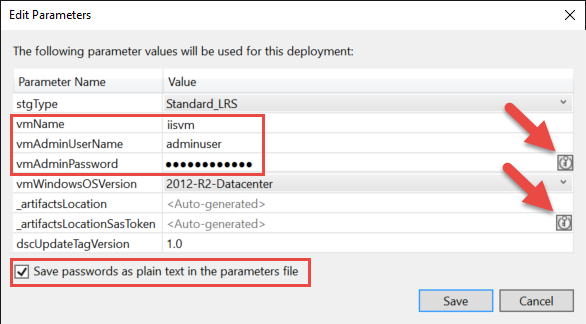

Note: It is a best practice to save passwords in Azure Key Vault instead of in source code. However, Azure Key Vault is beyond the scope of this lab so we are storing the password in the azuredeploy.parameters.json file.

The Visual Studio tools integrate with your Azure Key Vault (assuming you have already created a Key Vault) and enable you to store your passwords and secrets in the vault. To access these features of the Visual Studio tools, click the **Key Vault** icon as shown.

1. Set the **Artifact storage account** field to *&lt;Automatically create a storage account&gt;* if it is not already.

1. Click **Deploy**.

    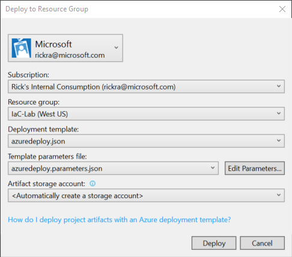

    When you click **Deploy**, Visual Studio invokes the *Deploy-AzureResourceGroup.ps1* PowerShell script that is part of your Azure Resource Group project. You can see evidence of it in the **Output** window as shown. Note: If the **Output** window is not visible, then you can open it by selecting **View &gt; Output** from the main menu.

    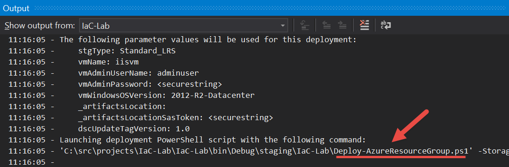

    Explore the output in the **Output** window to understand what the deployment script is doing and review the Deploy-AzureResourceGroup.ps1 script in the project. Some things that are worthy of pointing out include:

    -   The script generates a unique name for a storage account that is used solely to upload the DSC artifacts to blob storage. After the virtual machine is provisioned, the DSC.zip file is copied into the virtual machine using a SAS token and the DSC process internal to the virtual machine is started. The storage account created for this purpose is created in a new resource group call *ARM\_Deploy\_Staging*. If you open the portal, you will see this resource group and the auto-generated storage account. If you look at the blob container in the storage account, you will see the DSC.zip fle.

    -   The script automatically generates the DSC.zip file. If you add additional DSC modules such as xNetworking, xActiveDirectory, xSQServer, etc. to this folder, the script will include them in the DSC.zip file that is copied to the virtual machine.

    -   The script automatically generates a SAS token (and URL) that is used by the virtual machine after it is provisioned to copy the DSC.zip file locally and start the DSC process.

    -   The bulk of the script is only applicable if there are artifacts that need to be uploaded. For example, in this case we need the DSC configuration (an artifact) copied to the virtual machine to configure it the way we want. If we did not have any artifacts, then the script essentially calls **New-AzureRmResourceGroup** to create the resource group and then **New-AzureRmResourceGroupDeployment** to deploy the resources into the resource group.

A successful deployment will take about 15 minutes to finish. You will see evidence of it in the **Output** window as shown.

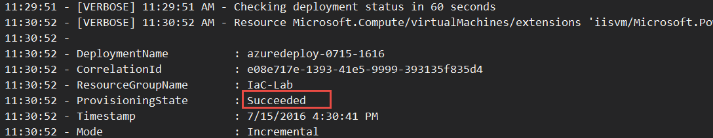

If your deployment is still running, you may continue to the next section. It is not necessary to wait. Leave Visual Studio open so you can come back to it later.

## Deploy using PowerShell

1. Open PowerShell on your machine. Press **Windows Key** and enter **PowerShell**.

1. Right-click **Windows PowerShell** and select **Run as administrator**.

    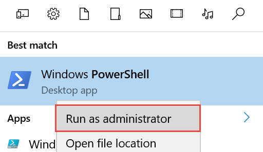

1. In the PowerShell console, run the **Set-ExecutionPolicy** cmdlet to allow script execution on your machine.

    `Set-ExecutionPolicy -ExecutionPolicy RemoteSigned -Force`

    Note: It is a one-time step and does not need to be repeated every time. It is also why you had to run PowerShell as an administrator—because you are changing the execution policy on the machine.

    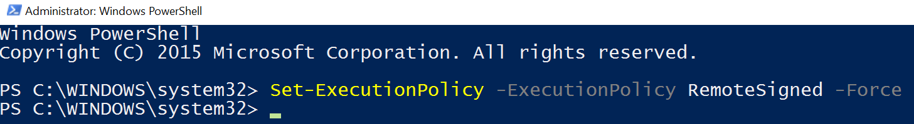

1. Change the directory to the location where your Azure Resource Group project was created. Specifically, you want to be in the directory where the Deploy-AzureResourceGroup.ps1 script is located.

    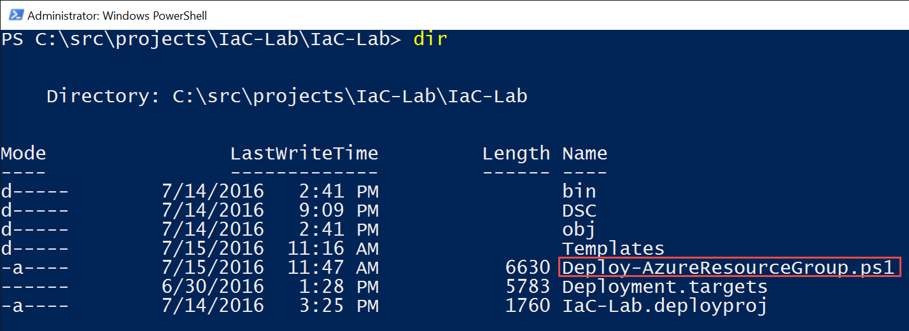

1. Sign-in to your Azure subscription using the **Login-AzureRmAccount** cmdlet.

    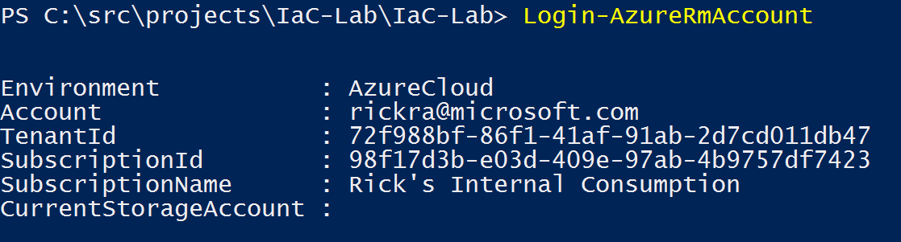

1. Invoke the deployment script from the Azure Resource Group project using the command shown.

    `.\\Deploy-AzureResourceGroup.ps1 -ResourceGroupName "IaC-Lab-2" -ResourceGroupLocation "westus" -UploadArtifacts`

If you recall from earlier observations of the script, there is one mandatory parameter that is the **ResourceGroupLocation**, for which a value of *westus* is provided. The **ResourceGroupName** parameter is not mandatory, however it defaults to *IaC-Lab* and since that was the resource group name you used when deploying from Visual Studio, a new value needs to be provided. Finally, the **UploadArtifacts** switch must be specified to indicate to the script that we want it to create the DSC.zip file, create a storage account to store the DSC.zip file, and other steps as identified previously.

The output from the script is the same as what you saw in the scenario where you deployed directly from Visual Studio. After about 15 minutes, you will see output indicating a successful deployment as shown.

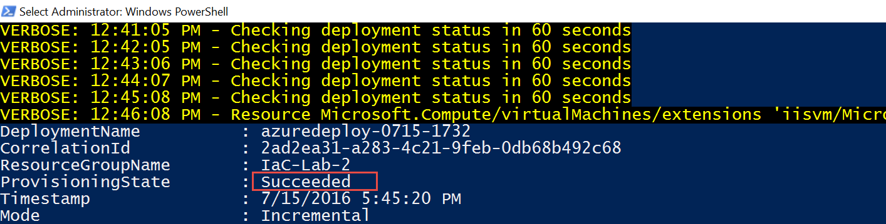

If your deployment is still running, you may continue to the next section. It is not necessary to wait. Leave the PowerShell console open so you can come back to it later if you want.

# Exercise 3: Verify the ARM template deployment

## Scenario

In this exercise, you will verify that the infrastructure as described in the ARM template and the virtual machine configuration as described in the DSC script are working as expected.

Recall, the DSC script configures the virtual machine as an IIS server and deploys a web deploy package to the virtual machine. The web deploy package contains the application we expect IIS to serve when a user browses to the virtual machine’s public IP address.

## Create a new Azure Resource Group Project

1. Sign in to the Azure portal (<https://portal.azure.com>).

1. In the Azure portal, click **Resource Groups**.

1. Click the resource group named *IaC-Lab*. Recall, it was the resource group deployed using Visual Studio. The deployment should be complete by this time.

    The **Resource Group** blade will display all the resources in the resource group.

    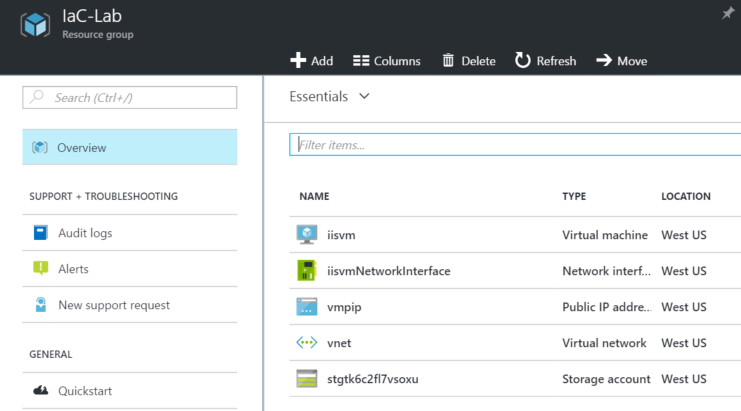

1. Click the **Public IP Address** resource named *vmpip*.

1. In the **Public IP Address** blade, copy either the **IP Address** or the **DNS name** values shown in the **Essentials** section of the blade.

    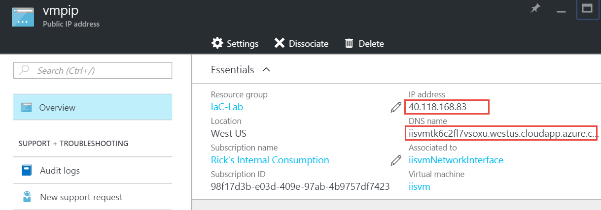

1. Open a browser window and navigate to either the **IP Address** or **DNS Name**. If the deployment was successful, you will see the application that was included in the web deploy package as shown.

    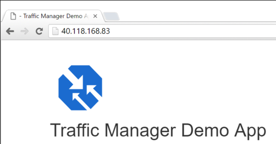
