# Continuous Integration Lab

During this lab, you will work in a simulated environment with the following computers or virtual machines.

## Computers and Virtual Machines Used in This Lab

Your own laptop with Visual Studio (or if you prefer a Virtual Machine in Azure) with Visual Studio).

## Logon Credentials

A Microsoft account, either one you already have, or one you create specifically for this lab.

# Lab Overview

## Abstract

During this lab, you will run several exercises to help you understand continuous integration and automated testing using Visual Studio and Visual Studio Team Services.

## Learning Objectives

After completing the exercises in this lab, you will be able to:

-   Setup an automated build in Visual Studio Team Services.

-   Setup automated test cases in Visual Studio Team Services.

**Estimated time to complete this lab: *60* minutes**

# Choose a Scenario

Choose one of the three scenarios listed below before continuing.

-   **Scenario A: with tests (easiest)**

    -   Choose this scenario if you have little experience developing web applications and/or creating unit tests.

    -   In this scenario, you begin with a complete project that includes a basic ASP.NET MVC-based web application and unit tests. You will add some basic functionality to the web application and writing one or more unit tests to ensure the functionality meets all requirements.

    -   We optimized the web application for unit testing.

-   **Scenario B: easy to test (more challenging)**

    -   Choose this scenario if you have moderate experience developing web applications and/or creating unit tests.

    -   In this scenario, you begin with a project that includes a basic ASP.NET MVC-based web application with no unit tests. You will add a unit test project (using NUnit and, optionally, the mocking framework of your choice) and create several unit tests to ensure that the application functionality meets requirements.

    -   We optimized the web application for unit testing.

-   **Scenario C: hard to test (most challenging)**

    -   Choose this scenario if you have advanced experience developing web applications and/or creating unit tests.

    -   In this scenario, you being with a project that includes a basic ASP.NET MVC-based web application that was not designed with testability in mind with no unit tests. You will review the application and make minor modifications to ensure you can write effective, isolated unit tests. Once you make the appropriate modifications, you will create several unit tests to ensure the application functionality meets requirements.

    -   We did not optimize the web application for unit testing.

# Exercise : Setup the Azure App Service Plan and WebApps

## Scenario

In this exercise, you will use a preconfigure ARM template to populate the App Service Plan and WebApp as Azure Resource, so you can deploy your application to see it in action.

After completing this exercise, you will understand how to create an Azure Web using Azure Resource Manager from Visual Studio.

## Prerequisites 

This section lists the prerequisites required for this demonstration.

-   Azure subscription

-   Active Visual Studio Team Services (VSTS) account

## Exercise Steps

1.  Download the deployment project zip from [here](./code/code.zip).

1.  Extract the zip to a folder on your hard drive.

1.  Open the extracted project in Visual Studio.

    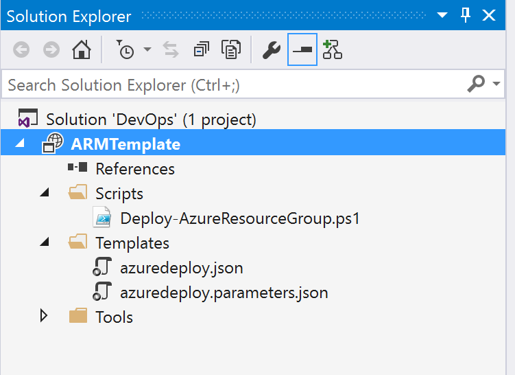

1.  Right-click the **ARMTemplate** and select **Deployment** &gt; **New** **Deployment**.

    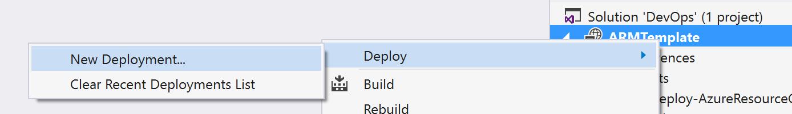

1.  Complete the deployment parameters as per the screenshot example:

    -   Resource group name (for example, DevOpsDemo)

    -   Resource group location (closest to where you are based to avoid latency)

        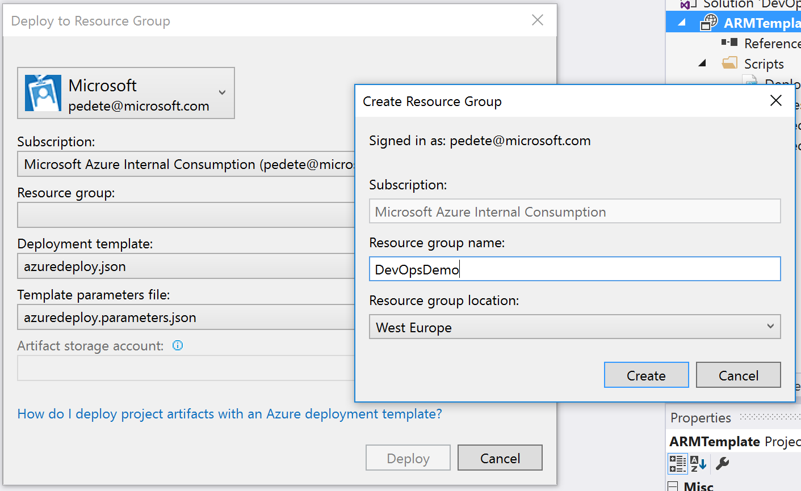

1.  Edit the parameters for the template parameters file as per the screenshot example.

    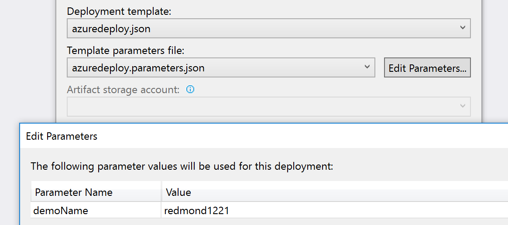

1.  Deploy the template. You can verify the deployment task in the Visual Studio Output window.

    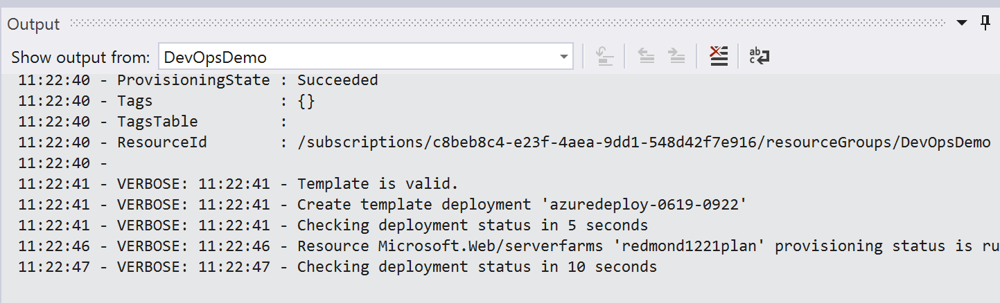

1.  Verify the Resource Group and resources created successfully from the Azure Portal.

    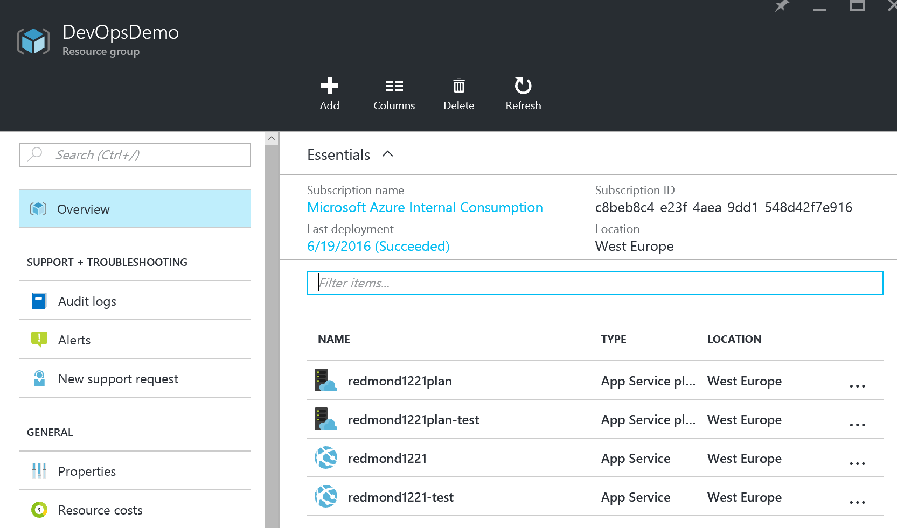

The creation of an Azure Resource Group, in which you deployed two App Service Plans and two WebApps, that will be used later in this lab and in subsequent labs is complete.

# Exercise : Setup the Visual Studio Team Services Project Repository

## Scenario

In this exercise, you will create a new Visual Studio Teams Services project online, which you will use for the Continuous Integration exercise.

After completing this exercise, you will understand:

-   How to create a Visual Studio Team Services project.

-   How to add code and commit it to the repository.

## Exercise Steps

1.  Navigate to <http://visualstudio.com>.

1.  Scroll to Visual Studio Team Services and click **Get started for free**.
    
    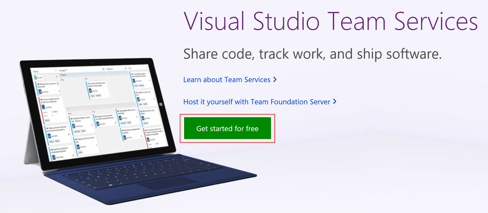

1.  Sign in with a Microsoft account.

1.  If the Microsoft account is already associated with a VSTS project, VSTS redirects you to that project. In that case, skip to step 7.

1.  Enter a name for the project (for example, DevOpsDemo), and click **Create project**.
    
    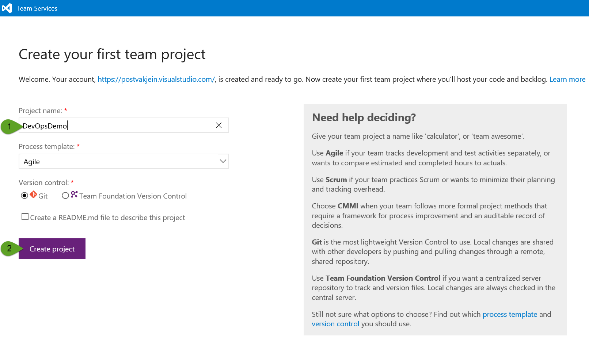

1.  Skip to step 11.

1.  If received a project, you will see the project name after **Team Services** in the upper-left corner. Click **Team Services** to go to the main dashboard of your VSTS environment.
    
    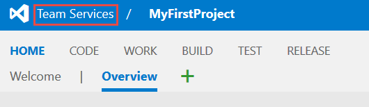

1.  Click **New** to create a new project.
    
    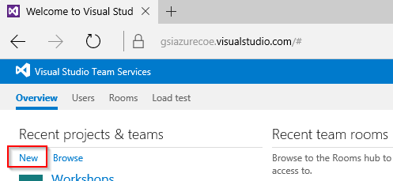

1.  Enter a name for the project (for example, DevOpsDemo) and click **Create project**.
    
    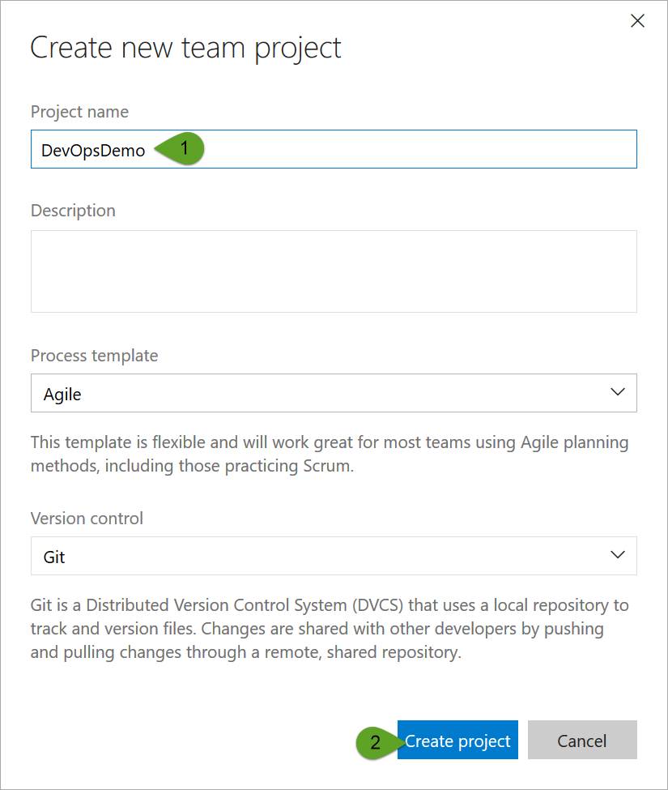

1. When the project is created, click **Navigate to project**.

1. On the project page, click **Open in Visual Studio**.
    
    

1. Click **Clone the repository** from VSTS to your local machine by selecting a folder on your local hard drive.
    
    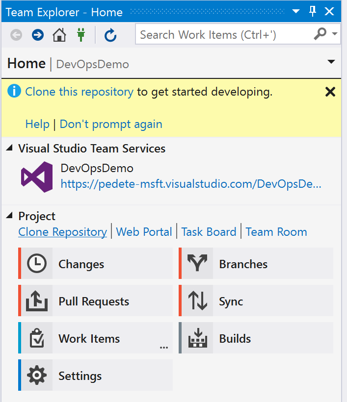

1. Set the location to clone to and click **Clone**.
    
    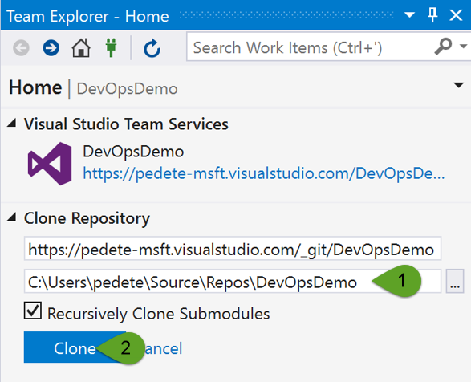

1. Download the lab materials:

    -  [For Scenario A (with tests)](./code/CalculatorTestDemo-WithTests.zip)

    -  [For Scenario B (easy to test)](./code/CalculatorTestDemo-EasyToTest.zip)

    -  [For Scenario C (hard to test)](./code/CalculatorTestDemo-HardToTest.zip)

1. Extract the lab materials to a location on your disk.

1. Open the extracted folder.

1. In the extracted folder, open the folder that matches the scenario that you chose at the beginning of the lab.

1. Copy the contents of the scenario folder to the directory in which you cloned your repository.

1. Go back to Visual Studio. The extracted scenario files should show up as changes in the Team Explorer.

1. Enter a comment and click the small arrow to the right of **Commit All** to display additional options.

1. Click **Commit & Push** to push the changes to VSTS.
    
    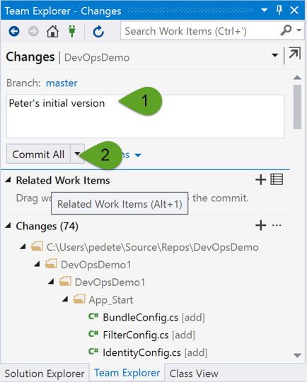

1. Verify that the solution is visible in the **Code** tab of VSTS

    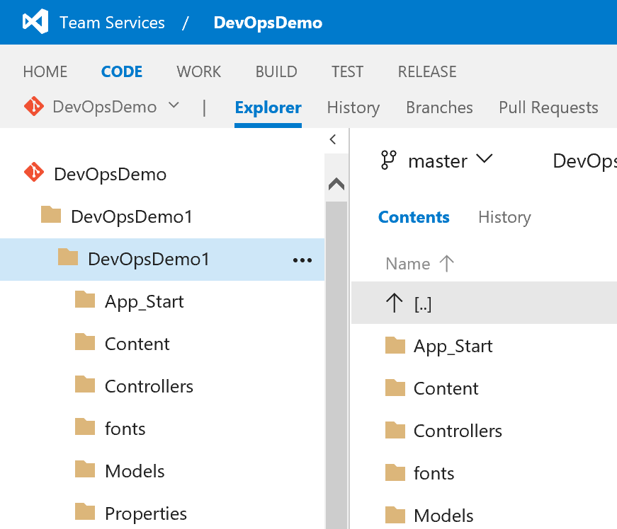

The configuration of a new VSTS Project is complete including: synchronizing it offline to your development station, creating a new ASP.NET Web Application, and uploading the changes to VSTS.

# Exercise 3: Create Automated Tests

Choose the appropriate scenario below to continue.

## Scenario A: with tests (easiest)

In this exercise, you add a small validation feature to the application and an additional unit test to ensure that the change meets requirements. You will also create a Visual Studio Team Services project to host your application in preparation for configuring Continuous Integration (CI) in the next exercise.

After completing this exercise, you will understand:

-   How to add validation logic to an existing ASP.NET MVC-based web application controller.

-   How to create unit tests to ensure the application meets requirements.

-   How to set up a Visual Studio Team Services project.

## Exercise Steps

1.  Within Visual Studio, run the application by either pressing **F5** or clicking **Run**.

    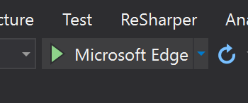

1.  Click **Divide** in the menu bar to open the **Divide** view.

    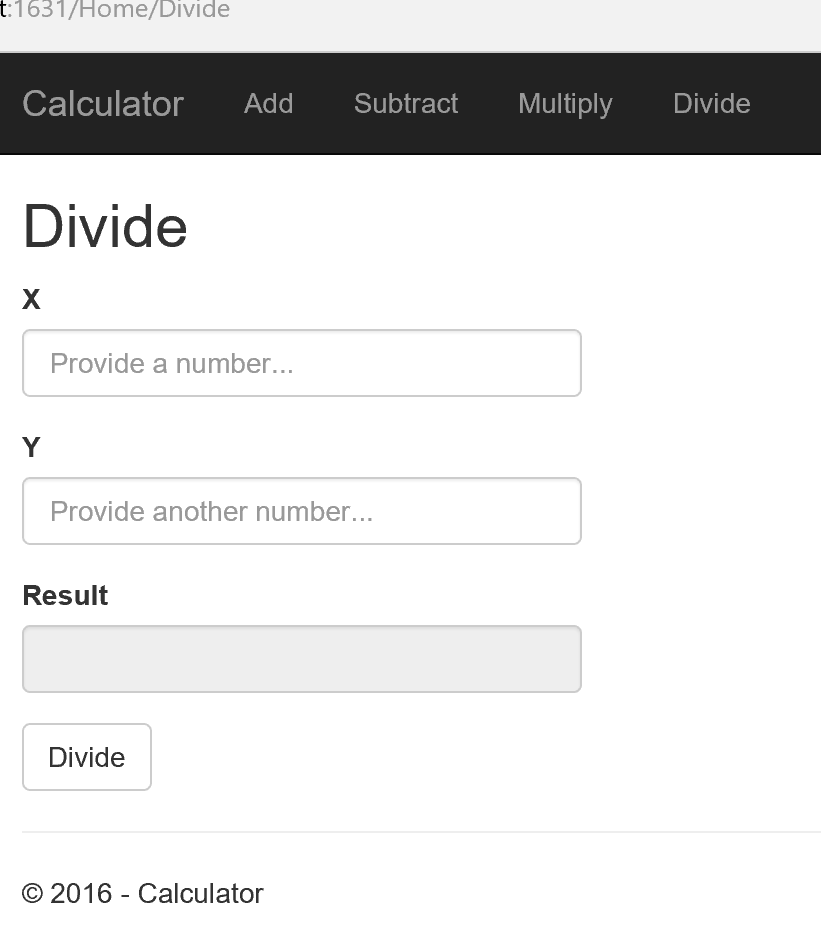

1.  We want to prevent the user from dividing by zero (Y = 0). If the user attempts to divide by zero, a validation error displays. This functionality does not yet exist. In Visual Studio, locate and open **HomeController.cs**.

    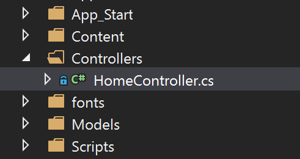

1.  Within the controller, locate the **Divide** method that takes a **CalculatorModel** as its single parameter. This method is also decorated with the **HttpPost** attribute. It is the last method in the file.

    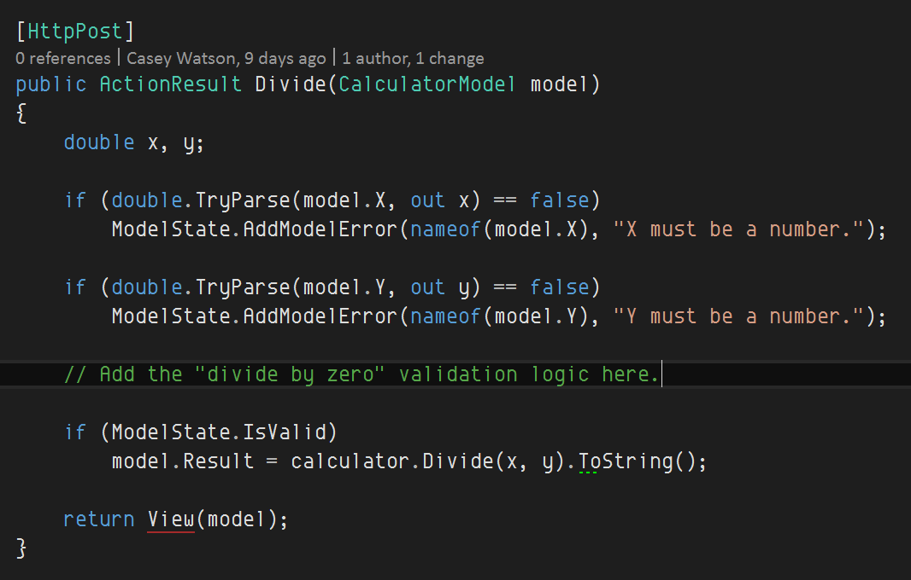

1.  Using the two existing validation blocks as an example (**“X must be a number.”** and **“Y must be a number.”**), add a third validation block that ensures that if **Y** is equal to zero (i.e., (y == 0)) a validation error displays. Try to make the change on your own first. If you get lost, refer to the picture below.

    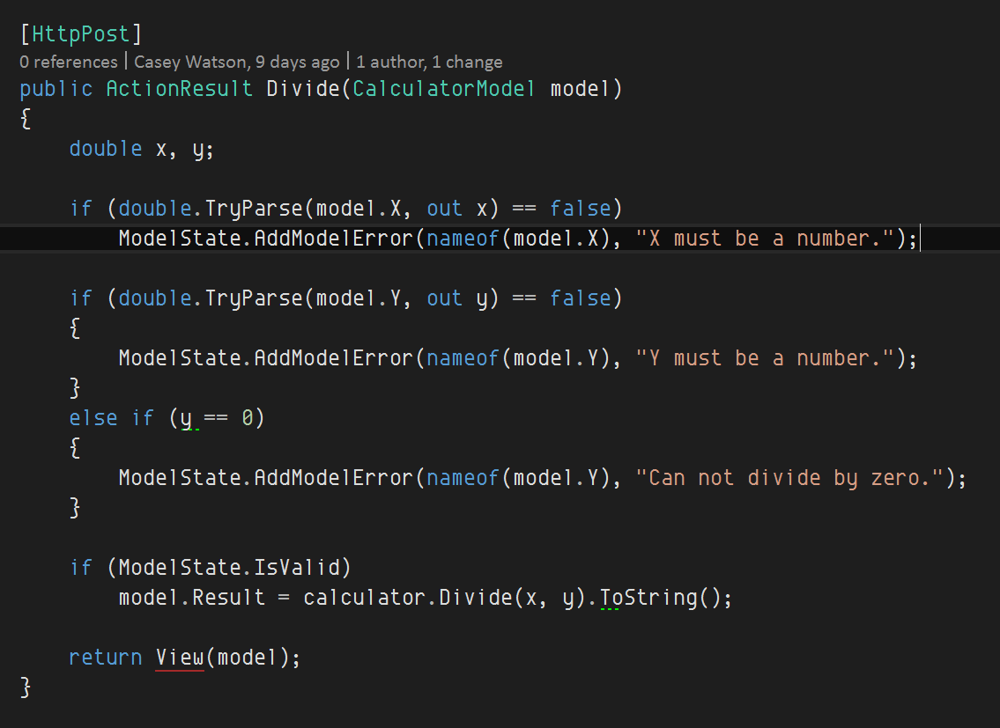

1.  Test the application to ensure the validation works as expected by pressing **F5** or clicking **Run**.

1.  Navigate to the **Divide** view and attempt to divide by zero. A validation error should display.

    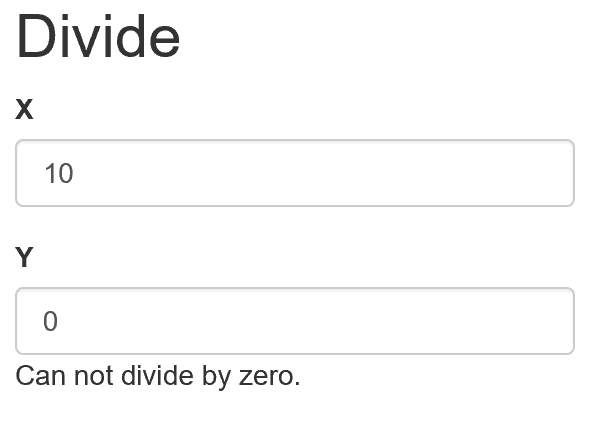

1.  You need to add an additional unit test to ensure the new functionality is not accidentally broken in the future. In **Solution Explorer**, navigate to the **Calculator.Web.Tests** project and open **HomeControllerTests.cs**.

    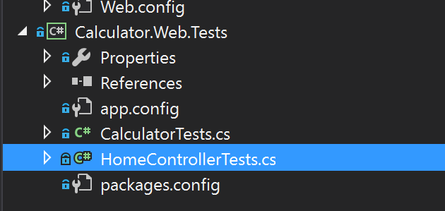

1.  This file contains tests that you will execute every time a Continuous Integration build is run. Look at the **Should\_raise\_validation\_error\_when\_adding\_where\_X\_is\_not\_a\_number** test method. Note that it is decorated with a **Test** attribute. It indicates to Visual Studio Team Services that this method contains a test that should execute upon building. Also, note that the method follows the **Arrange/Act/Assert (AAA)** pattern covered in the previous session. 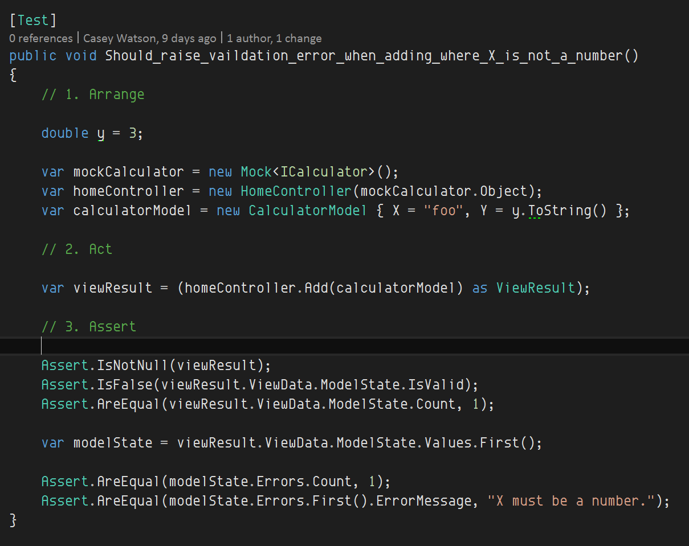

1.  In the same file, add a new test that verifies the divide by zero functionality that we just added to the application using the same **Arrange/Act/Assert (AAA)** pattern. Try to create the test on your own first using other tests in the same file as an example. If you get lost, refer to the image below.

    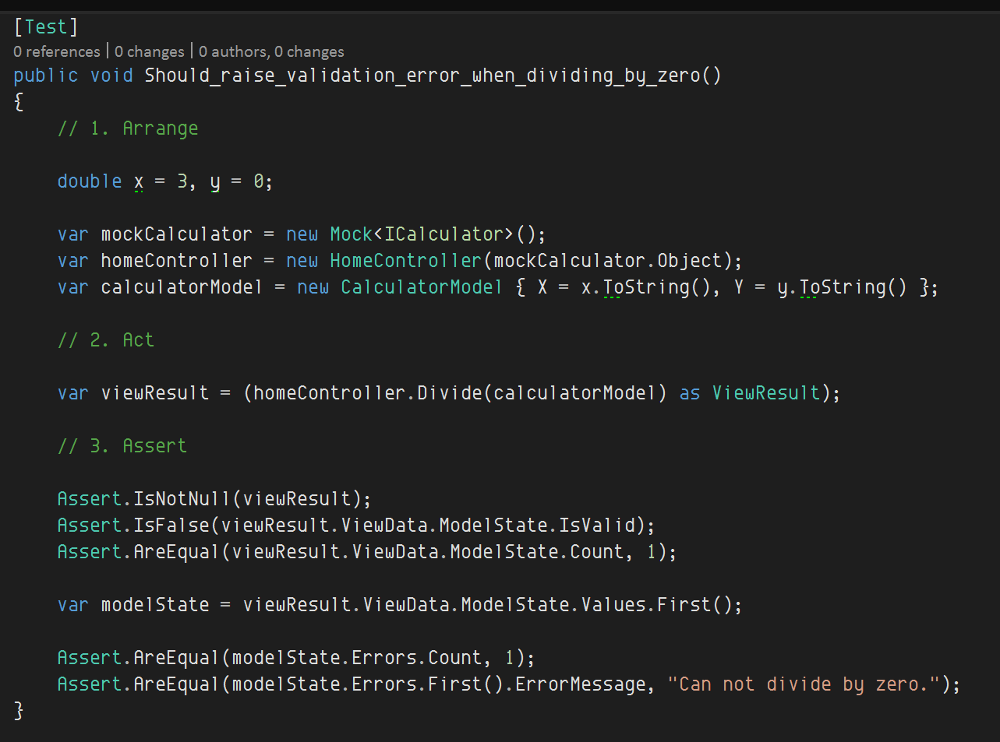

1.  Click **Test** **&gt; Run &gt; All Tests**.

    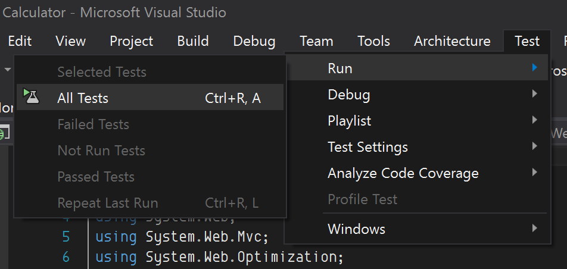

1.  Ensure that all tests run successfully.

    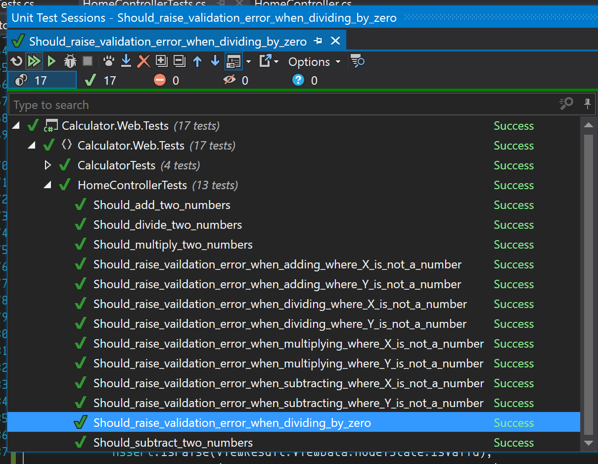

## Scenario B: easy to test (more challenging)

In this exercise, you will create a series of unit tests that ensure that the application meets all requirements. Once you create your tests and ensure they all run successfully, you will create a Visual Studio Team Services project to host your application in preparation for configuring Continuous Integration (CI) in the next exercise.

After completing this exercise, you will understand:

-   How to create a unit test project.

-   How to use both a unit test framework and mocking framework to create effective, efficient unit tests.

-   How to set up a Visual Studio Team Services project.

## Exercise Steps

1.  Right-click the **Calculator.Web.Tests** project and select **New &gt; Class**.

    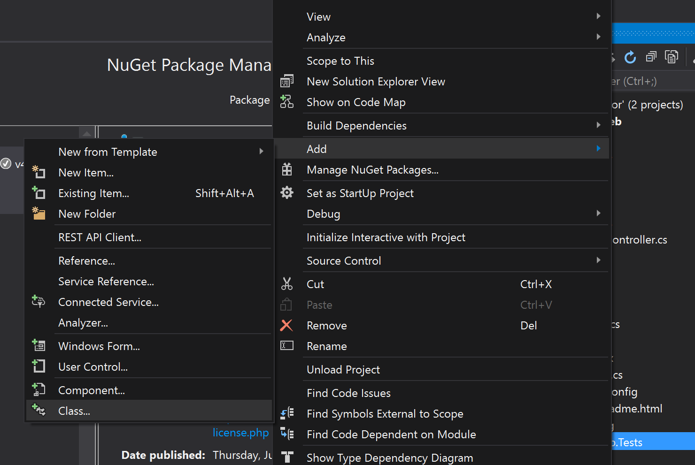

1.  Name the new class **HomeControllerTests.cs** and click **Add.** This place is where you will add unit tests for your **HomeController**.

1.  If needed, double-click on the **HomeControllerTests.cs** in the **Solution Explorer** to open it.

1.  Ensure the class is **public** and decorate it with the **TestFixture** attribute as shown. The **TestFixture** attribute indicates to the **NUnit** framework that this class contains unit tests. We can execute these tests manually from **Visual Studio** or automatically as part of a Continuous Integration (CI) process from **Visual Studio Team Services**. Note that the **TestFixture** attribute is available from within the **NUnit.Framework** namespace.

    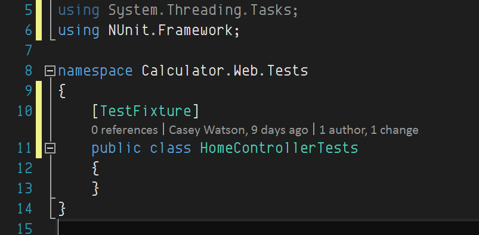

1.  It is time to add our first unit test. Look at **HomeController.cs** located in the **Calculator.Web** project. Note the functionality is basic. There are only eight methods. There is a method to display the **Add, Subtract, Multiply**, and **Divide** views and methods to perform the calculations once the user posts the form back to the web server.

1.  For our first test, ensure that given two numbers, the web application can add them together and return the result to the user. Open the **HomeControllerTests.cs** file within the **Calculator.Web.Tests** project and add the following test. 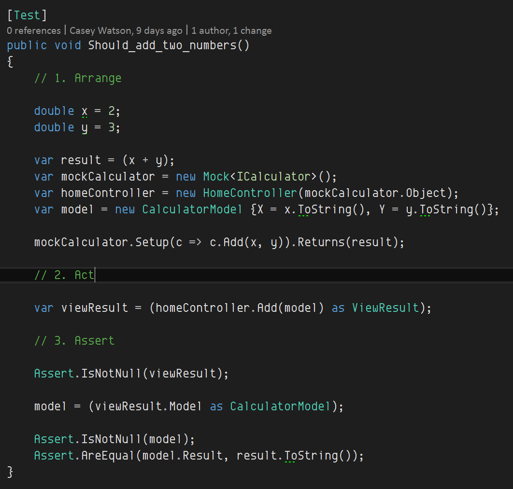

1.  Take a moment to review this test. Note that it follows the same **Arrange/Act/Assert (AAA)** model discussed in the previous session.

    1.  The test name is clear and easy to understand. The method is decorated with **NUnit’s Test** attribute that indicates to **NUnit** that this method contains a test that should be executed.

    1.  There are a number of things happening in the **Assert** part of this test. First, we are defining the inputs that we will use and the expected output. Next, we use the popular **Moq** framework to mock out the **ICalculator** that will be injected into the **HomeController**. By mocking out this dependency, we can strictly control its behavior and ensure that we are testing only the **HomeController**. We also setup the mock to ensure it behaves as we would expect the calculator to.

    1.  Next, we **Act** and capture the result of calling **Add** on the **HomeController**. This method would normally be called by an ASP.NET MVC view but, in this case, we are testing only the controller itself.

    1.  Finally, we **Assert** that the value obtained from the **HomeController** is the one that we expected. If any of these assertions are false, the test will fail.

1.  What else should we test? It is important that we test each of the different operations (**Add, Subtract, Multiply,** and **Divide**) but what are some other cases that we should test for? What happens when the user does not provide **X**? What if the user does not provide either value? Think of different cases that you should test for and add appropriate tests to the **HomeControllerTests.cs** file. Remember that at this point we are **testing only the HomeController and not the Calculator**.

1.  Ensure all of your tests pass by right-clicking **HomeControllerTests.cs** and selecting **Run Unit Tests.**

    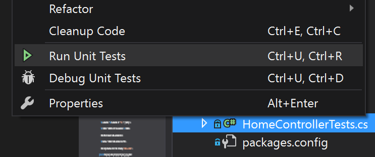

    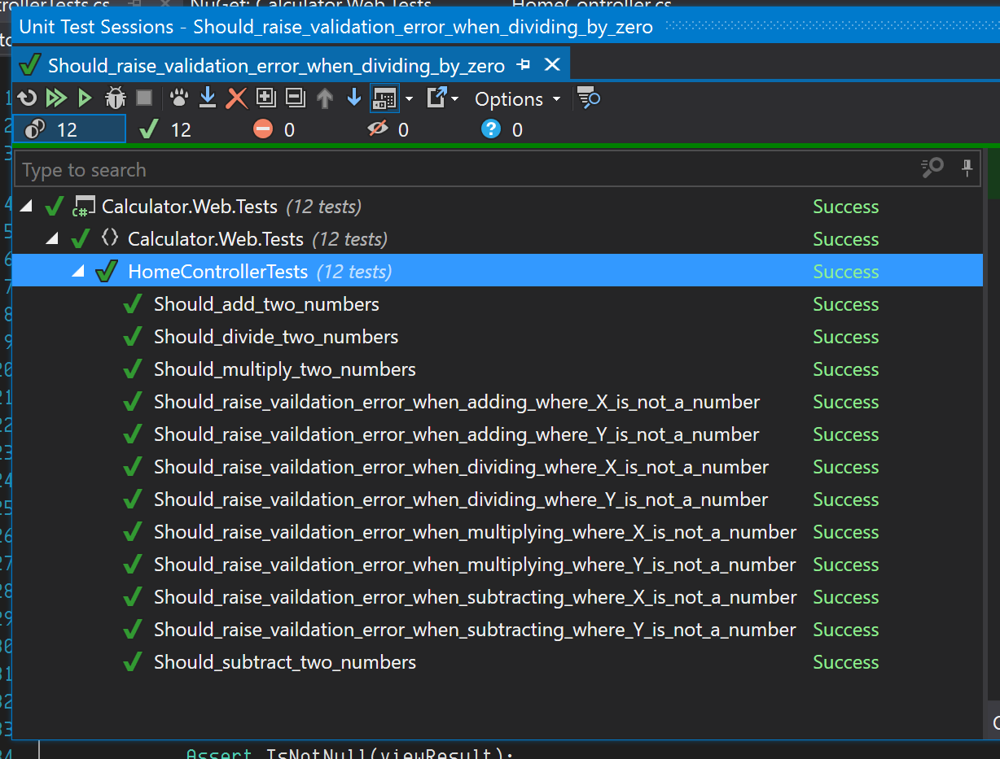

1. Now that you have tested the **HomeController**, it is important you test the **Calculator**. Create a new file named **CalculatorTests.cs** and create a few tests to ensure the functionality of the **Calculator** meets all of your requirements. Does the **Calculator Add, Subtract, Multiply**, and **Divide** as expected? Are there any unique edge cases that you should account for? Carefully consider whether you need to use mocks when testing the **Calculator**. Does **Calculator** have any dependencies that needed to be mocked?

1. Ensure that all of your calculator tests pass.

    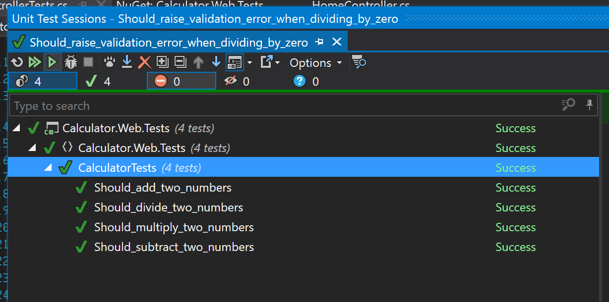

## Scenario C: Hard to Test (Most Challenging)

Some applications are more **testable** than others are. In this scenario, we are going to look at an application that is **tightly coupled**. Tightly coupled applications are more difficult to test because it is difficult to isolate and test individual components. In this exercise, you **refactor** an existing ASP.NET MVC-based web application by making it **loosely coupled** and easier to effectively unit test. Once you have refactored the application, you will create a series of unit tests to ensure that the application meets all requirements. Once you have created your unit tests and ensured that they all run successfully, you will create a Visual Studio Team Services project to host your application in preparation for configuring Continuous Integration (CI) in the next exercise.

After completing this exercise, you will understand:

-   How to modify an application to make it more **loosely coupled**.

-   The basics of **dependency injection**.

-   How to use both a **Unit Test Framework** and **Mocking Framework** to create effective, efficient unit tests.

-   How to set up a Visual Studio Team Services project.

## Exercise Steps

1.  Go to the **Calculator.Web** project in **Solution Explorer,** expand the **Controllers** folder, and open **HomeController.cs**.

1.  Take a moment to familiarize yourself with the code. Notice that the calculator operations do not take place within the controller itself but are offloaded to a separate **Calculator** class that is instantiated when the controller is created. While it is certainly smart to encapsulate the calculator in its own class, the calculator is hard coded using a concrete type directly in the controller making it extremely difficult to test the controller in an isolated way. You will always be, by design, testing the **Calculator** class by association. We need to be able to test the **HomeController** and **Calculator** independently of one another.

    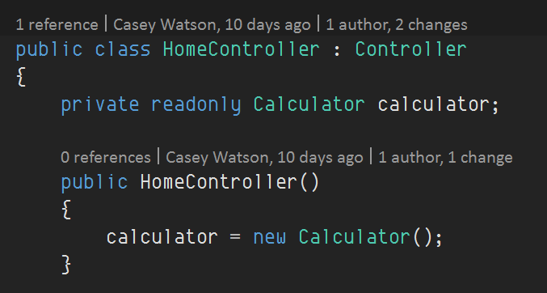

1.  To make this application more loosely coupled, we first need to remove the dependency on the concrete **Calculator** class. We need to define an interface, **ICalculator**, which the **Calculator** class implements and always work off that interface. Right-click the **Calculator.Web** project in **Solution Explorer** and select **Add &gt; Class**.

    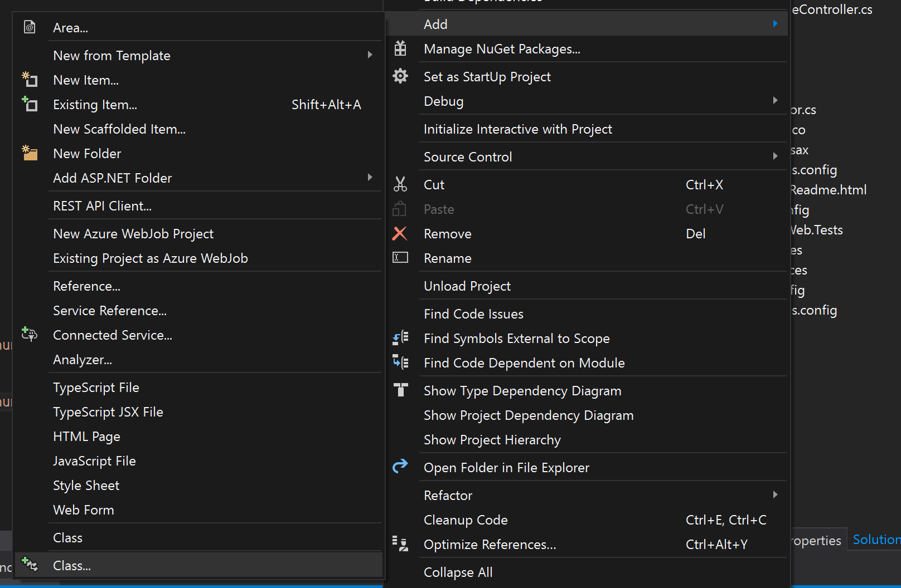

1.  When prompted for the class name, enter **ICalculator**. Click **OK** to continue.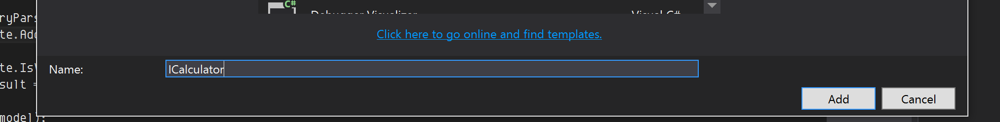

1.  Open the newly created **ICalculator.cs** and modify it as shown. Note that we have changed from a **class** to an **interface** and we have made the interface **public**. Note that **ICalculator** defines all of the same methods that **Calculator** has.

    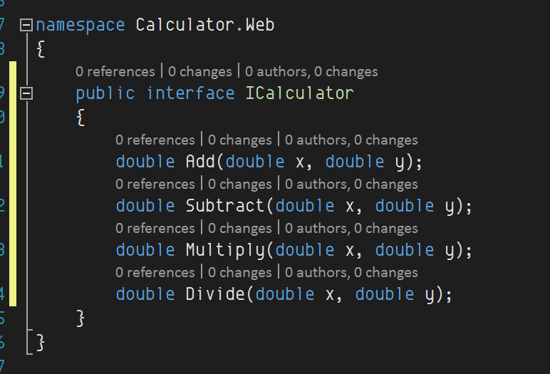

1.  We need to associate the **ICalculator** interface with the **Calculator** class. Open **Calculator.cs** and update it as shown \\. **Calculator** now *implements* **ICalculator.**

    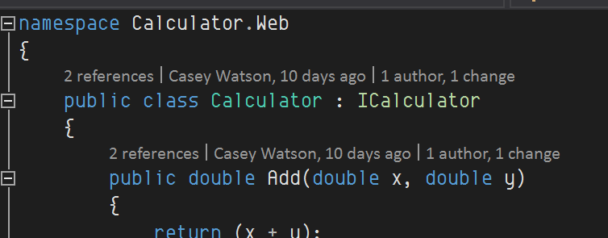

1.  Next, we need to *inject* the calculator into **HomeController**. Open **HomeController.cs** and modify it as shown. Note that the **HomeController** no longer uses the **Calculator** class but works directly against the **ICalculator** interface making it easier to replace the calculator with a different version in the future and to test **Calculator** and **HomeController** independently. The old code has been commented out to highlight the change.

    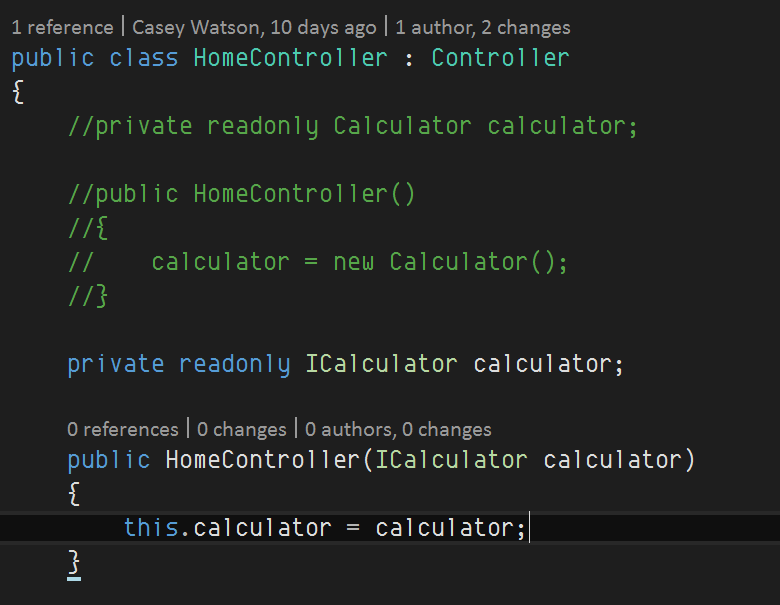

1.  Everything looks good, but how do we actually get **ICalculator** into **HomeController**? For that, we use **dependency injection**. **Ninject**, an extremely popular and easy-to-learn dependency injection framework was added to the **Calculator.Web** project. In **Solution Explorer**, expand the **App\_Start** folder and open **NinjectWebCommon.cs**.

    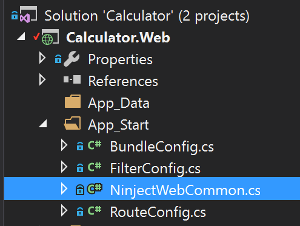

1.  Scroll to the bottom of **NinjectWebCommon.cs** and locate the **RegisterServices** method. Update the method to look like the screenshot. This code tells ASP.NET MVC that any time anyone asks for **ICalculator**; provide them with the **Calculator** class. When we run our web application, **Calculator** will be provided automatically to **HomeController**.

    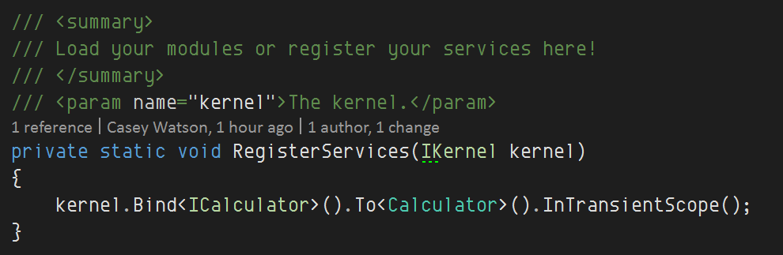

1. With these simple changes, we have made our application more **loosely coupled** and considerably easier to unit test. Now, we can test the **Calculator** independently of the **HomeController**. Verify that your changes work by running the application.

    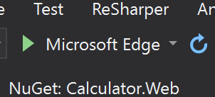

1.  Now it is time to write some unit tests. Right-click the **Calculator.Web.Tests** project and select **New &gt; Class**.

    

1.  Name the new class **HomeControllerTests.cs** and click **Add.** You will add unit tests for your **HomeController**.

1.  If needed, double-click the **HomeControllerTests.cs** in **Solution Explorer** to open it.

1.  Ensure the class is **public** and decorate it with the **TestFixture** attribute as shown. The **TestFixture** attribute indicates to the **NUnit** framework that this class contains unit tests. We can execute these tests manually from **Visual Studio** or automatically as part of a Continuous Integration (CI) process from **Visual Studio Team Services**. Note that the **TestFixture** attribute is available from within the **NUnit.Framework** namespace.

    

1.  Now it is time to add our first unit test. Look at **HomeController.cs** located in the **Calculator.Web** project. Note that the functionality is basic. There are only eight methods. There is a method to display the **Add, Subtract, Multiply**, and **Divide** views and methods to perform the calculations once the user posts the form back to the web server.

1.  For our first test, let us ensure that given two numbers, the web application can add them and return the result to the user. Open the **HomeControllerTests.cs** file within the **Calculator.Web.Tests** project and add the following test. 

1.  Take a moment to review this test. Note that it follows the same **Arrange/Act/Assert (AAA)** model discussed in the previous session.

    1.  The test name is clear and easy to understand. The method is also decorated with **NUnit’s Test** attribute, which indicates to **NUnit** that this method contains a test that should be executed.

    1.  There are a number of things happening in the **Assert** part of this test. First, we are defining the inputs that we will use and the expected output. Next, we are using the popular **Moq** framework to mock out the **ICalculator** that will be injected into the **HomeController**. By mocking out this dependency, we can strictly control its behavior and ensure that we are testing only the **HomeController**. We also setup the mock to ensure that it behaves as we would expect the calculator to.

    1.  Next, we **Act** and capture the result of calling **Add** on the **HomeController**. This method would normally be called by an ASP.NET MVC view but, in this case, we are testing only the controller itself.

    1.  Finally, we **Assert** that the value obtained from the **HomeController** is the one that we expected. If any of these assertions are false, the test will fail.

1.  What else should we tested? It is important that we test each of the different operations (**Add, Subtract, Multiply**, and **Divide**) but what are some other cases that we should test for? What happens when the user does not provide **X**? What if the user does not provide either value? Think of different cases that you should test for and add appropriate tests to the **HomeControllerTests.cs** file. Remember that at this point we are **testing only the HomeController and not the Calculator**.

1.  Ensure all of your tests pass by right-clicking **HomeControllerTests.cs** and select **Run Unit Tests.**

    

    

1. Now that you have thoroughly tested the **HomeController**, it is important that you test the **Calculator**. Create a new file named **CalculatorTests.cs** and create a few tests to ensure that the functionality of the **Calculator** meets all of your requirements. Does the **Calculator Add, Subtract, Multiply**, and **Divide** as expected? Are there any unique edge cases that you should account for? Carefully consider whether you need to use mocks when testing the **Calculator**. Does **Calculator** have any dependencies that needed to be mocked?

1. Ensure that all of your calculator tests pass.

    

# Exercise 4: Use Visual Studio Team Services to create a new build (Continuous Integration)

## Scenario

In this exercise, you will create a build for Continuous Integration (CI).

After completing this exercise, you will understand hot to setup a Build Pipeline in VSTS.

## Exercise Steps

1.  From your VSTS project, select **Build** and click **+**.

    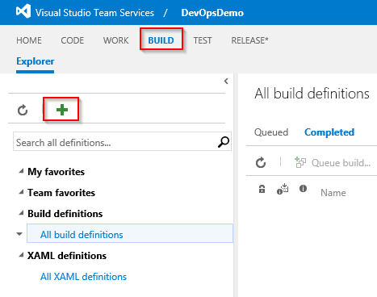

1.  Since we have been working with Visual Studio, select the Visual Studio Template.

    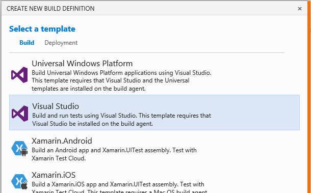

1.  In the **Settings** dialog, select **Continuous integration** and click **Create**.

    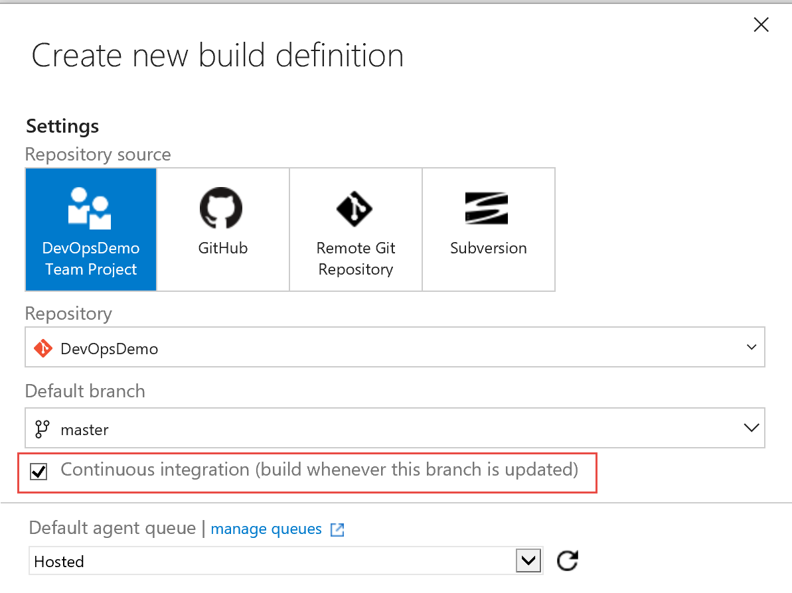

1.  This template prebakes the steps that we need for a build.

1.  You will be deploying to a web app later, so you will need a web deployment package, which is a .zip file. To generate this .zip file, you need to **adjust the MSBuild Arguments** from the second step to include:

    ```
    /p:DeployOnBuild=true /p:WebPublishMethod=Package /p:PackageAsSingleFile=true /p:SkipInvalidConfigurations=true /p:PackageLocation="bin\\deploymentpackage"
    ```

    

1.  In the **Visual Studio Test** step you need to add a reference to the folder where the NUnit Test Adapter package is located. Click on the step and open the **Advacne Execution Options** panel. In the **Path to Custom Test Adapters** textbox add the following **$(Build.SourcesDirectory)\\packages**
    
    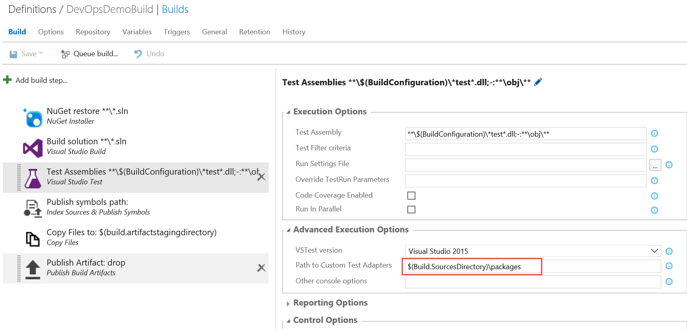

1.  You need to make a minor change in the Contents directory used in the **Copy Files to $(build.artifactstagingdirectory)** step**:**

    `**\bin\**`
    
    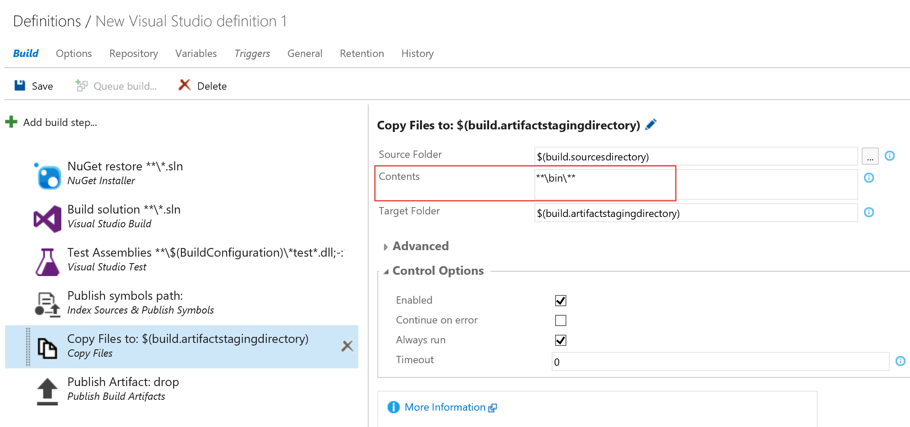

1.  Click **Save** and give your Build definition a title, for example DevOpsDemoBuild.

1.  Queue a new build and verify the build completes successfully. (It could take a few minutes).

    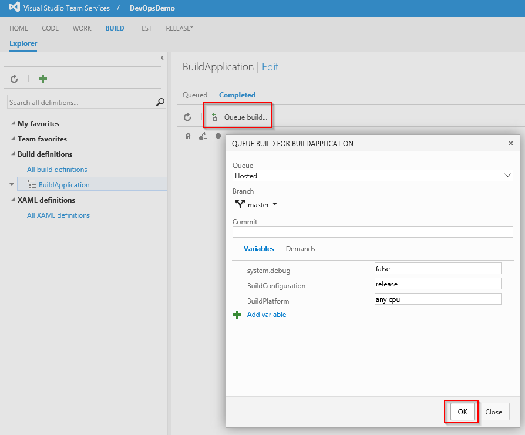

1.  Click the **Artifacts** tab. The tab displays the option to explore files generated during the build, including the deployment package.

    

    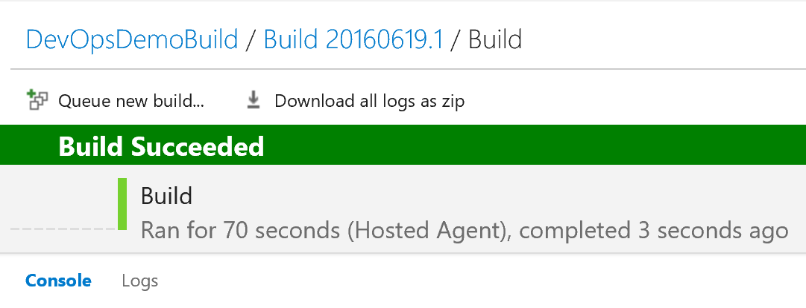

    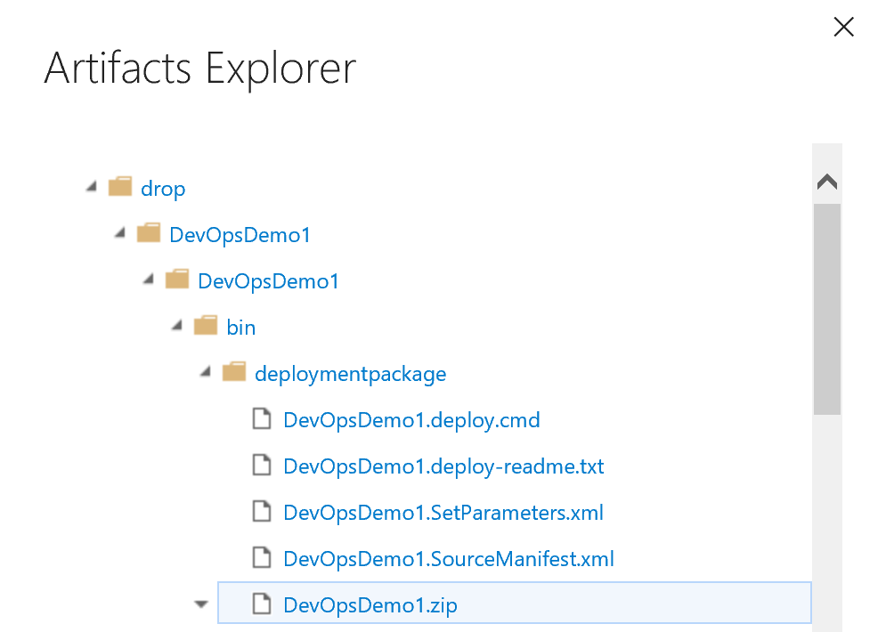