# Continuous Deployment Lab

During this lab, you will work in a simulated environment with the following computers or virtual machines.

## Computers and Virtual Machines Used in This Lab

Your own laptop with Visual Studio (or if you prefer a Virtual Machine in Azure) with Visual Studio)

## Logon Credentials

A Microsoft account. either one you already have, or one you create specifically for this lab

# Lab Overview

## Abstract

During this lab, you will run several exercises that will help you achieve a better understanding of the capabilities of continuous deployment with the VSTS release management system.

## Learning Objectives

After completing the exercises in this lab, you will be able to:

-   Create release definition.

-   Deploy application to test and staging environments.

-   Swap staging slot into production.

**Estimated time to complete this lab: *60* minutes**

# Exercise 1: Continuous deployment using VSTS Release Management system

## Scenario

In this exercise, we will introduced you to how to release code to a variety of environments with the VSTS Release Management system.

After completing this exercise, you will understand:

-   How to create release definition in VSTS.

-   How to deploy application to test and staging environments.

-   How to swap staging slot into production.

## Prerequisites

This section lists the prerequisites required for this demonstration.

-   HOL Continuous Integration (**Exercise 4: Use Visual Studio Team Services to create a new Build (Continuous Integration))**

-   Azure subscription

-   Active Visual Studio Team Services (VSTS) account

-   Visual Studio Team Services (VSTS) project

1. At the end of the Continuous Integration HOL, we successfully built code in VSTS.

    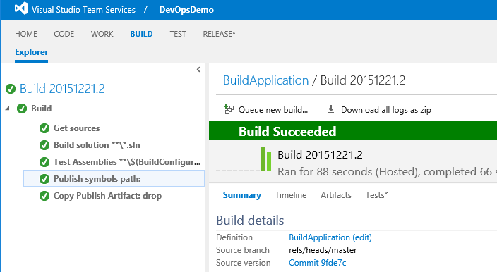

1. Click the **Release** tab and **+**. The Release Management tools are built to be similar to the build tools we showed before, so much of the UI and process should look familiar.

    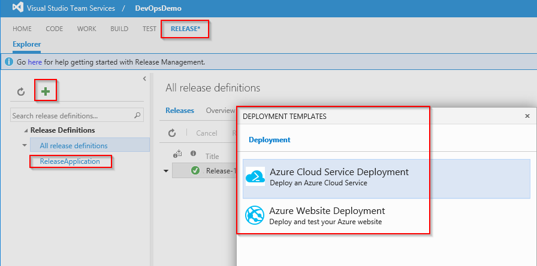

1. We have started to setup a new release definition and can see the prebuilt templates from which we can start. We can opt for a blank definition file.

    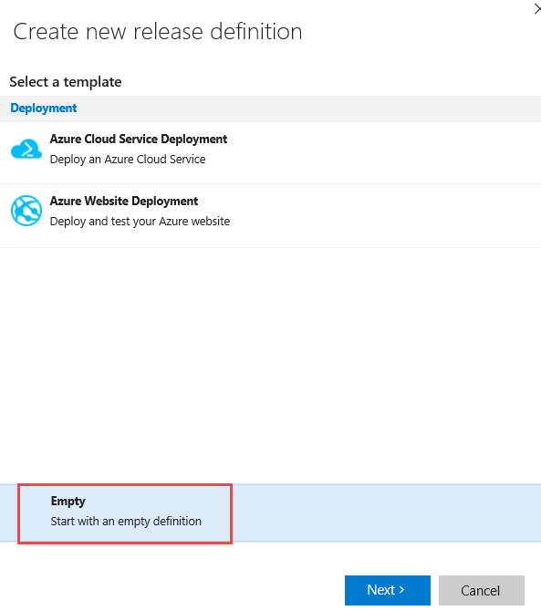

1. In the **Create new release definition** group, choose the artifacts, project, source (build definition that was created as part of CI HOL), select **Continuous deployment,** and select the agent queue (Hosted).

    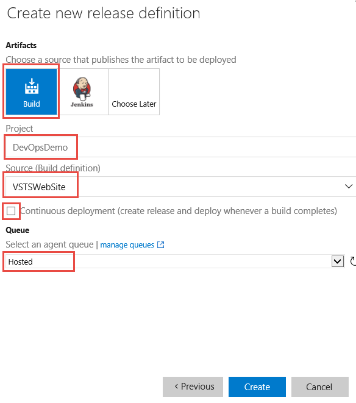

1. Click **Create** to create the empty release definition.

    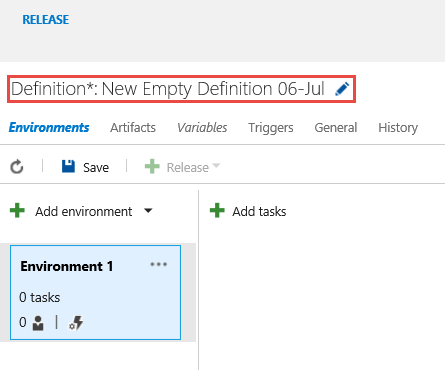

1. We are deploying to three separate environments: Dev, QA, and Staging. Each of these environments is a separate Azure web app running on a separate app hosting plan.

    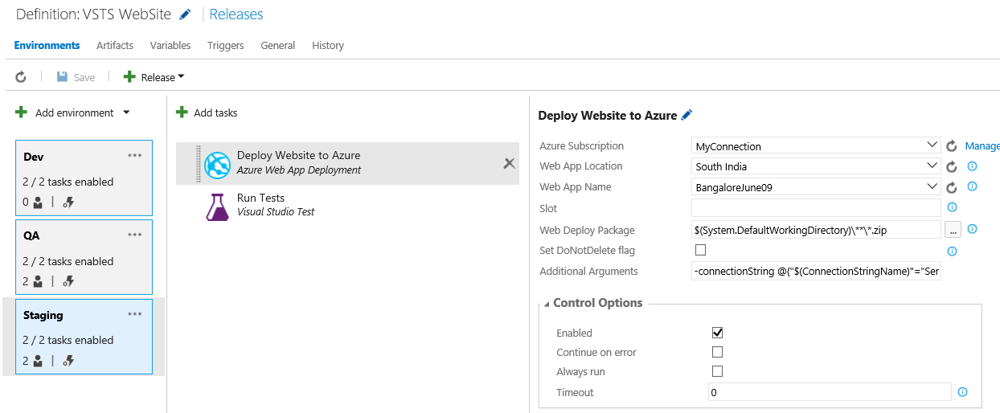

1. By default, our release will deploy to Dev, and then immediately to QA. However, we often want to wait to deploy to QA depending on how our application looks in Dev. Click the ellipsis in the QA environment and select **Assign Approvers**.

    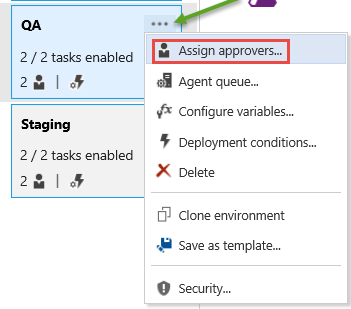

1. Clear **Automatic** by **Post-deployment approver**.

1. Select another workshop presenter (who is in the MSFT AD) and input them as an approver. We can also select a group if we wanted to allow groups of approvers, such as our QA team.

1. Click **OK**.

    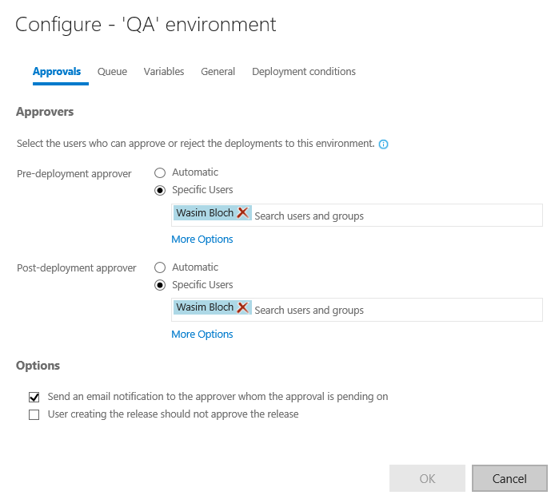

1. Change the header name in default page of source code in Visual studio and check in the code to initiate build and then release.

1. Click the title **VSTS Website** to check the release progress.

1. Click **Logs** to show the granular logging for each step in the release pipeline.

    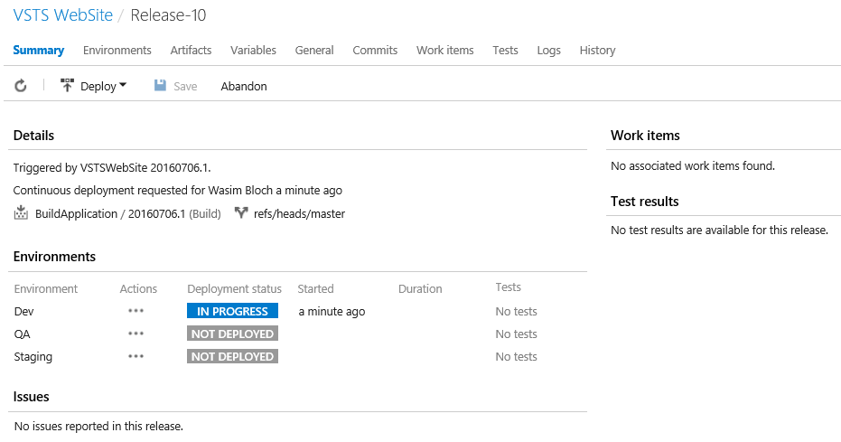

    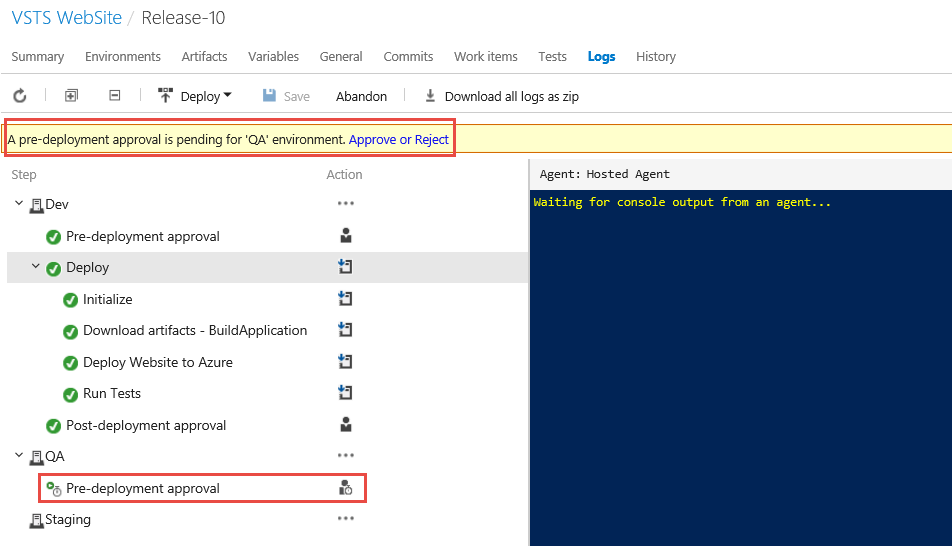

1. As we have enabled predeployment approval, you will get the email notification for the approval to the QA environment. Approve it to continue release code to the QA environment.

    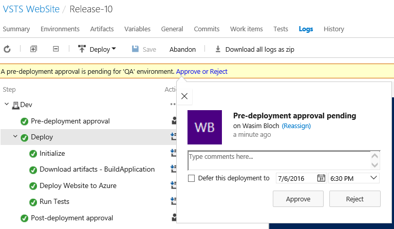

1. When the release is finished, switch browser tabs and refresh the Dev environment web app to show the updated title.

    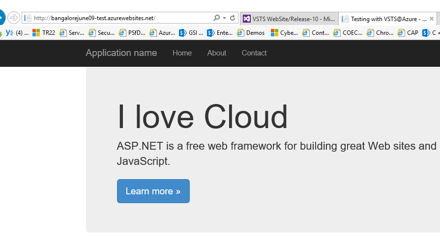

1. If the release has finished deploying to QA, also show the Staging site. To get the app all the way into production, we need to execute a deployment slot swap.

    

1. In the Azure Portal, open the production web app and click **Swap**.

    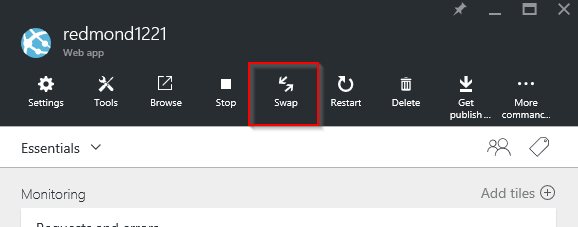

1. Setup staging as the source, with production as the destination and click **OK**.

    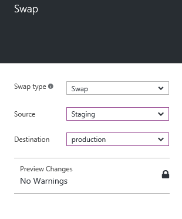

1. In about 30 seconds, your slots swap and the production app now shows our updated title. If there were any issues, we could easily swap back and the previous code would be back in production with zero downtime.

    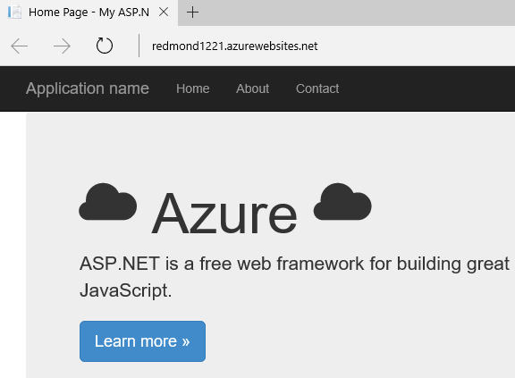

# Clean Up

To clean up this environment, delete the release definition created in VSTS project.
