# DSC Using Chef Server Lab 

During this lab, you will continue working with the three Azure Virtual Machines (VMs) you deployed in the Azure Resource Manager lab. The goal of this lab is to configure a trial Hosted Chef Server account, and using this technology, bootstrap any of the already deployed Windows Server Virtual Machines as web servers running Internet Information Server.

## Prerequisites

In order to be able to go through the exercises in this lab, your management station requires the following:

-   Text editor or code environment to build Chef code. While Notepad will do, we would also recommend PowerShell ISE, Notepad++, Visual Studio Code, Atom, Sublime Text, or any other text editor.

# Lab overview

## Abstract

During this lab, you will run several exercises that will help you achieve a better understanding of the capabilities of Chef Server for using some of the Configuration Management concepts of DevOps.

## Learning Objectives

After completing the exercises in this lab, you will be able to:

-   Configure a trial account in the Hosted Chef Server environment.

-   Configure a Chef Server.

-   Modify a Chef Cookbook recipe from the Chef Supermarket to bootstrap an already deployed Windows Server 2012 R2 VM in Azure as a web server with Internet Information Server as well as deploy a sample website on it.

**Estimated time to complete this lab: 30 minutes**

# Exercise 1: Creating a trial account for a Hosted Chef Server environment

## Scenario

Chef provides an automation system for building, deploying, and managing your infrastructure.

Chef code is authored and managed using a folder structure called cookbooks (Chef specific). Each component of a cookbook is called a resource. Chef code contains reusable definitions that provide instructions for tasks such as configuring a web server. A cookbook may contain more than one recipe (more than one task to do), and each recipe may contain reusable resources like files, templates, libraries, and attributes, etc.

Chef helps you write recipes (DSC code) and store them on Chef Servers. (You can either create your own Chef Server by using an Azure Marketplace template; or, as in this exercise, create a trial account for a Hosted Chef Server environment.)

In this exercise, you will learn how to create a free Chef Server subscription. (This allows you to deploy and manage five nodes (=Azure VMs) in this scenario.)

## Task

1. Browse to <https://manage.chef.io/signup>, and complete the form. **Note you have to use an existing email address, as you need to verify the account.**

    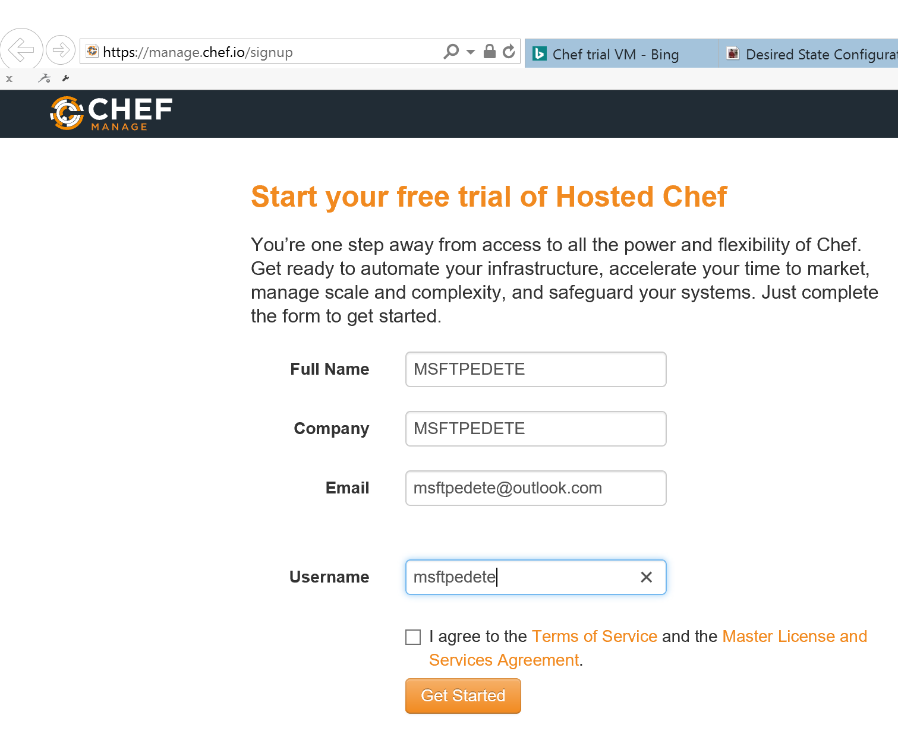

1. Wait for the Chef account validation email to arrive in your Inbox.

    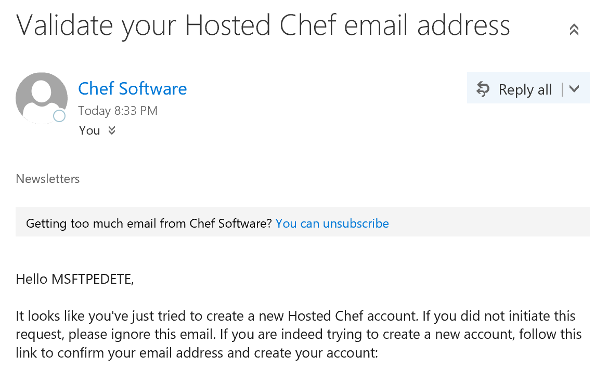

1. Select the verification URL in the email, and validate your account on the Chef portal.

    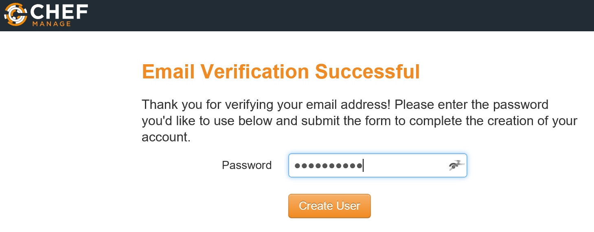

1. Create a new Chef organization from the Chef portal, using any name of your choice. The name must be unique to the Chef environment.

    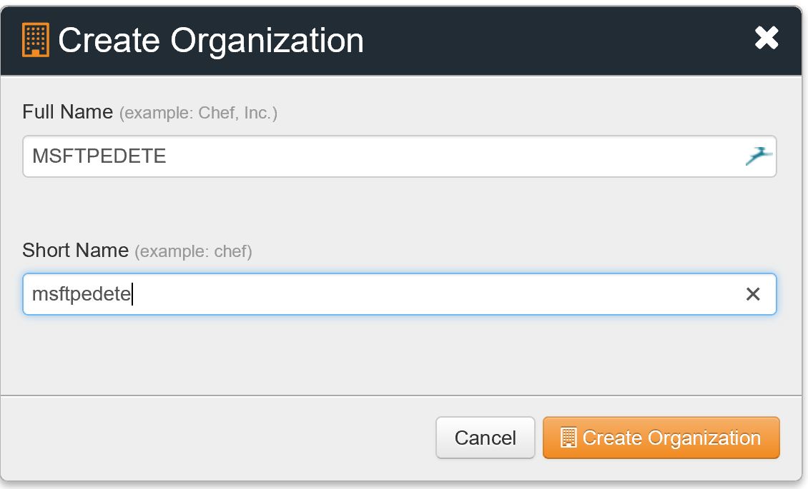

# Exercise 2: Configuring your workstation as a Chef administrative client

## Scenario

In this exercise, you will download the Chef Starter Kit and Chef Development Kit to your local workstation. Next to that, you will run several Chef commands to prepare and configure your workstation as a Chef administrative client.

1. From your newly created Chef organization, select the **Administration** tab. From here, select the **Download Starter Kit** button.

    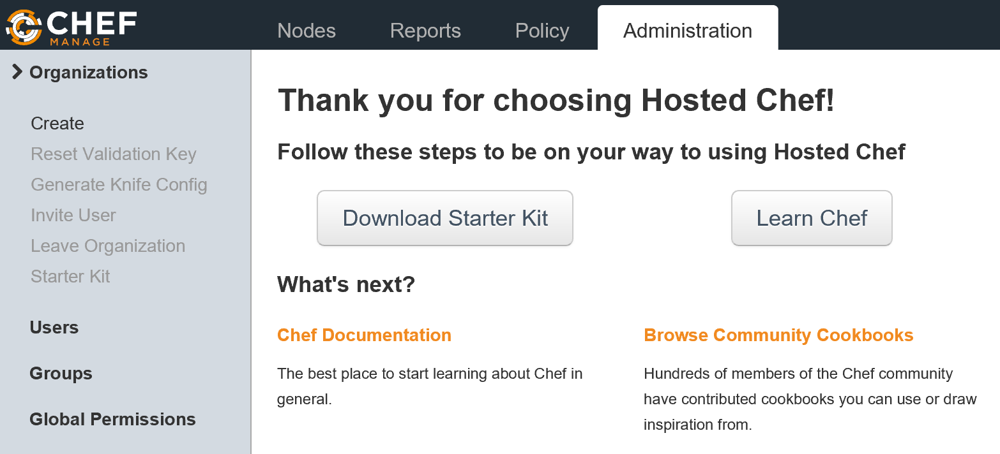

1. Extract the downloaded file to your local workstation. I am using my user profile directory in this exercise, but it could basically be any folder of your choice.

    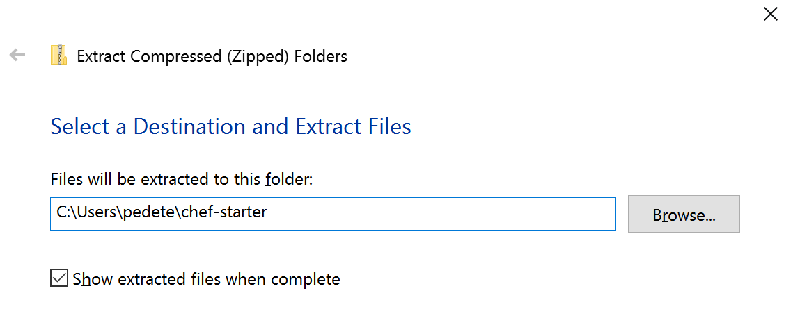

1. Download the Chef Development Kit from the following URL: <https://downloads.chef.io/chef-dk>.
    **Note: For this exercise, select the Windows platform.**

    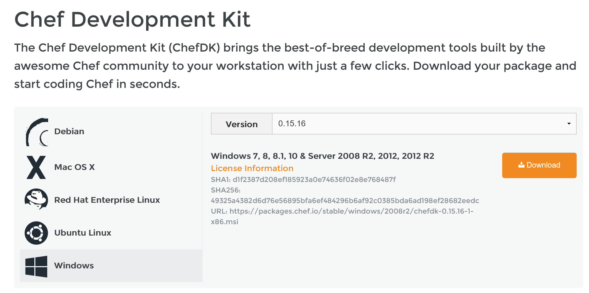

1. Install the Chef Development Kit onto your local machine. Make sure you select the default to install all components.

    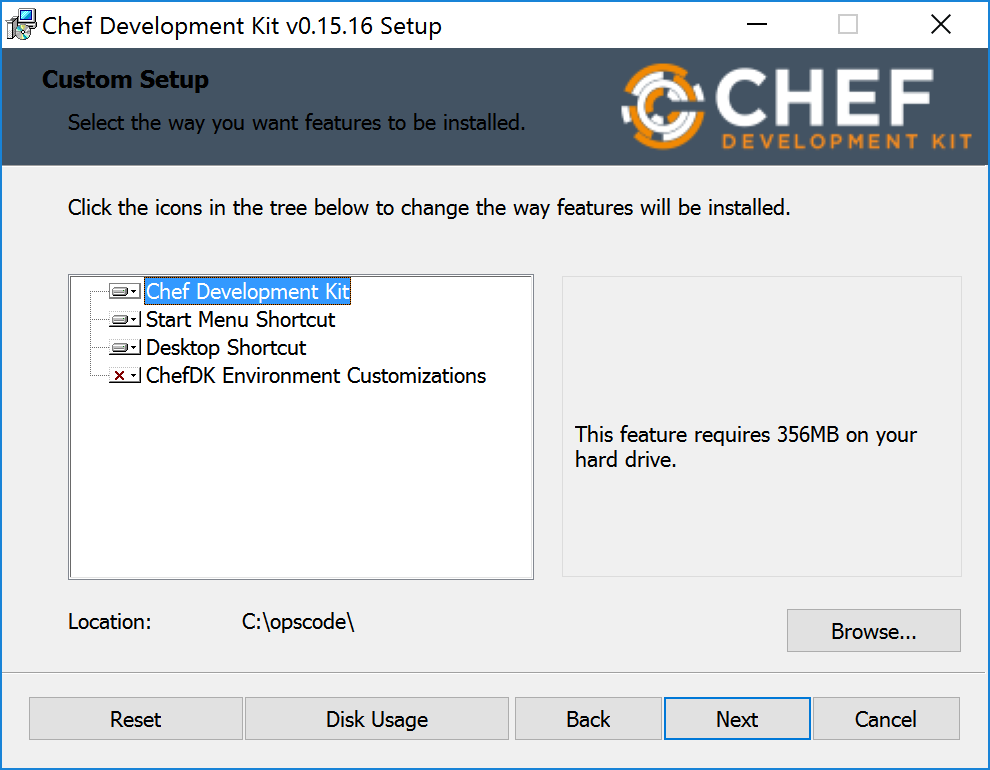

    In order to be able to work with Azure resources from within Chef, you need to prepare the Chef environment for that. You can do this by using a **knife command**. (Knife is a command line tool which comes with the Chef Development Kit (ChefDK). This is where we run our commands. You can use the Windows command prompt, notepad, or notepad++, etc.)

1. Open a command prompt with administrative rights, and browse (cd) to the following Chef directory: **c:\\opscode\\chefdk\\embedded\\bin\\**. (This is the default directory where the ChefDK was installed; alter this path if you installed it in another location.)

    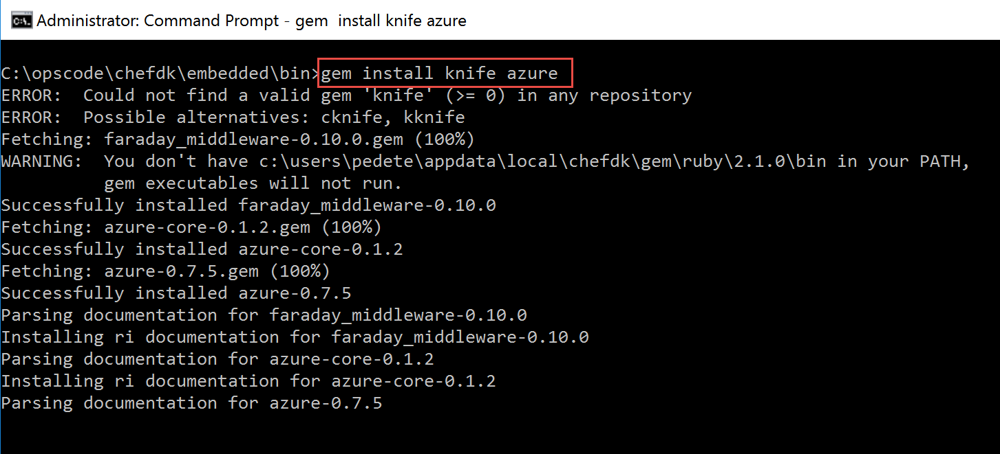

1. Once the installation is successful, you can verify the installation and versions using the following command:

    `Gem list | grep azure`

    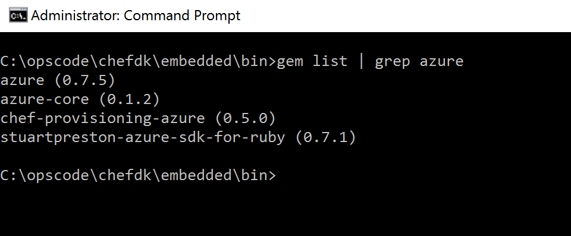

1. Start the Chef Development Kit from the Start menu on your local machine. (It looks like a PowerShell window.)

    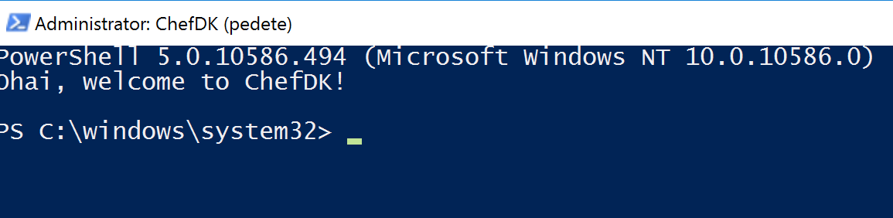

    Change to the Chef-repo folder (this folder might be different in your setup, if you extracted the Chef Starter Kit to another location) by running the **cd** command:

    `cd .\\Users\\pedete\\chef-starter\\chef-repo\\`

    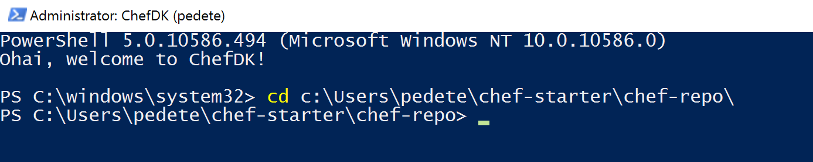

1. Next, you have to download the Chef SSL certificates from your Chef organization, using the following command:

    ``Knife ssl fetch``

    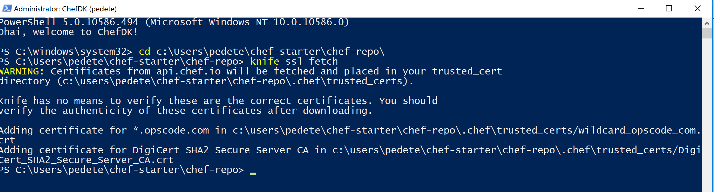

1. Chef provides an app store-like repository called Supermarket, where you can download samples of preconfigured cookbooks and recipes. Several of these are built by Chef or by the Chef community. You can download cookbooks from the Chef Supermarket website or from within the Chef Development Kit Shell. In this exercise, you will download the IIS-setup cookbook, called �learn\_chef\_iis�. To download the cookbook, use the following command:

    `knife cookbook site download learn\_chef\_iis`

    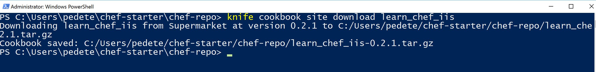

1. Since the download file is a compressed file, you have to extract it first. Extract the file using the following command:

    `tar -zxvf learn\_chef\_iis-0.2.1.tar.gz -C cookbooks`

    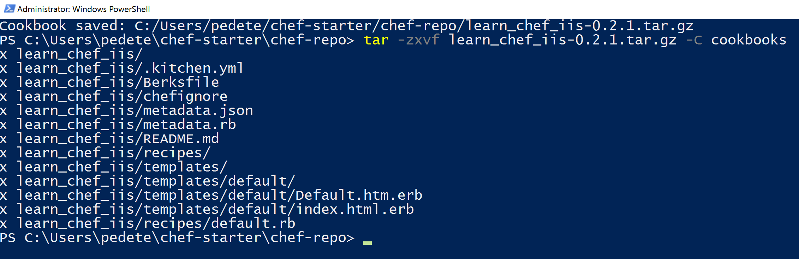

1. This package extracts to the Chef-repo cookbooks folder:

    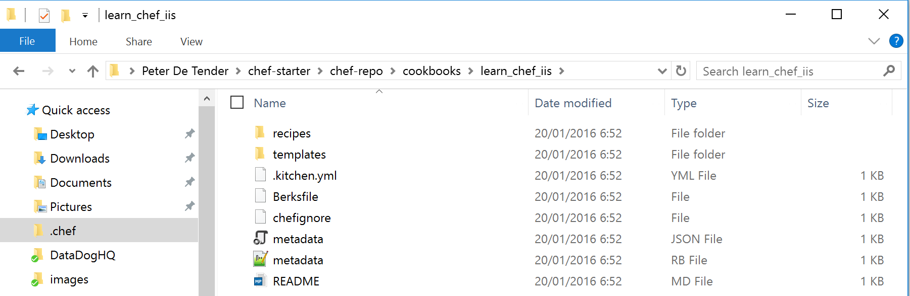

1. As this cookbook is ready to be used without further modifications (for this exercise), we can upload it directly to our Chef Server organization, using the following command:

    `knife cookbook upload learn\_chef\_iis`

    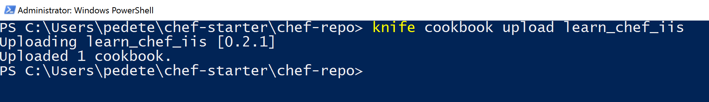

1. Go back to your Chef Server organization and select the **Policy** tab. The uploaded cookbook should be visible there.

    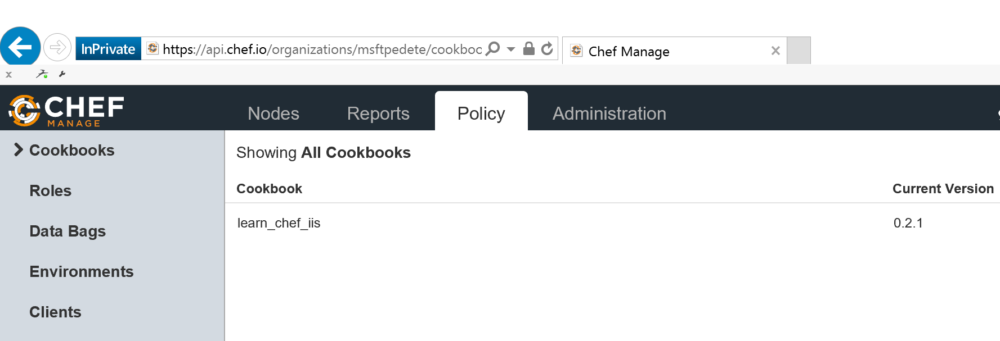

# Exercise 3: Running Chef extensions on an Azure VM

## Scenario

In this exercise, you will install the Chef extension on an already deployed Azure VM from the portal. Once deployment is complete, you will sign in to the Windows VM using RDP, verify the Chef client install, and validate the execution of the IIS Chef cookbook, by connecting to the deployed website.

1. To allow the integration from within ChefDK and running knife commands, you need to download the Azure publishsettings file, and save it in the Chef-repo folder that was created by extracting the Chef Starter Kit earlier. To download the Azure publishsettings file, connect to the following URL:

    <https://manage.windowsazure.com/publishsettings/index?client=powershell>.

    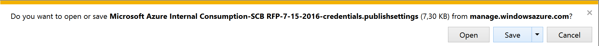

1. To verify you are now able to run **knife** commands against Azure, run the following command:

    `knife azure image list`

    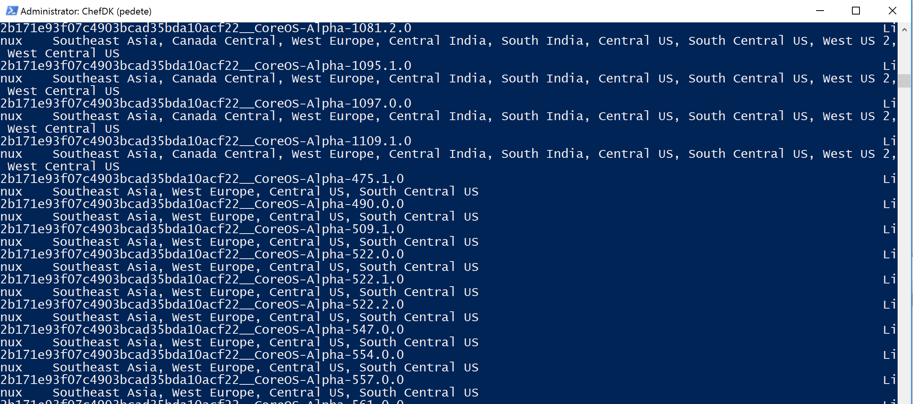

    This confirms the ChefDK can connect to your Azure subscription and recognize different Azure VM images that are available to your subscription.

1. From within the Azure portal, select any of the already deployed Windows Server 2012 R2 VMs you see there. (Make sure the machine is already running.) From the settings list, go to **Extensions**. Select the **+Add** button.

    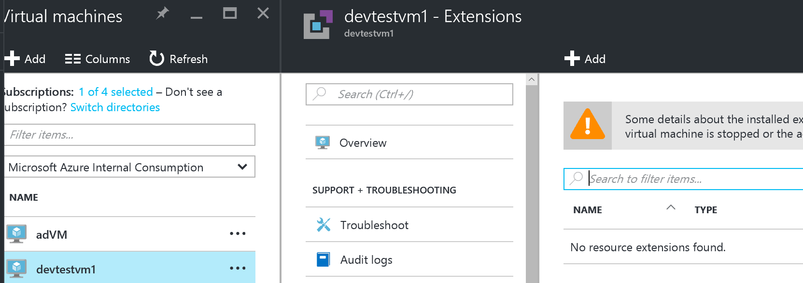

1. Select **Windows** **Chef extension 1.2.3** from this list; select the **Create** button.

1. Now you need to complete the extension install parameters. You can retrieve most of the information from the Chef-repo folder on our workstation, since we downloaded the knife.rb file already during the Chef Starter Kit download. Browse to your �.Chef� folder:
    ( **c:\\users\\pedete\\chef-starter\\chef-repo\\.chef in my demo setup**)

    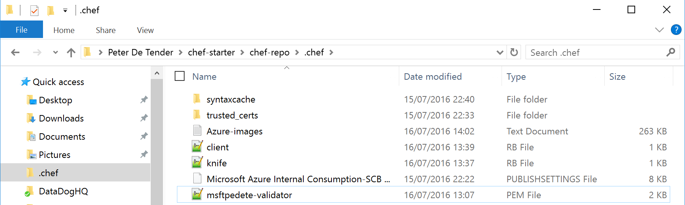

    **Note:** If you do not see the client.rb or &lt;organization&gt;-validator.pem files in this folder, download them from the Chef Server portal by selecting the **Generate Knife Config** and **Reset Validation Key** options.

    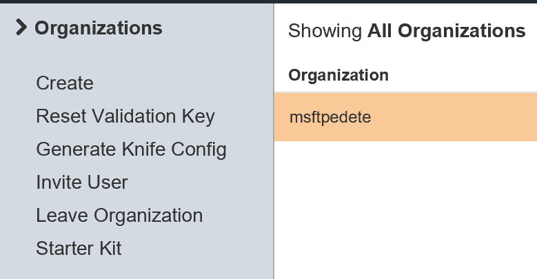

1. Open the **knife.rb** file (in notepad or notepad++ or any other text editor you prefer).

    The contents should look like the following example:

    ```
    # See http://docs.chef.io/config_rb_knife.html for more information on knife configuration options

    current_dir = File.dirname(__FILE__)

    log_level :info

    log_location STDOUT

    node_name "msftpedete"

    client_key "#{current_dir}/msftpedete.pem"

    validation_client_name "msftpedete-validator"

    chef_server_url "https://api.chef.io/organizations/msftpedete"

    cookbook_path ["#{current_dir}/cookbooks"]

    knife[:azure_publish_settings_file] = "Microsoft Azure Internal Consumption-SCB RFP-7-15-2016-credentials.publishsettings"    ```

    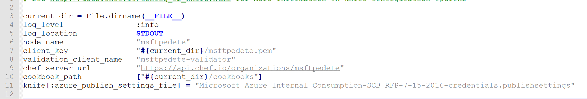

1. Open the **client.**rb file (in notepad or notepad++ or any other text editor you prefer). The contents should look like the following example:

    ```
    log_level :info

    log_location STDOUT

    chef_server_url "https://api.chef.io/organizations/msftpedete"

    validation_client_name "msftepedete-validator"

    validation_key "{current_dir}/msftpedete.pem"

    client_key "{current_dir}/msftpedete.pem"

    ssl_verify_mode :verify_none
    ```

    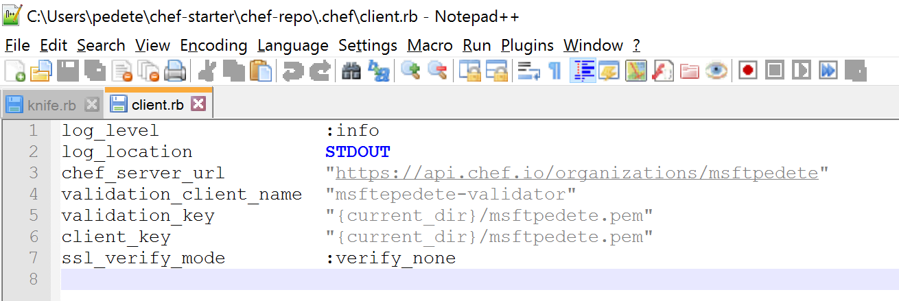

1. I used the following parameters in the Azure extension install window:

    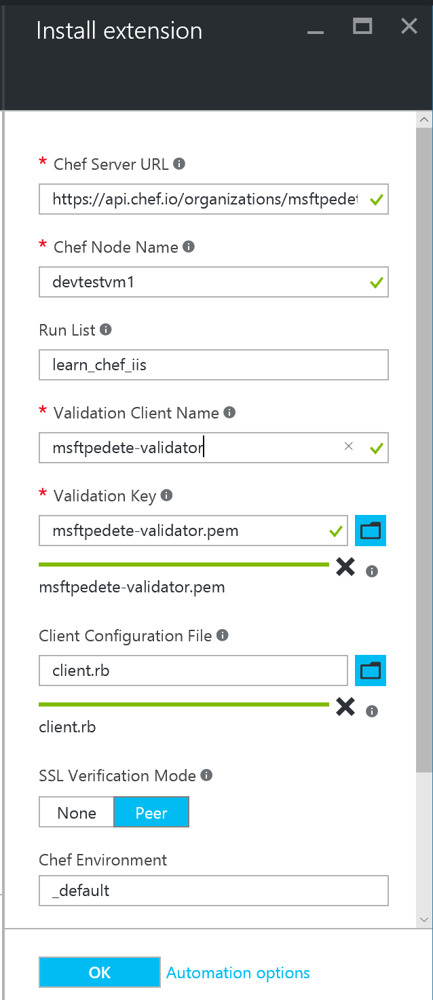

    - Chef Server URL = parameter from knife.rb

    - Chef Node Name = Azure VM name

    - Run List = Chef cookbook name

    - Validation Client Name = your Chef organization Name

    - Validation Key = organization-validator.pem file

    - Client Configuration File = client.rb file

1. Wait for the deployment of the extension to be completed successfully.

1. Open an RDP session to the Azure VM, and open file explorer. Notice both the **Chef** and **Opscode** directories on the c: drive. From within the c:\\chef folder, notice the client.rb file and open this in Notepad. In the first few lines of this file, verify that it is pointing to your Chef organization details.

    

1. Open up the event viewer on the Azure VM, and browse to the Windows Logs / Applications. For the last couple of minutes, go through the MsiInstaller and Chef events.

    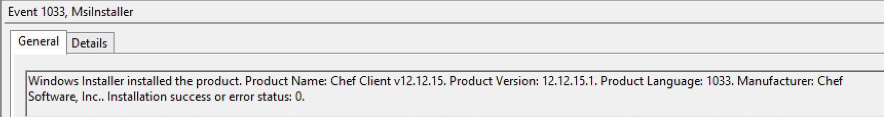

    Event ID 1033 MsiInstaller points to the successful installation of the Chef Client v12.

    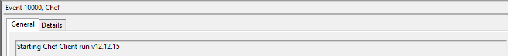

    Event ID 10000 Chef points to the Chef Client starting.

    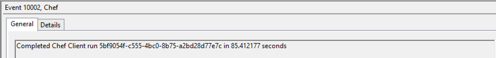

    Event ID 10002 Chef points to the successful run of the Chef cookbook, although it is a bit encrypted.

1. From within the Event viewer, open up the Windows Logs / System. At about the same time the previous Event ID 10002 occurred, there should be a �Service Manager� event, pointing to the successful installation of the IIS web server component.

    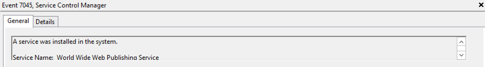

    Event ID 7045, Service Control Manager, confirms the installation of the World Wide Web Publishing Service.

    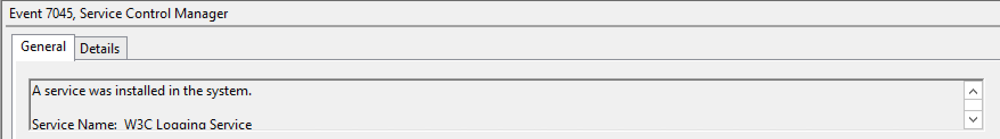

    Event ID 7045, Service Control Manager, confirms the installation of the W3C Logging Service.

1. The final test consists of opening the Internet Explorer browser and connecting to [http://localhost](http://localhost/).

    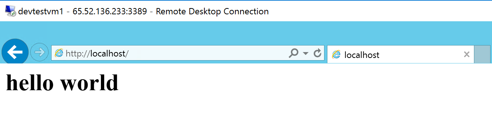

Notice the website is running, and successfully displaying the **hello world** web page. (This comes from the learn\_chef\_iis templates\\default\\default.html file in our .Chef directory on the administrative workstation.)

# Review

This completes the lab in which you:

-   Configured a Chef Server organization.

-   Configured your workstation with several Chef tools.

-   Integrated Chef Server with Azure.

-   Installed the Chef VM extension to an already running Azure Windows VM.

-   Verified the installation and configuration of IIS Server and corresponding website, as was defined in a Chef cookbook.