# Monitoring Lab Overview

## Abstract

During this lab, you will run several exercises that will help you achieve a better understanding of the monitoring capabilities of the Azure platform.

## Learning Objectives

After completing the exercises in this lab, you will be able to:

-   Monitor virtual machine workloads with Operations Management Suite

-   Instrument a web application with Application Insights

-   Better quantify the performance of your Azure resources

## Prerequisites

You should have Visual Studio installed on your machine with the latest Azure SDK installed. You should also understand how to clone code from GitHub.

Estimated time to complete this lab: 60 minutes

# Exercise 1: Getting Started with Operations Management Suite (OMS)

## Scenario

In this exercise, we will introduce you to Operations Management Suite (OMS). OMS is a suite of cloud-based services that can be used to manage, monitor, and protect your on-premises and cloud-based infrastructure. At the time of this writing, OMS consists of the following services: Log Analytics, Azure Automation, Azure Backup, Azure site recovery, and Security and Compliance.

This hands-on-lab will focus on integrating the Log Analytics features into your DevOps build and release pipeline. It will guide you through the process of setting up an OMS workspace, configuring log collection, and configuring a custom dashboard for your application.

After completing this exercise, you will understand:

-   The different methods for deploying the Log Analytics feature of OMS.

-   Key configuration options for OMS.

-   How to integrate OMS into your cloud-based IaaS workloads.

## Create an OMS Workspace

1. Navigate to the Azure Portal and sign in to your subscription.

1. You will create a resource group that will hold the assets you will monitor and the OMS dashboard. Click **New &gt; Management &gt; Resource Group**.

    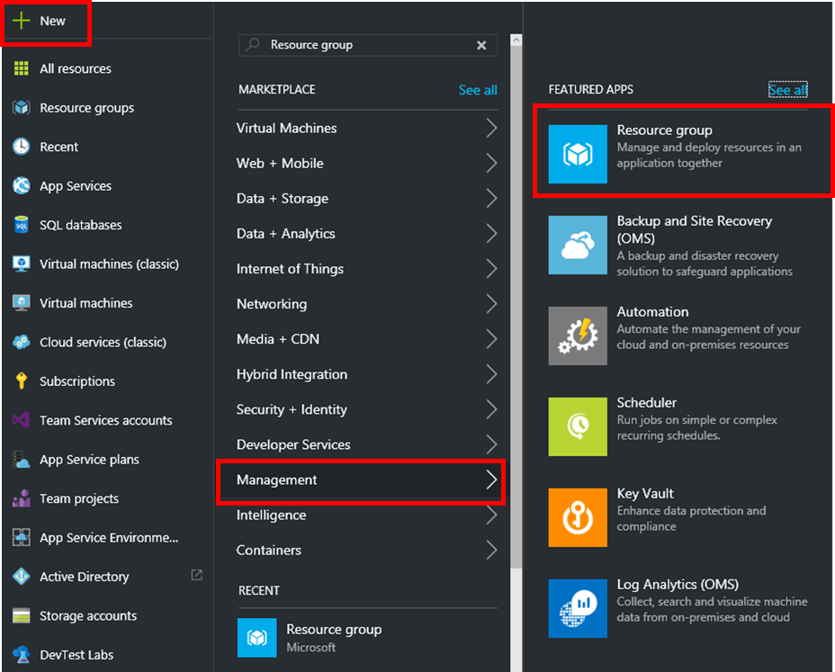

1. Provide a unique name and click **Create**.

    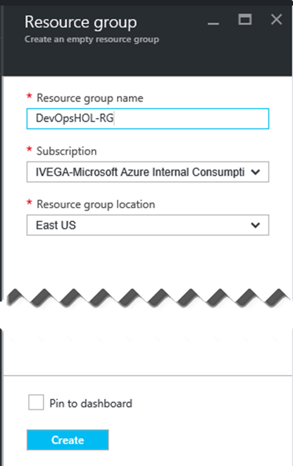

1. Navigate to the resource group and click **Add**.

    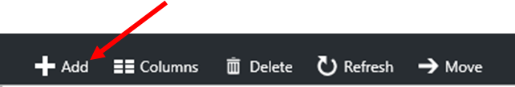

1. In the **Search** field, enter **Log Analytics (OMS)**, click **Log Analytics (OMS)**, and click **Create**.

    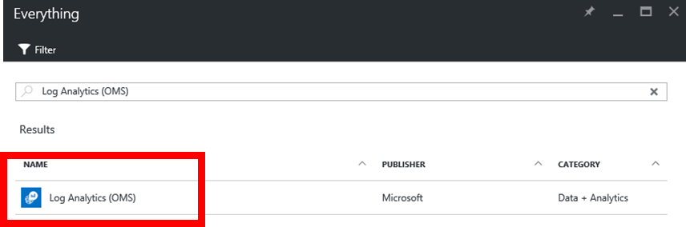

1. Provide a name for your workspace and a location.

1. Click **Pricing tier** to view the different options available. For this HOL we will use the **Free** tier.

    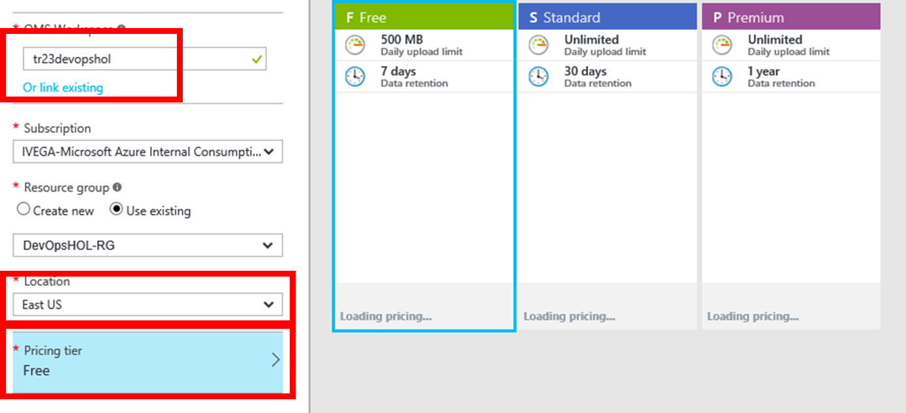

1. Click **Create**.

1. Once the workspace creation process is complete, navigate to the OMS resource you just created.

    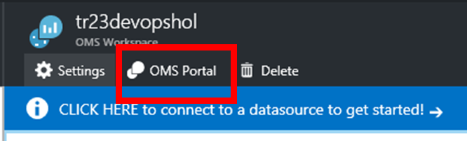

1. On the **main dashboard** page, click **Settings**.

    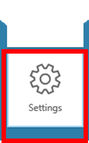

1. Click **Connected Sources**.

    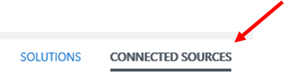

1. Keep this page open.

## Download the ARM template for the deployment assets

1. Open a browser and navigate to the GitHub repo: <https://github.com/ivegamsft/DevOpsMonHol>.

1. Click **Clone or download** and select **Open in Visual Studio**. It will launch Visual Studio and download the source code needed.

    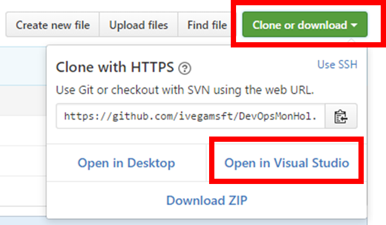

1. Select a local path and click **Clone**.

    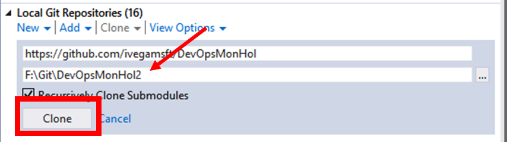

1. Once the clone is complete, double-click the GitHub repository. It will open the GitHub pane in Visual Studio.

    

1. Select the solution and open it.

    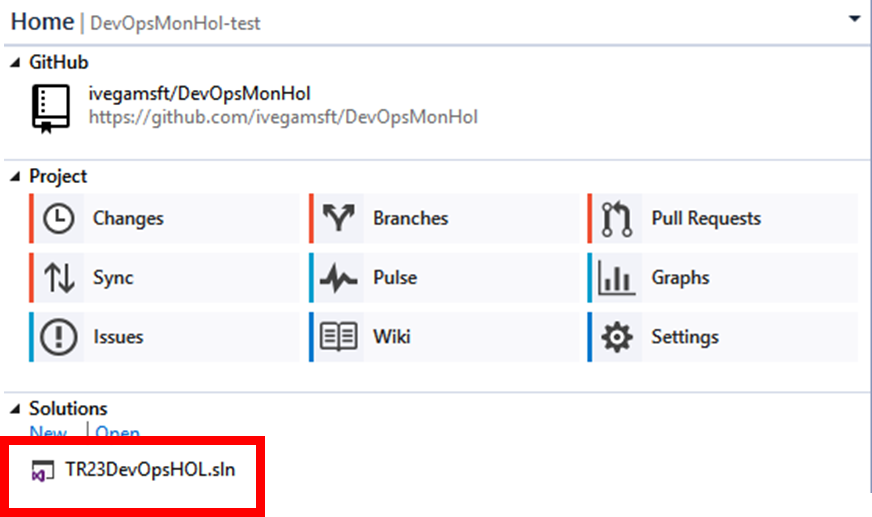

1. In the **Solution** tab, select the Azure deploy parameters.

1. Navigate to the browser tab where the OMS dashboard is open and copy the **Workspace ID** and the **Workspace key** values into the ARM deployment template. 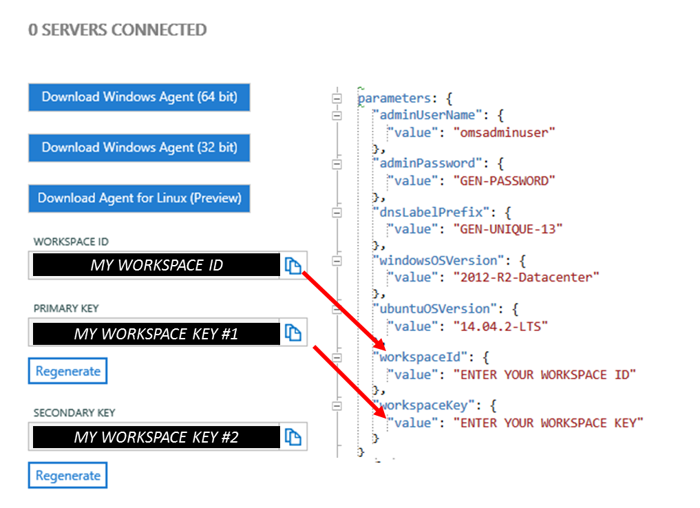

1. Enter a desired user ID, password, and DNS Label prefix. Leave the other fields as-is.

1. Right-click the solution and select **Deploy &gt; New Deployment***.*

    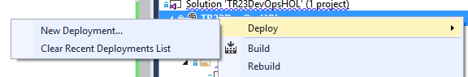

1. Select your subscription and select the resource group you created in step 2.

1. Click **Deploy**.

    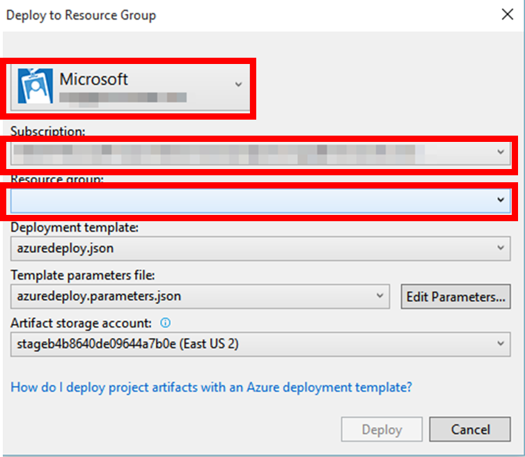

1. The ARM template will deploy four virtual machines:

-   Windows VM 1—Uses an Azure extension to deploy the OMS agent to the machine and will also register the machine with your OMS workspace.

-   Windows VM 2—Uses PowerShell DSC to install an IIS role but does *not* register it with the workspace. This is performed in a separate step.

-   Linux VM 1—Uses an Azure extension to deploy the OMS agent to the machine and will also register the machine with your OMS workspace.

-   Windows VM 3—Uses DSC to download the agent onto the machine but does not configure it. Note: The download of the agent is performed for convenience of the HOL. The agent can be obtained and installed manually from the portal.

While the resources are deploying, you will configure the OMS workspace.

## Configure Dashboard

1. Navigate to the OMS dashboard.

1. Click **Settings**.

    

1. Click **Data**. From this page, you can configure the types of events you want to capture from the different virtual machines.

1. Add performance counters for windows.

    

1. Add performance counters for Linux.

    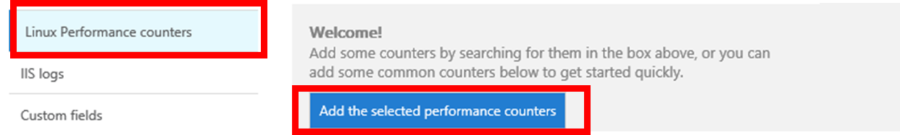

1. Add performance counters for IIS Logs.

    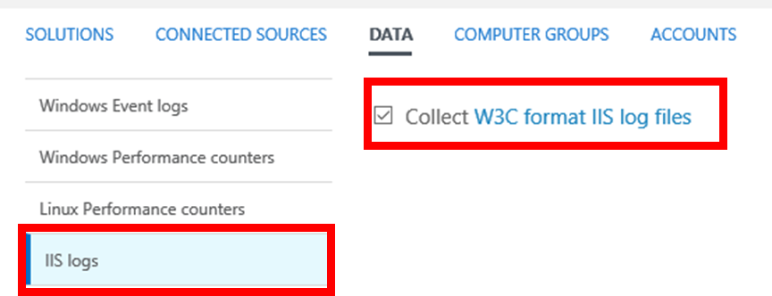

1. Click **Save**.

    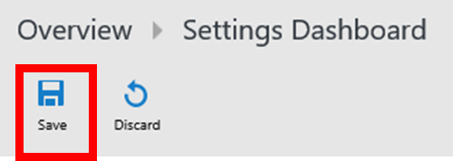

## Configure the OMS agent via the portal

1. Navigate to the Azure Portal and select the OMS workspace (Log Analytics).

    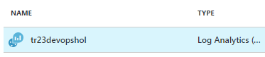

1. Click **Virtual Machines**.

    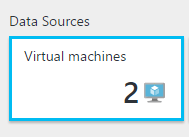

1. You should see two machines connected. From the Virtual machines list, select the **Win2 machine (tr23holwin2)**.

    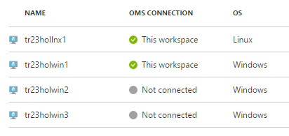

1. Click **Connect**. It will deploy the agent to the machine.

    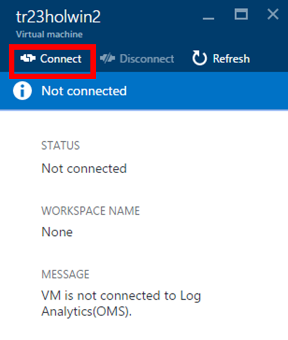

## Configure the OMS agent via download

1. Navigate to the list of Azure Virtual machines in the resource group.

1. Select the **tr23holwin3** virtual machine.

1. Click **Connect** to begin a remote desktop session.

    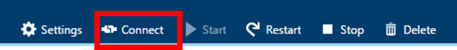

1. Once connected to the machine, open **Windows Explorer** and navigate to **C:\\OMS**.

1. Double-click **\[*MMASetup.AMD64.exe\]*** to begin the installation and configuration of the of the OMS agent.

    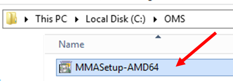

1. In the **Microsoft Monitoring Agent Setup** screen, click **Next**.

    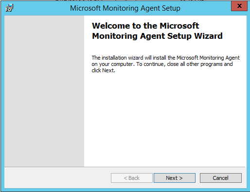

1. Click **I agree**.

    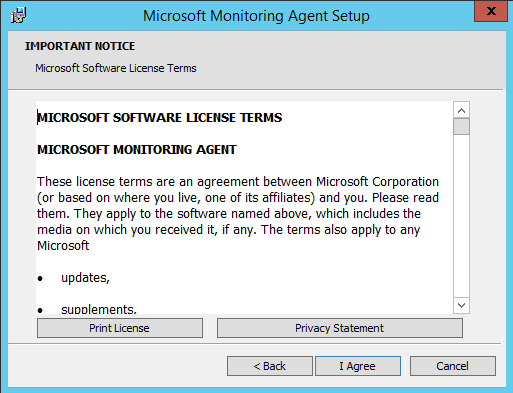

1. Accept the default installation location and click **Next**.

    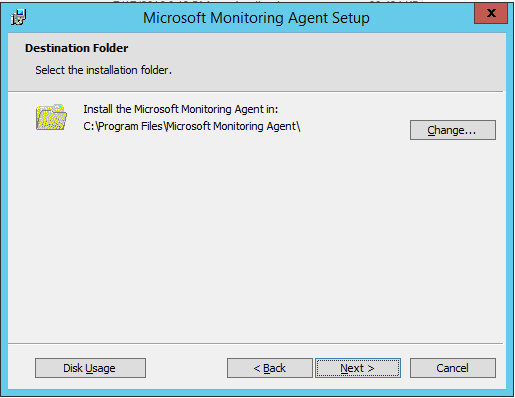

1. Select **Connect the agent to Azure Log Analytics (OMS)** and click **Next**.

    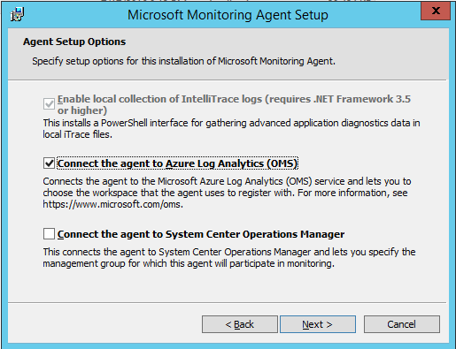

1. Enter your workspace ID and workspace key and click **Next**.

    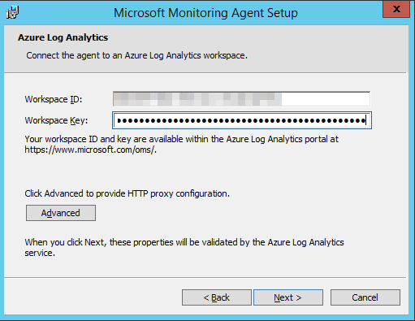

1. Click **Install**.

    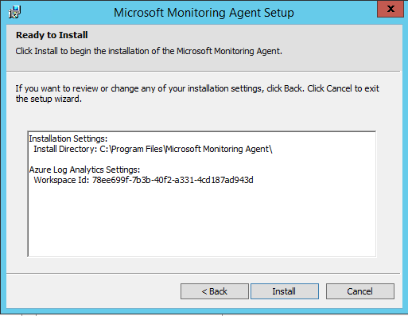

1. Once complete, click **Finish**. This machine is now connected to the OMS agent.

    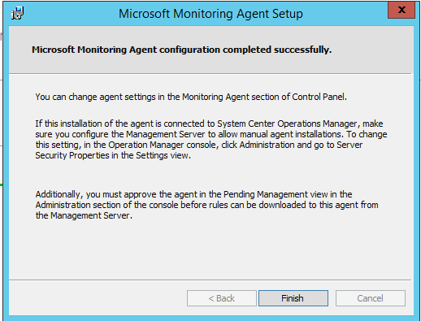

It may take a few minutes for the machines to begin sending telemetry to OMS. You can see the log data in the log search screen.

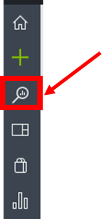

1. Click **All collected data** to show the data gathered so far.

    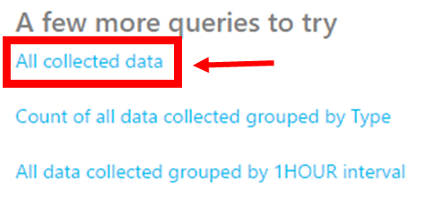

    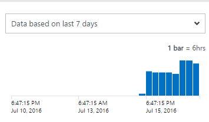

# Exercise 2: Working with Application Insights

## Scenario

In this exercise, we will introduce you to Visual Studio Application Insights, an extensible analytics service for monitoring a live application.extensible analytics service that monitors your live applicationextensible analytics service that monitors your live application

After completing this exercise, you will understand:

-   How to provision an instance of the Application Insights service.

-   How to onboard an existing web application to the service.

-   How to use Application Insights to understand application performance.

## Create a standard web application 

1. Open Visual Studio.

1. Click **File &gt; New &gt; Project**.

    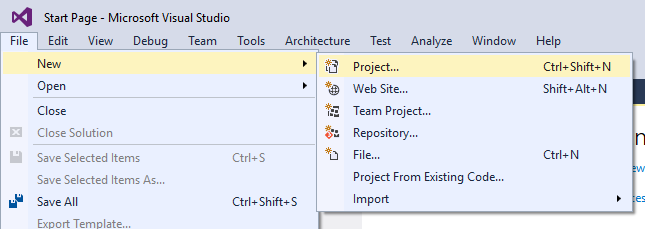

1. Select **ASP.NET Web Application** project template from **Installed &gt; Templates &gt; Visual C\# &gt; Web**. It is a basic starter template for a web application.

    Note: ensure you clear **Add Application Insights to project**. We will be doing this step manually instead of during project creation.

    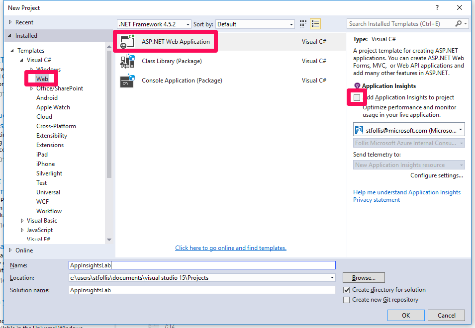

1. Click **MVC** and clear **Host in the cloud**.

    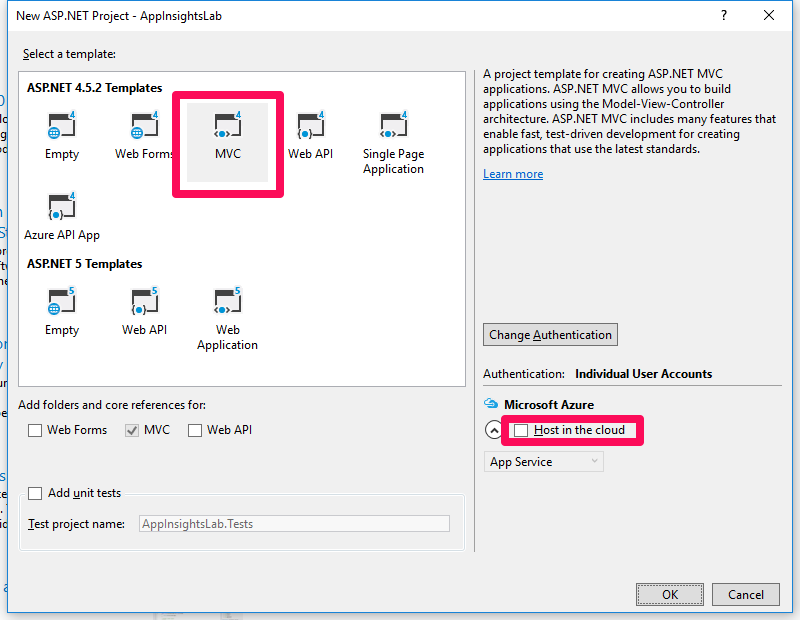

1. Click **OK** and Visual Studio will setup all files necessary for your application project.

    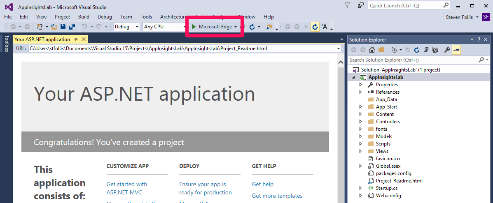

1. When finished setting up, press **F5** or click start arrow to launch your app in a browser window.

    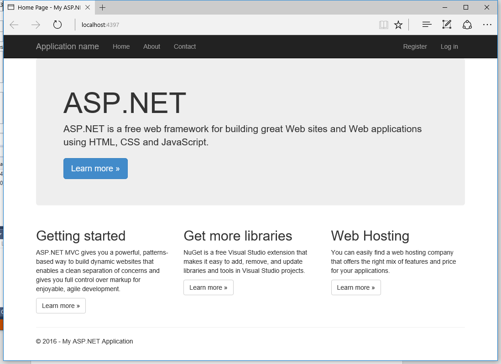

1. Now that the web app is running locally, we will deploy it to the Azure App Service. In **Solution Explorer** in Visual Studio, right-click the project and select **Publish**.

    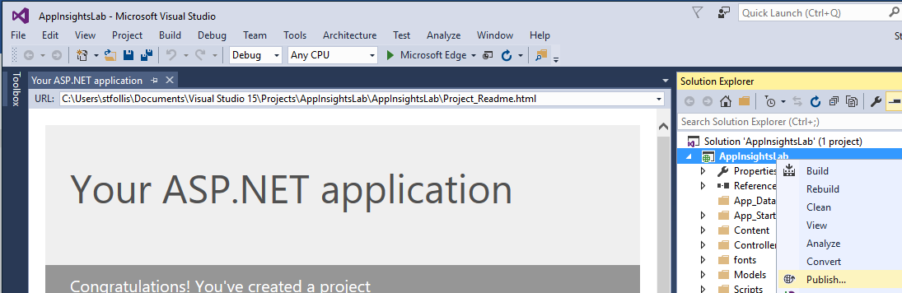

1. Select a Publish Target of **Microsoft Azure App Service**.

    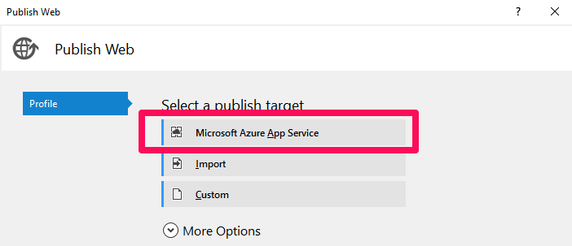

1. Click **New** to setup a resource group for the application.

    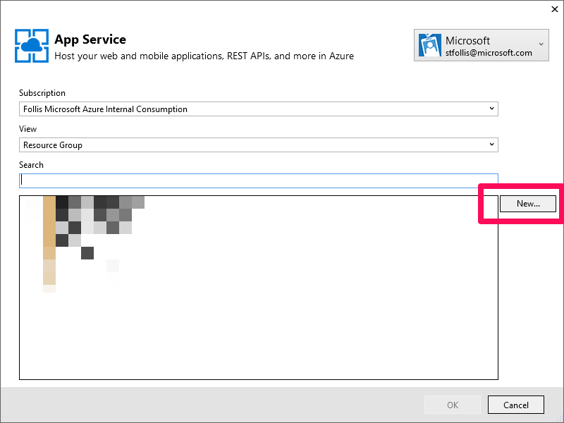

1. Add a unique Web App Name, a Resource Group name, and click **New** to create a plan for the application to live under.

    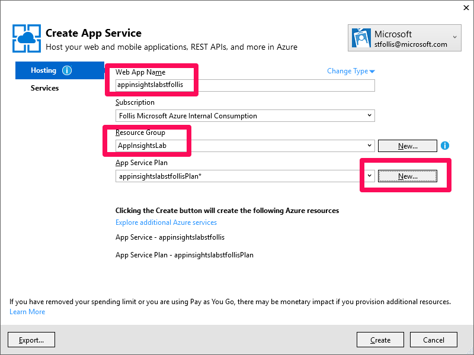

1. Select a free application in any region and use a unique plan name.

    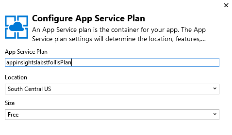

1. Click **Create** to kick off provisioning of the resource group, app service plan, and web application.

1. Once the provisioning process finished, click **Publish** to execute a Web Deploy of your local site assets up to Azure.

    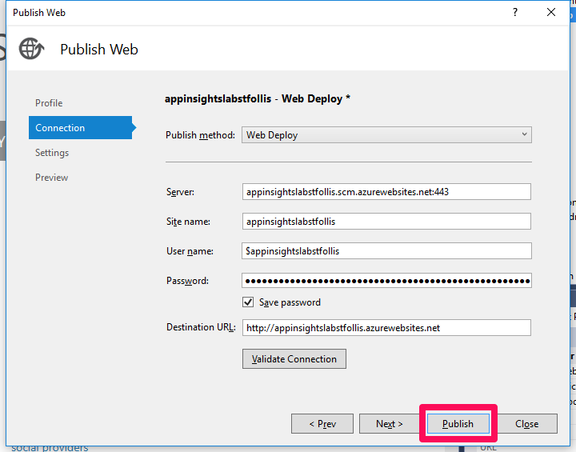

1. Your new application should open in a browser window (if not, manually navigate to the URL of the application name you just provisioned in a browser, for example <http://appinsightslabstfollis.azurewebsites.net/>).

    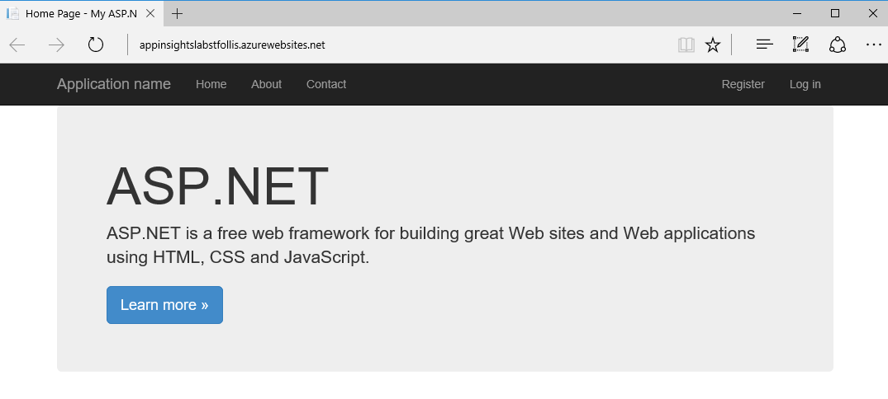

1. Congratulations! You have a working and deployable web application. It simulates a legacy web application that was not initially setup with any Application Insights telemetry. Next, we will setup an instance of Application Insights.

## Provision Application Insights

1. There is a variety of ways to start with Application Insights, but today we are going to work in the Azure Portal. Navigate to <http://portal.azure.com> in a browser and sign in with an Azure subscription.

1. To start the provisioning flow, click **+ &gt; Developer Services &gt; Application Insights**.

    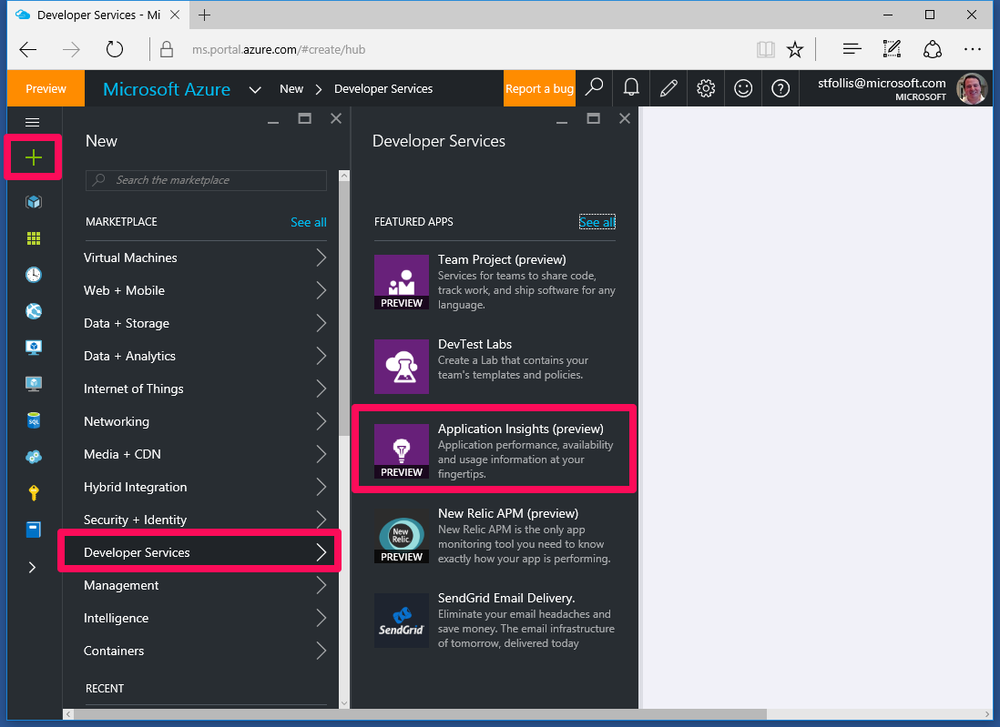

1. In the **Configuration** blade, select a name for this instance. Using the same name as your web application is a good choice.

1. Ensure the Application Type is **ASP.NET web application** and the Resource Group uses the group you created in a previous step.

1. Click **Create**.

    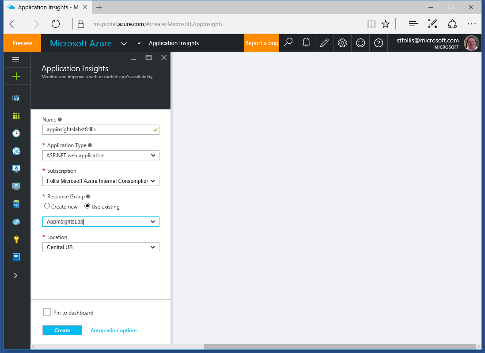

1. After the resource finishes provisioning, navigate to the Resource Group and click the newly created **Application Insights** icon.

    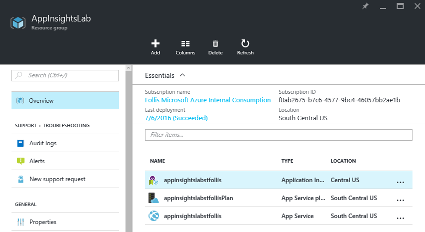

1. This blade displays all of the information for a web application that has been configured to use Application Insights. We will add that configuration next.

## Configure the web application to use Application Insights

1. In Visual Studio’s **Solution Explorer**, right-click the project icon and select **Add Application Insights Telemetry**.

    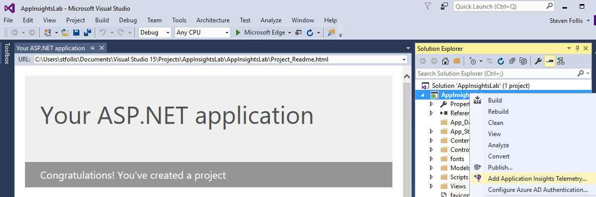

1. In the dialog window, we can opt to create a new instance of Application Insights, but since we have already manually created ours, select it from the dropdown box.

1. Click **Add**.

    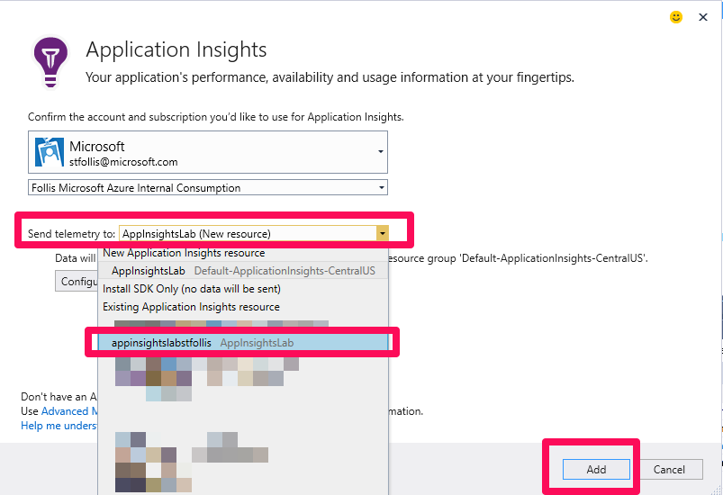

1. Visual Studio adds the Application Insights Web SDK from NuGet, but to take advantage of the latest Application Insights features we need to ensure that the latest version of the SDK is being added used. Right-click the project icon and select **Manage NuGet Packages**.

    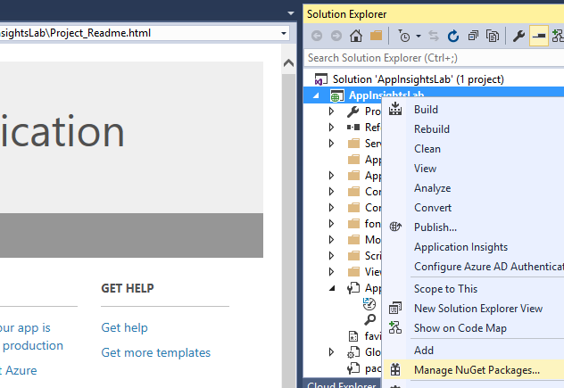

1. In the **NuGet Package Manager** window, select **Include prelease** &gt; **Microsoft.ApplicationInsights.Web**. We can see that Visual Studio installed an older version (v1.2.3) yet a newer version is available.

1. Select **v2.1.0-beta4**, click **Upgrade**, and accept all changes. It will ensure we have the latest SDK, and thus can use all of the latest Application Insights features.

1. Republish the application so that our changes are visible on our Azure Web App. Right-click the Project name and click **Publish**.

1. In the dialog window, click **Publish** to push our changes to Azure.

1. In the Azure Portal, navigate to our Application Insights resource.

1. If you see a bright orange banner saying “Enable Application Insights to start collecting telemetry data”, click it and in the new blade select **Start monitoring**.

    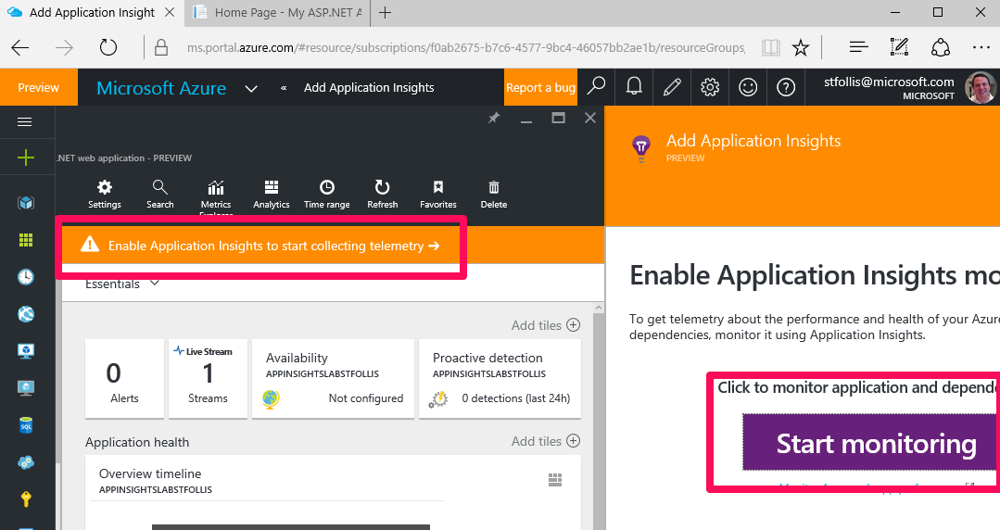

1. Click and reopen the **Application Insights** blade and you should see telemetry flowing into your application. However, there is a missing section **Page View Load Time**. Click **Learn how to collection page load data**.

    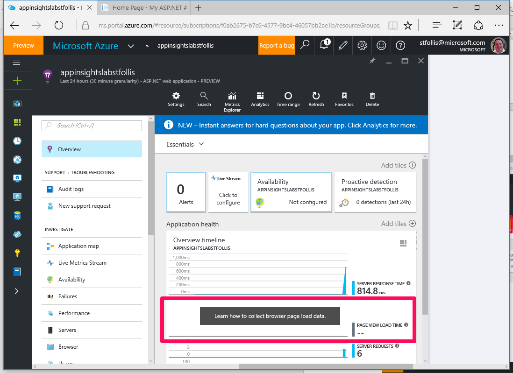

1. While we did add and configure the server side NuGet component, **Page View Load Time** is managed from the client side of our application via JavaScript. This new blade gives us the snippet of JavaScript that we need to paste into our application. Click the icon to copy the entire snippet to the clipboard.

    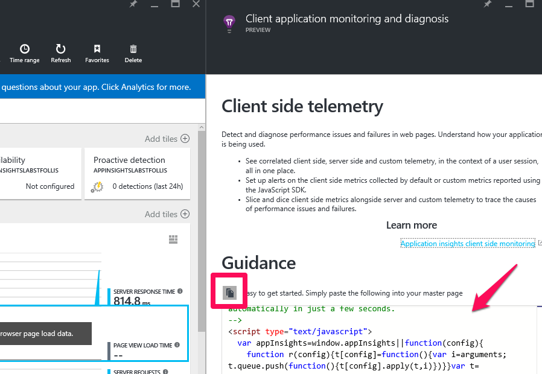

1. We need to paste the JavaScript snippet into our application. In Visual Studio’s **Solution Explorer**, open **Views &gt; Shared &gt; \_Layout.cshtml** and paste the script before the tag closing our &lt;/head&gt; section (approximately line 10).

1. Save and republish to Azure. Right-click the project icon and select **Publish**. Now our changes are pushed to Azure.

1. Once the Azure Web App opens in a browser, navigate to the **About** and **Contact** pages to generate some telemetry.

    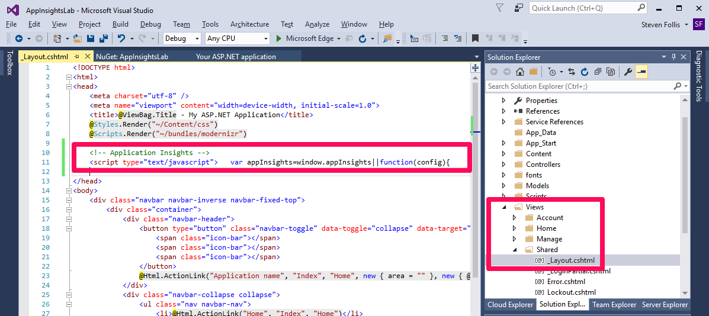

1. In the **Azure Portal**, we can see Page View Load Time data in our **Application Insights** blade.

    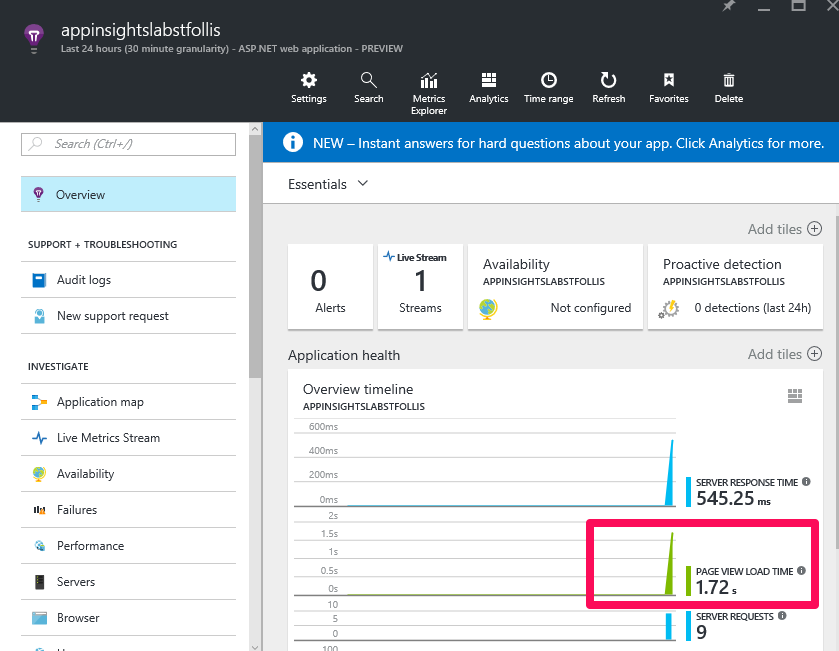

1. We have created a new instance of Application Insights, configured a legacy web application to use that instance via a NuGet package and JavaScript snippet, and visualized telemetry data flowing into the service. Next, we will extend this baseline setup to add a web test.

## Configure a web test

1. Web tests are a way to generate pings from around the globe to track application uptime and performance. Navigate to the **Application Insights resource** blade that we previously configured. Click the **Availability** tile to open the **Web Tests** blade.

    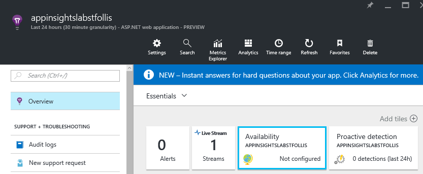

1. Select **Add web test** from the blade navigation.

    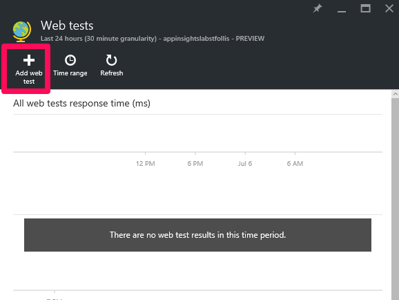

1. Give the test a name and for **Test Locations** select **Select/Delect All**.

1. Click **Create** to finish the Web Test.

    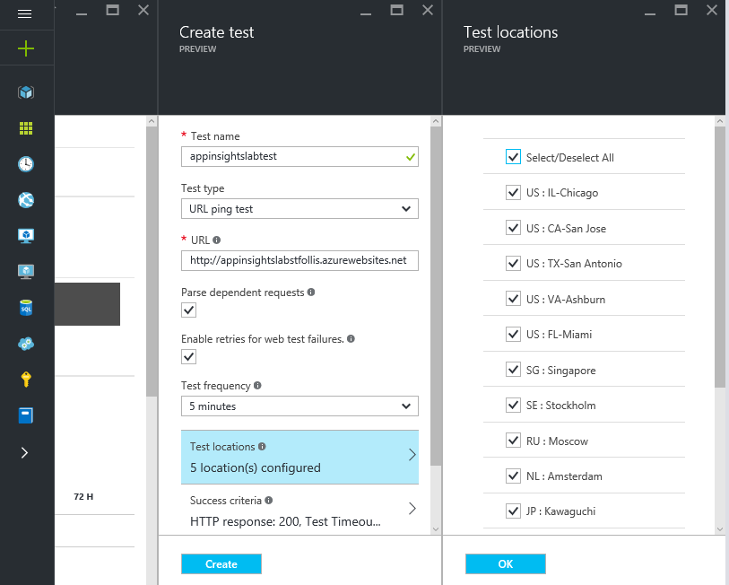

1. The lowest test frequency is 5 minutes, so it may take up to 5 minutes for the tests to begin executing. Periodically click **Refresh** in the **Web Tests** blade until you see test data flowing through.

    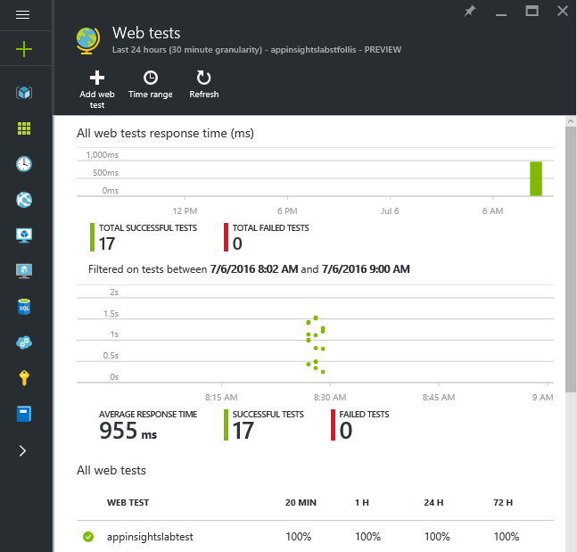

1. We can now dig into the test data, seeing how latency changes from datacenter to datacenter. For example, if our app is deployed into the West US datacenter, then the latency from Australia will likely be higher than other datacenters. In addition to adding tests from the portal, we can also track custom events directly from our code.

## Create a custom event on the client side

1. Custom events can be created from either the server side or client side of our application. For this exercise, we will add some JavaScript to track anytime the page is clicked by the user. In Visual Studio, navigate to **\_Layout.cshtml** described earlier and add the following JavaScript block before the closing &lt;/body&gt; tag:

    ```javascript
    <!-- App Insights Custom Event -->
    <script type="text/javascript">
        
        // Execute when jQuery is ready
        $(document).ready(function () {
        
            // Add a click event handler to detect when the page is clicked on
            $('body').click(function () {
            
            // When a click is recorded by jQuery
            // Send custom telementry data to AppInsights
            appInsights.trackEvent("CustomUserClick");
                console.log('Custom telementry sent');
            });

        });
    </script>
    ```

    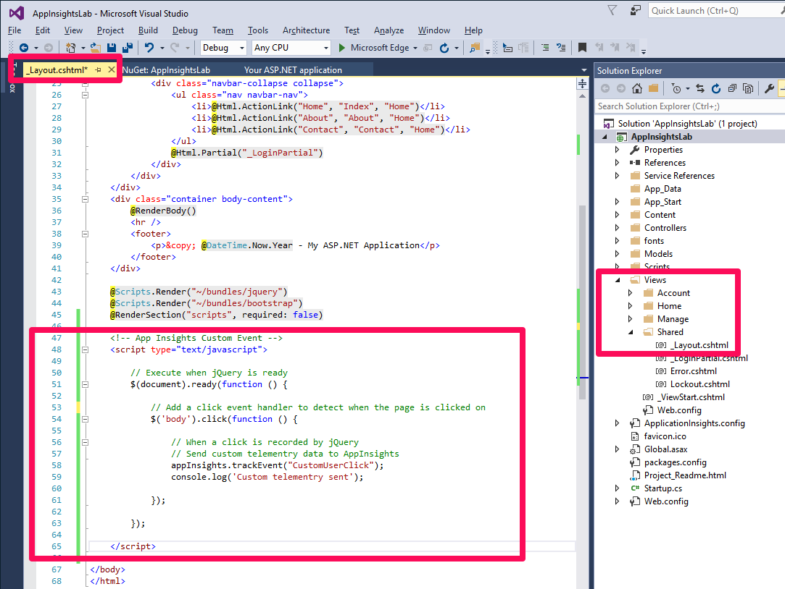

1. Republish to Azure and click around on the page.

1. To verify that the click events are occurring, you press **F12** to open the developer tools, reload the page, and check the Console.

    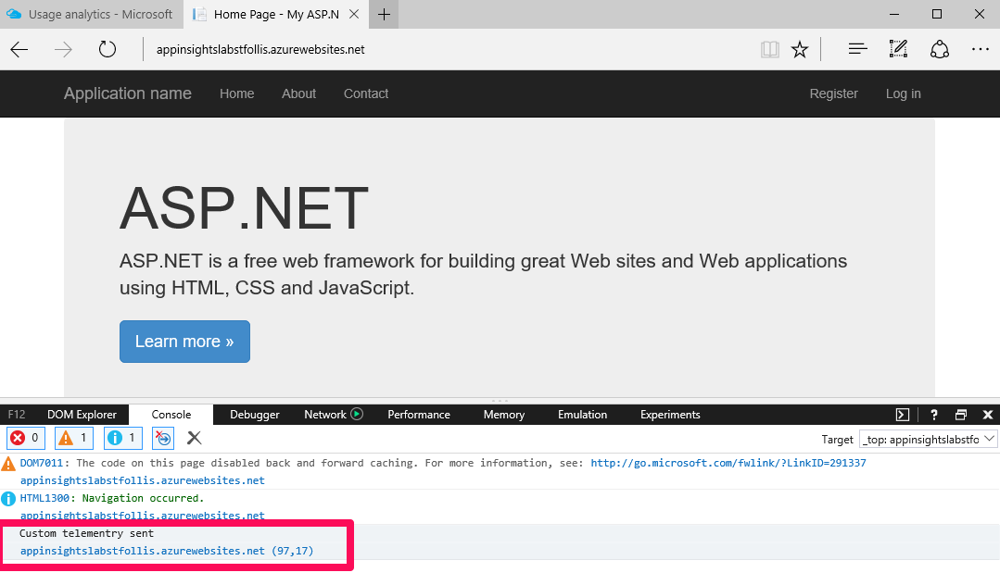

1. In the Azure Portal’s **Application Insights** blade, you can monitor this Custom Event by navigating to **Usage** and looking at the **Custom Events** tile. Click the **CustomUserClick** event to see more detailed information.

# Review

You have completed the Application Insights portion of the lab. In this section, you created a legacy application, provisioned a new instance of Application Insights, configured the application’s server and client sides to send telemetry to the service, created a custom Web Test from locations around the world to evaluate application performance, and extended the service with custom event logic. For more information on the breadth of Application Insights, please visit the documentation located at <https://azure.microsoft.com/en-us/documentation/services/application-insights/>.
