# Open Source Lab Overview

## Abstract

During this lab, you will experience the continuous integration workflow of an open source practitioner. You will start by configuring a containerized Jenkins environment, and then building a simple Node.js using NPM and Gulp.

## Learning Objectives

After completing the exercises in this lab, you will be able to:

-   Deploy and configure a Jenkins environment

-   Utilize containerization in a DevOps workflow

-   Build an open source Node.js application

**Estimated time to complete this lab: *60* minutes**

# Exercise : Provision Jenkins

## Scenario

In this exercise, you will stand up a Jenkins server running in a Docker container hosted inside of an Ubuntu Linux virtual machine within Azure.

After completing this exercise, you will understand:

-   How to create containerized application servers on Linux.

-   How to deploy and configure a Jenkins server.

-   How to interact with Linux environments over SSH.

## Provision Resources via ARM Template

1. Sign in to your Azure subscription at <http://portal.azure.com>.

1. To use Jenkins inside of a Docker container, we need to setup a virtual machine with the Docker Engine installed. To save some time, we will use an Azure Resource Manager template. Navigate to the Azure Quickstart Template repository at

    <https://github.com/Azure/azure-quickstart-templates>.

1. Locate the **docker-simple-on-ubuntu** folder and open it. This template will deploy all the necessary resources into our Azure subscription to enable Docker on Ubuntu.

1. Click **Deploy to Azure** to load the ARM template into the Azure Portal

    <https://github.com/Azure/azure-quickstart-templates/tree/master/docker-simple-on-ubuntu>.

    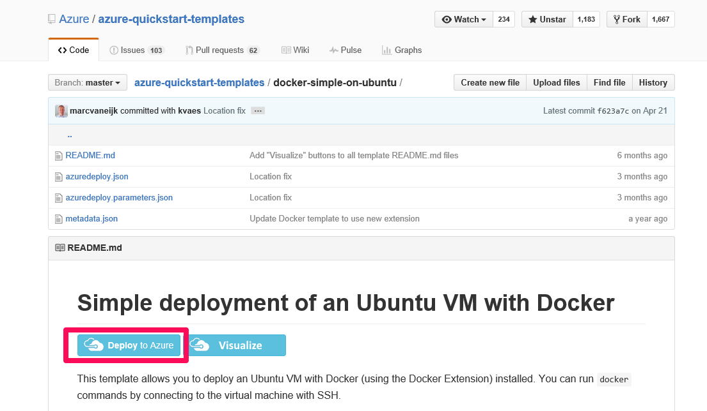

1. Complete the **Parameters** blade, provide a new Resource Group name and location, and approve the **Legal Terms** blade.

1. Click **Create** to begin provisioning the environment.

    Note: Take special note of the admin username and password; you will need them later.

    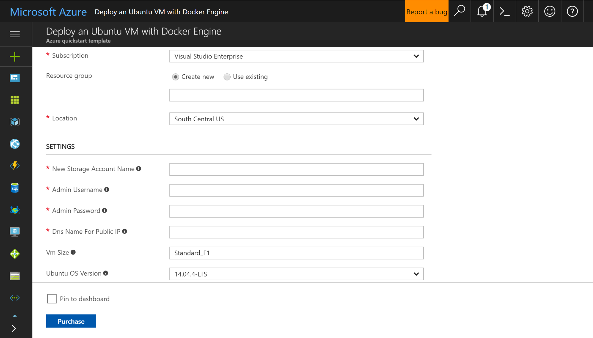

1. The provisioning process can last approximately 10 minutes. In the interim, we will install a tool that we will need: PuTTY. PuTTY is a free, simple SSH client for Windows that allow us to access our virtual machine. In the Windows world, we would use a Remote Desktop Connection; however, our Ubuntu Server image runs “headless” without a UI. Instead we will communicate with the server over the SSH protocol, and for that we need PuTTY. Browse to <http://www.putty.org/> and click **here**.

    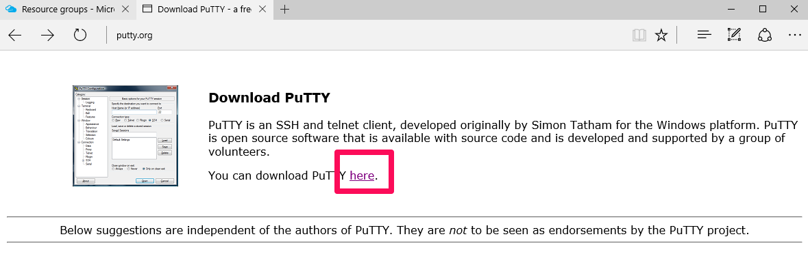

1. Select **putty.exe** for Windows on Intel x86.

    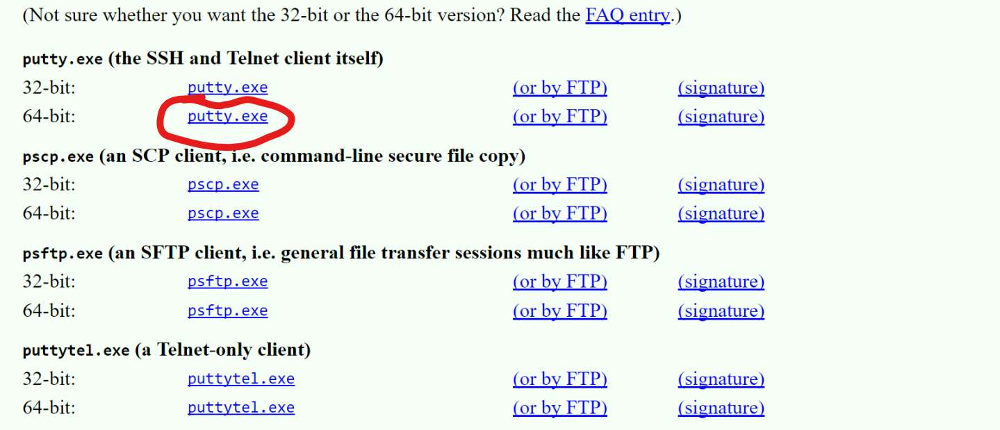

1. This small putty.exe file is all you need to open up a SSH connection to the virtual machine. Go back to the portal and wait for provisioning the complete.

1. Once the deployment is finished, navigate to the new Resource Group and open the virtual machine.

    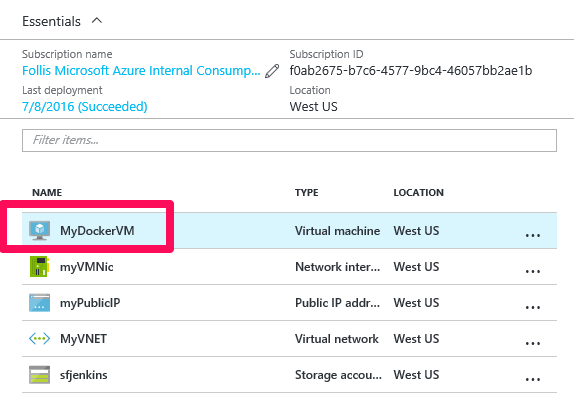

1. In the **VM’s** blade, expand the **Essentials** section and copy the **Public IP address** for the machine.

    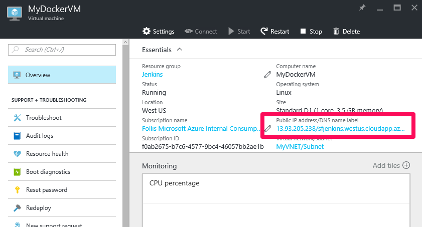

1. Open the PuTTY.exe.

1. In the **Host Name** field, paste the **Public IP Address**, and click **Open**.

    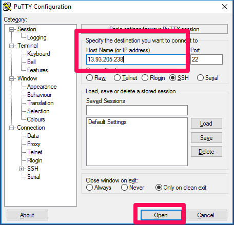

1. Click **Yes** to accept the server’s host key into your registry.

    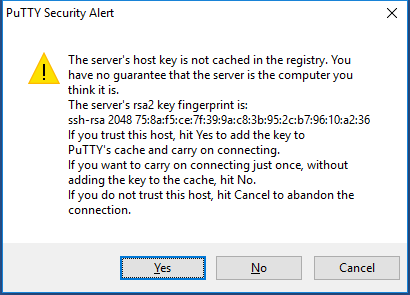

1. Using the admin username and password from the **Parameter** blade, sign in to the virtual machine. A welcome screen with system information about your Ubuntu VM displays.

1. At the prompt, enter **docker** and press enter.

    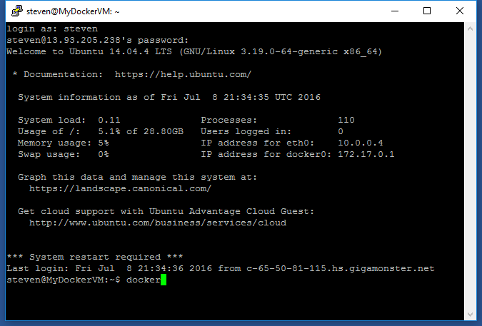

1. The system will spit out confirming all of the various commands available with the Docker Engine. Enter **docker version** to see an example of interacting with the engine.

    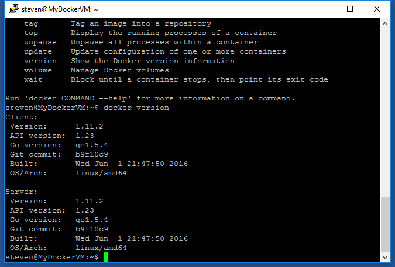

1. Now that we have an Ubuntu virtual machine setup with Docker installed, we need a Docker image. The Jenkins team publishes Docker images to the Docker Hub, located at <https://hub.docker.com/r/jenkinsci/jenkins/>.

1. To setup a container running the Jenkins image, execute **docker run -d -p 80:8080 jenkinsci/jenkins** in PuTTY. This command does several things:

    - `docker run` sets up a new container

    - `-d` means run the container in daemon mode. It runs the container in the background instead of placing your command prompt directly into the new container.

    - `-p 8080:8080` maps the container’s port to the VM’s port. It allows us to access Jenkins’ web interface from our regular machine, as Jenkins functions on port 801. By mapping it to the VM’s port 80, we can access our Public IP address without also having to specify a port number in the browser.

    - `jenkinsci/jenkins` is the name of the image. Since Docker cannot locate this image locally, it downloads the image from the Docker Hub and passes it along to be created into a new container.

1. A long alphanumeric string displays. The ID represents the new container. To get more information about all running containers, enter **docker ps**. Note the randomly generated **Names** value for your container, as we will use it shortly. In this example, the container’s name is **grave\_hopper**.

    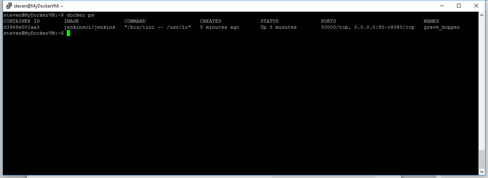

1. In your browser, open a new tab and navigate to your virtual machine’s Public IP address (ex. 13.93.205.238). You should see Jenkins initialize itself and after a moment, a security check will display. Jenkins has written an unlock password in to the file system to ensure only an admin can access the server.

    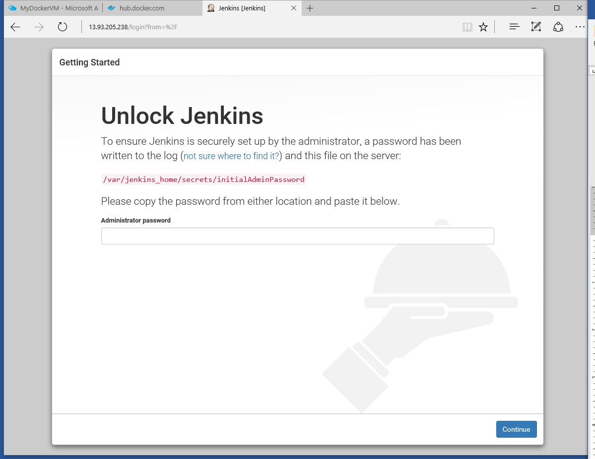

1. To unlock Jenkins, we need to read the unlock file on the file system inside of our new container. In PuTTY, execute

    **docker exec -it grave\_hopper tail /var/jenkins\_home/secrets/initialAdminPassword**.

    Remember to replace **grave\_hopper** with your container’s name.

    - `docker exec` executes a command inside of a given container.

    - `-it` means interactive mode, meaning the accompanying output will be echoed out to our PuTTY terminal.

1. The returned line, another long alphanumeric string, is the password that we need to unlock Jenkins. Copy this line.

    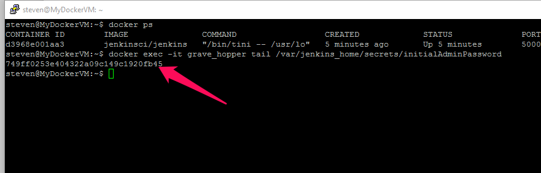

1. In the browser, paste the unlock code into the **Administrator password** field and click **Continue**.

    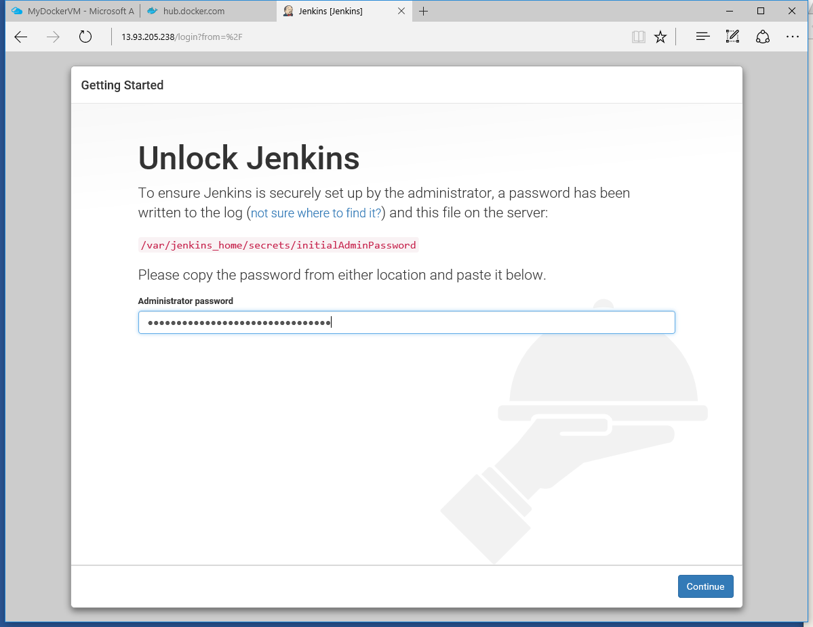

1. This code will unlock Jenkins, allowing us to continue configuring the server. On the **Customize Jenkins** screen, select **Install suggested plugins**. Jenkins is flexible, and relies on a wide ecosystem of plugins for a variety of functionality. Allow Jenkins a few moments to download and install the desired plugins.

    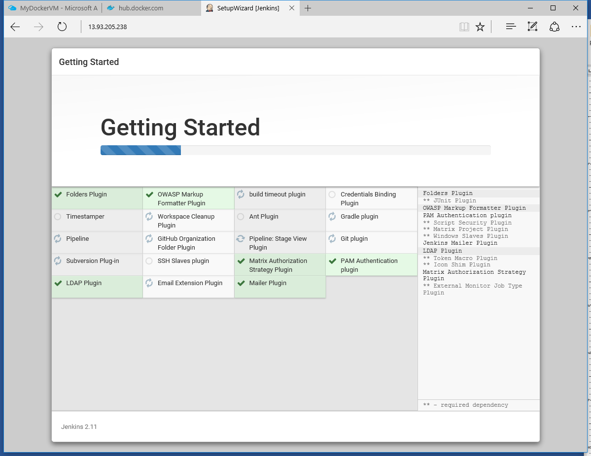

1. Once the plugins finish installing, Jenkins will ask you to create an Admin User. Complete the form if desired, but for time it is easier to click **Continue as admin**.

    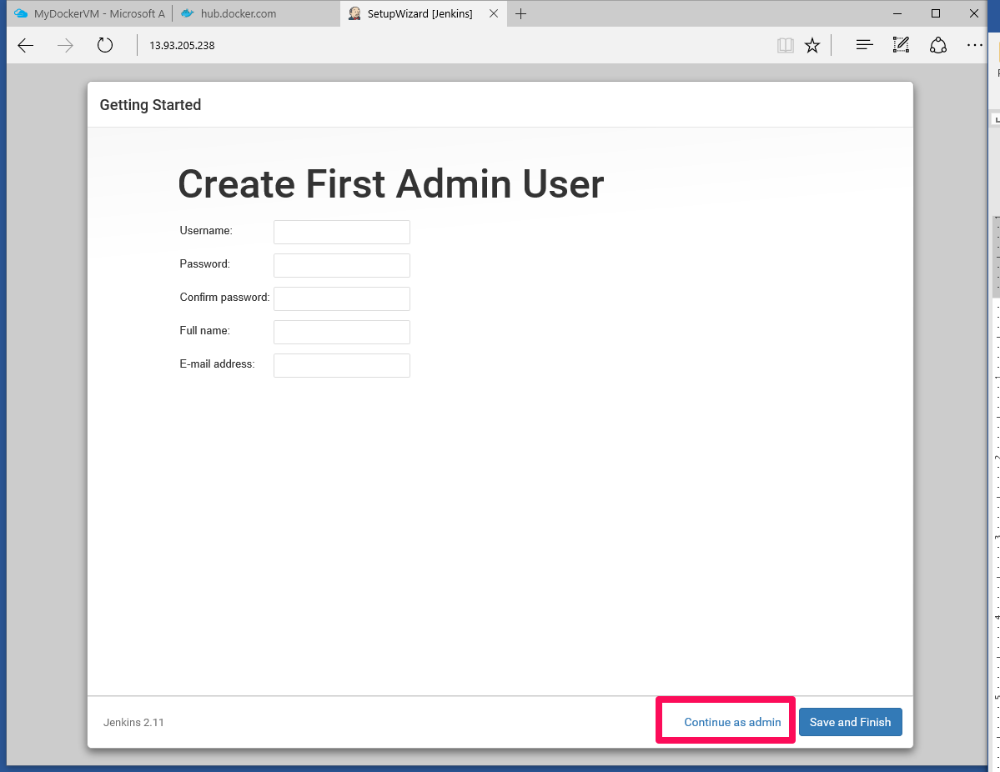

1. On the **Getting Started** screen, click **Start using Jenkins**. Jenkins installs with a baseline configuration.

    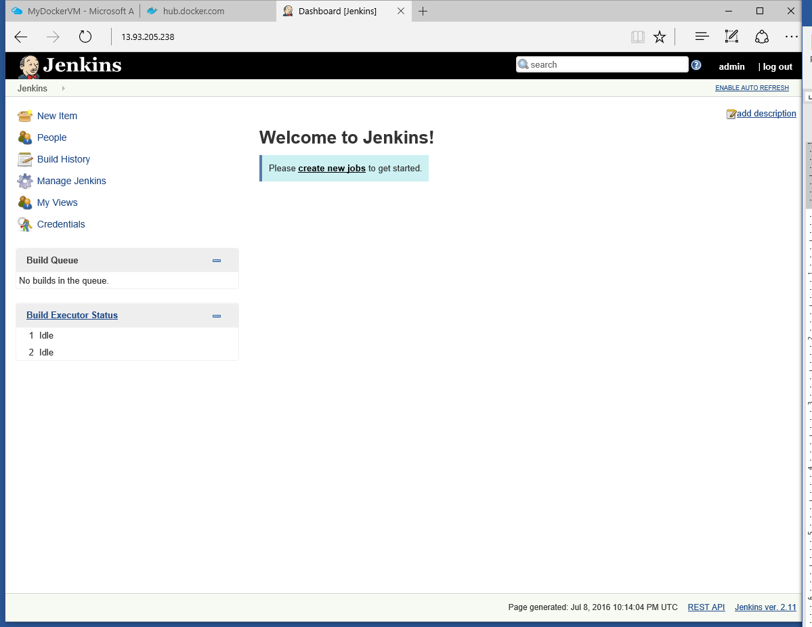

# Exercise : Build a Node.JS Application using Jenkins

## Scenario

In this exercise, we will introduce you to the continuous integration features of Jenkins by building a Node.js web application.extensible analytics service that monitors your live applicationextensible analytics service that monitors your live application

After completing this exercise, you will understand:

-   How to install and configure Jenkins plugins.

-   How to connect Jenkins to a source control repository.

-   How to build an application using Jenkins’ build steps.

## Install and Configure a Jenkins Plugin

1. Out of the box, Jenkins works with Java applications. In order to work with Node applications, we need to install and configure a Jenkins plugin.

1. From the homepage, click **Manage Jenkins**.

    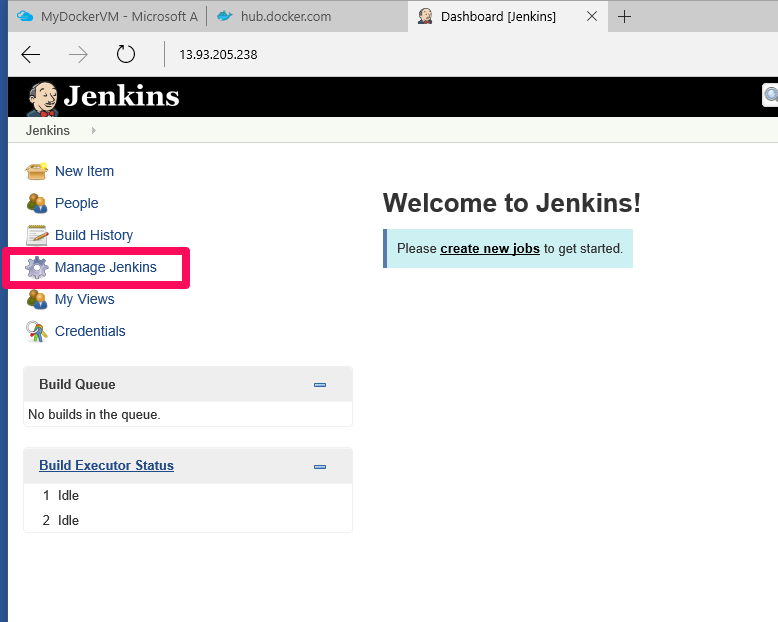

1. On the **Manage Jenkins** screen, click **Manage Plugins**.

    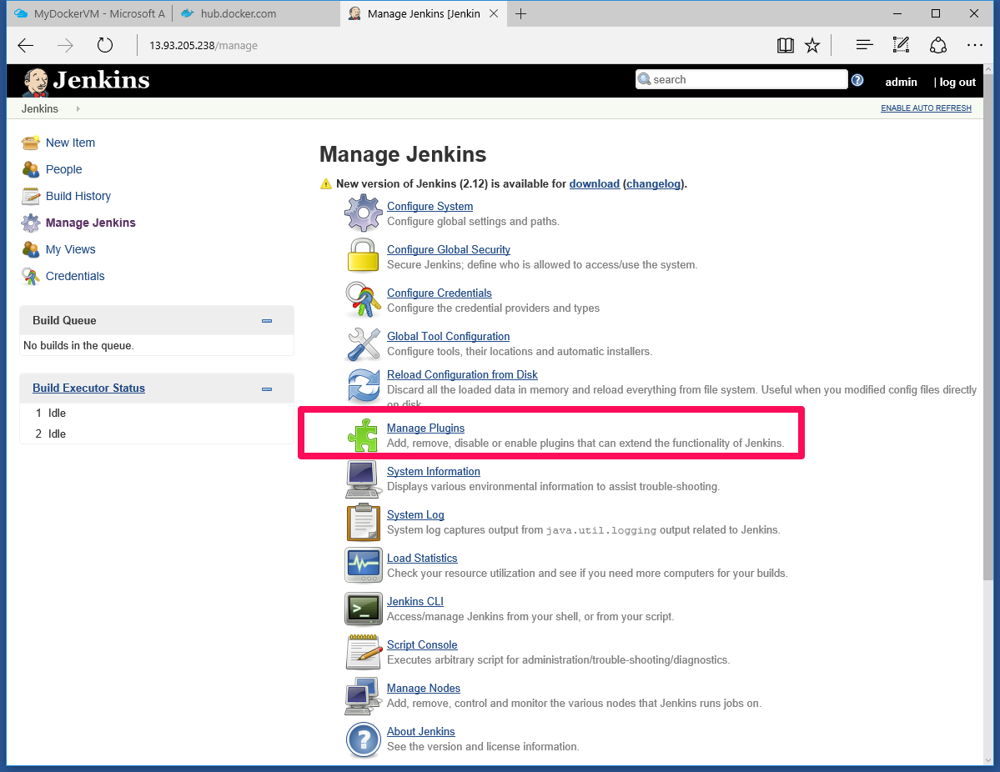

1. You use this screen to add and remove plugins from the Jenkins server. Click the **Available** tab and in the Filter field, enter in **nodejs**. The view will trim down substantially. Select **NodeJS Plugin** and click **Install without restart** to add the plugin to your server. This plugin eases the installation of Node specific tooling and configuration.

    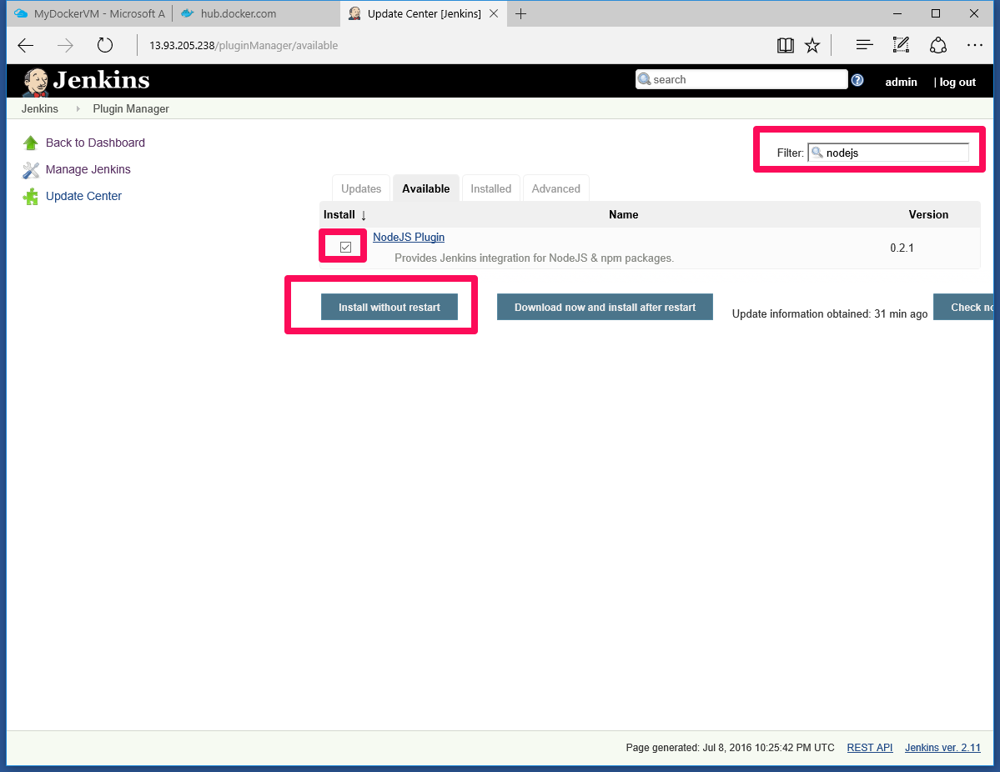

1. A status screen displays. Once the status of the NodeJS Plugin changes to **Success**, the plugin is available.

    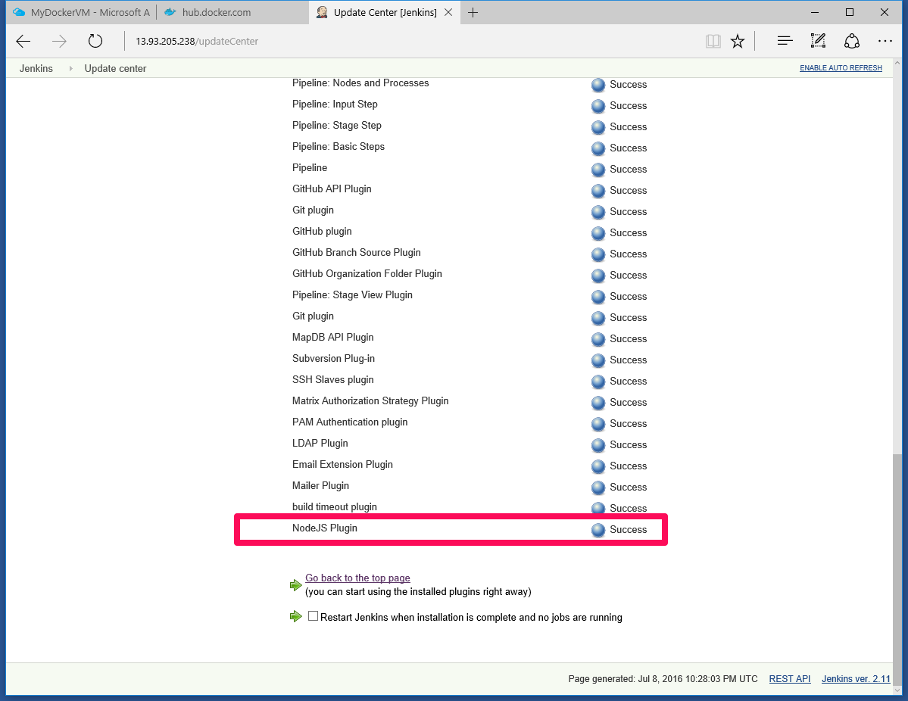

1. We need to configure the plugin. Click **Manage Jenkins**.

    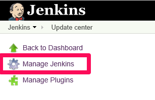

1. On the **Manage Jenkins** screen, click **Global Tool Configuration**.

    

1. In the **Global Tool Configuration** screen, we can select which version of the Node.js runtime we would like to install on the server. Scroll to the **NodeJS** section and click **Add** **NodeJS**. In the **Name** field, enter **Node6** and select **Install automatically**.

    

1. Now that the installation has a name, we need to define the actual software version. Click **Add Installer** and select **Install from nodejs.org**.

    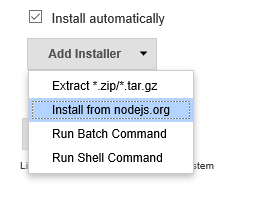

1. Select the latest version available and click **Save**.

    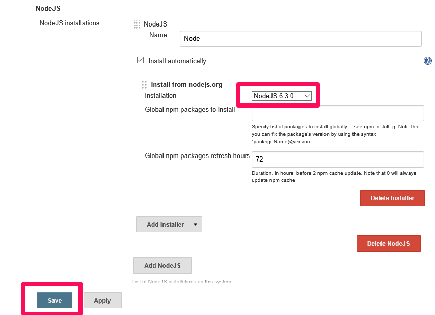

1. Jenkins now has the latest version of Node.js installed, which you can use for continuous integration.

## Create a New Job

1. In the Jenkins world, a project is roughly analogous to a build definition in Visual Studio Team Services. It is within the item that we configure build settings and create build steps. From the Jenkins homepage, click **New Item**.

    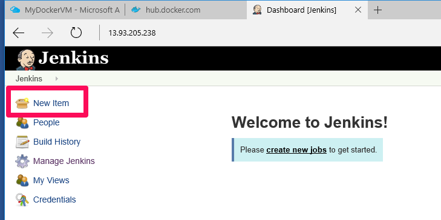

1. In the **Enter an item name** field, enter **NodeApp** and click **Freestyle project**.

    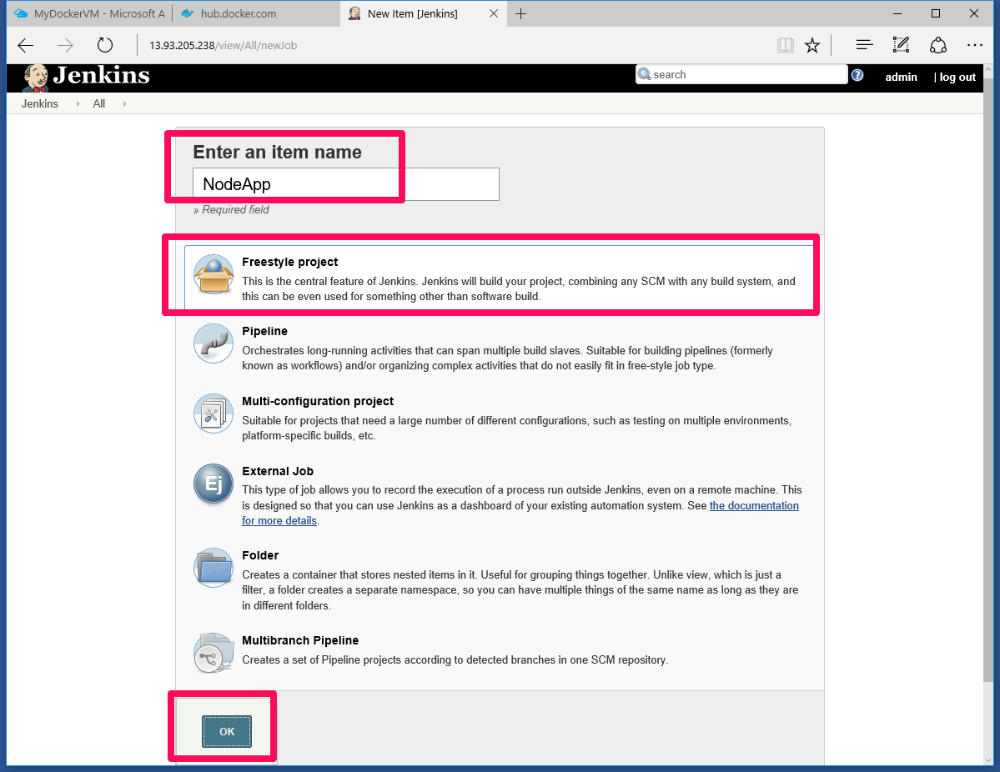

1. In order to build code, we need to *have* some code. Jenkins supports Git and Subversion, two very standard repository technologies.
    We will use a repository on GitHub with a sample Node.js application as our repository. In the **Source Code Management** section, select Git, paste **https://github.com/stevenfollis/express** in the **Repository URL** field, and click **Save**.

    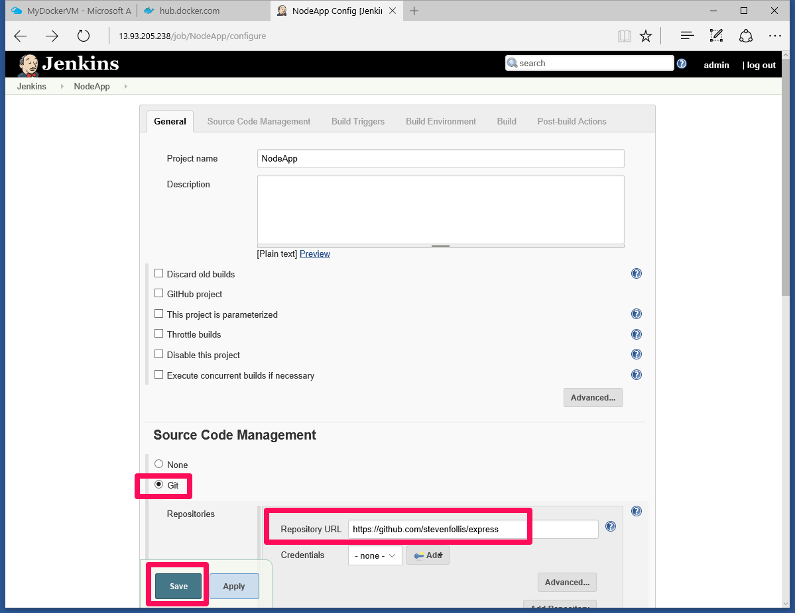

1. In the **Project NodeApp** screen, we will kick off a build to see if the code retrieves successfully. Click Build Now. A build starts and can be monitored in the **Build History** widget. When it is complete, click the build number.

    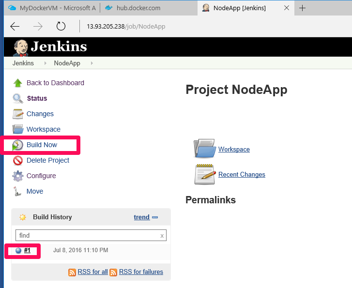

1. In the **Build Details** screen, how long the build took, when it ran, and a variety of other information displays. Click **Console Output** to see verbose control output for the particular build.

    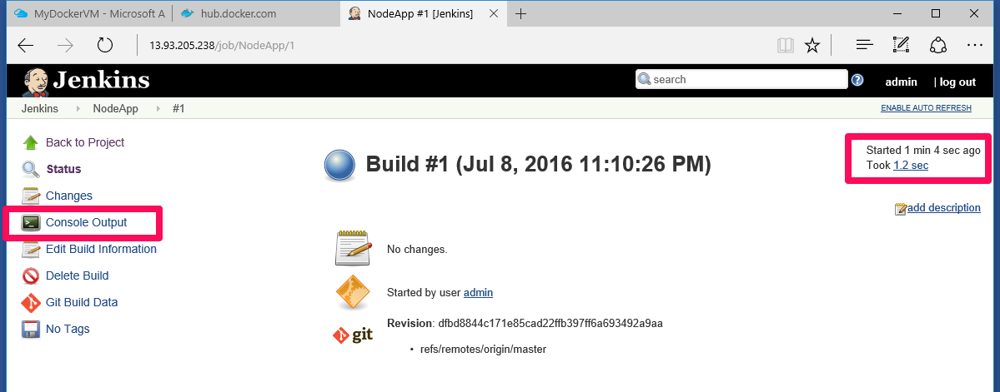

1. Examine how the server works with the Git repository, cloning from GitHub into the project’s workspace.

    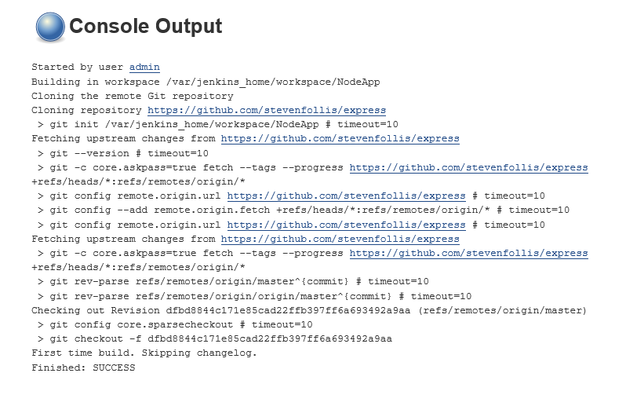

We have successfully connected a source repository and executed our first build. To provide more value, we need to actually create build steps that interact with our code.

## Creating Custom Build Steps

1. We will create some build steps to supercharge our workflow. Hover over **NodeApp** and selecting **Configure**.

    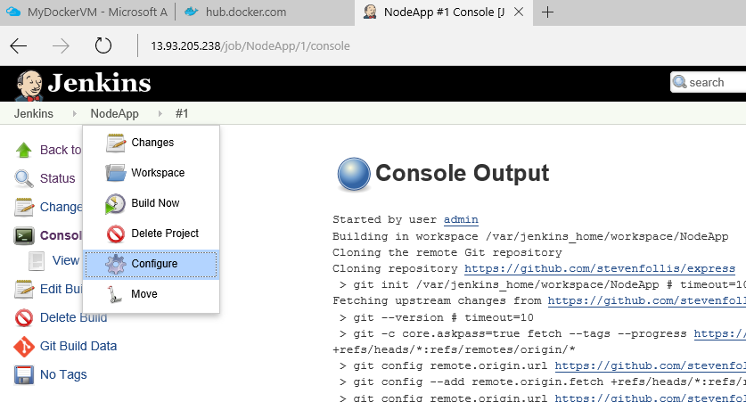

1. Scroll down the **Configuration** screen to the **Build Environment** section.

1. Select **Provide Node & npm bin/ folder to PATH** allowing us to use those commands in our build scripts.

1. In the **Build** section, click **Add build step** and select **Execute shell**. We can select a variety of scripts, but shells are often the most standard way of executing commands.

    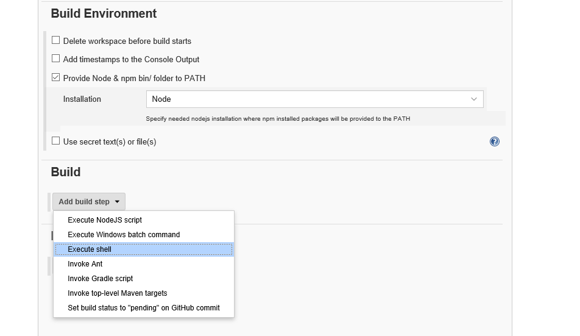

1. In the **Command** field, we will configure our NPM actions. First, we want to check the version of NPM installed and then retrieve all dependencies using the following code:

    ```
    npm --version

    npm install
    ```

    

1. We will then create a second build step to execute our Gulp related activities. First, we will install Gulp globally, check its version, and execute the Gulpfile’s default task. Click **Add build step**, select **Execute shell**, and enter:

    ```
    npm install -g gulp

    gulp --version

    gulp default
    ```

    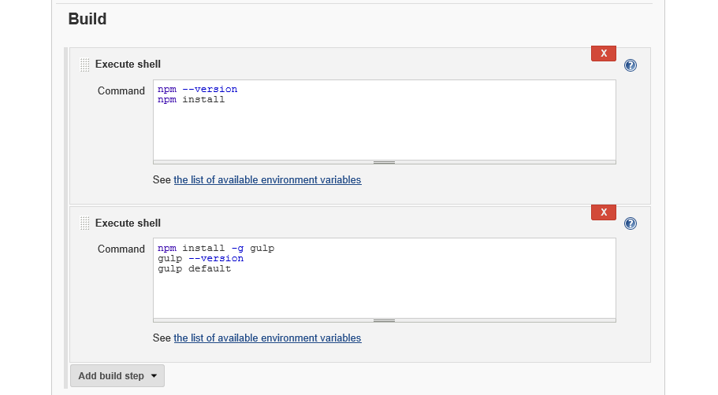

1. Once the two tasks are configured, click **Save** and **Build Now**. When the build finishes, click its number to see the detailed screen.

    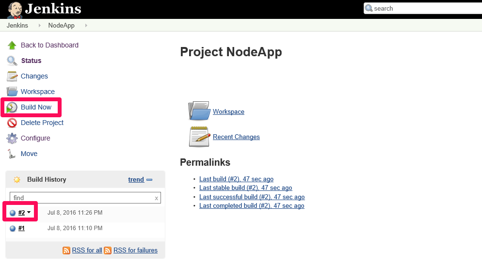

1. Examine the **Console Output** for this build, noticing all of the activity happening across NPM and Gulp.

    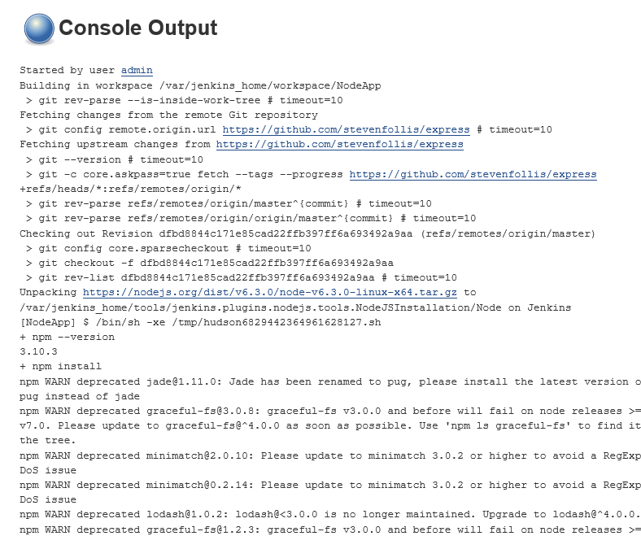

1. We will see what the build did. Hover over the NodeApp project title, click the **Workspace** link.

    

1. In the **Workspace**, we can see of the files cloned in from the original GitHub repository and a series of additional files that were created in our build steps. The **node\_modules** folder represents all of our project dependencies, whereas the **deploy** folder was generated from Gulp. In our Gulp tasks, we are zipping up the entire contents of the folder into a webdeploy package that we can deploy to an environment such as an Azure Web App. Click the **deploy** folder.

    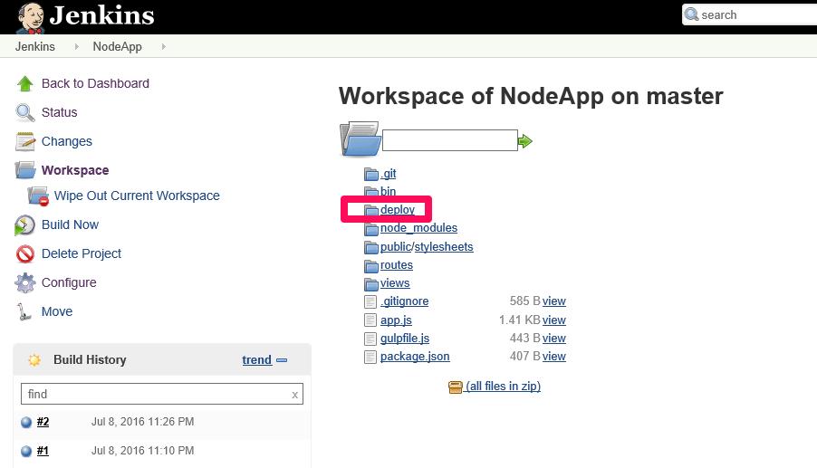

1. Click **deployment-package.zip** to download it to your local machine, examining the file contents. You can deploy this package to a variety of different environments and it represents our fully built application.

The activity is complete. You took a running Jenkins environment, created a new build project, connected it to a source code repository, defined custom build steps, and executed a series of build activities, all hosted inside of Azure. From here, you could take the webdeploy package and push it to environments as part of a further continuous deployment pipeline.

# Review

You have now completed the Open Source on Microsoft Azure Lab. In this lab you created a Linux virtual machine running in Microsoft Azure, accessed it via SSH on the command line, operated Docker to install the Jenkins image from Docker Hub, configured Jenkins, and built a Node.js application. The webdeploy package could then be taken and deployed to an environment of your choosing.
